# NeoTrix v2 Architecture

> **Date**: 2026-05-23 | **Compile**: ✅ 0 errors, 0 warnings (default + full) | **Tests**: ✅ 1,248+ passed

---

## 4-Layer Architecture

```mermaid
graph TB
    subgraph L1["Layer 1: Core Primitives (core/)"]
        C1[capability.rs - 22-dim CapabilityVector]
        C2[memory.rs - ReasoningBank 1805 lines]
        C3[knowledge.rs - KnowledgeSource 34+ variants]
        C4[traits.rs - ToolProvider / SessionProvider]
        C5[rkyv_store.rs - zero-copy serialization]
        C6[hypercube/ - VSA engine 4096-dim]
        C7[consciousness/ - GlobalWorkspace attention]
    end

    subgraph L2["Layer 2: Reasoning Engine (reasoning_brain/)"]
        R1[reasoning_engine.rs - Unified LLM+knowledge]
        R2[self_iterating/ - SEAL loop 5 files]
        R3[goal_loop.rs - 24/7 autonomous pursuit 1098 lines]
        R4[cortex_memory.rs - Human-like memory]
        R5[memory.rs - ReasoningBank store]
        R6[hypercube_bridge.rs - Layer2 ↔ Layer1 bridge]
        R7[attention_router.rs - SEAL ↔ GWT routing]
        R8[knowledge_engine / knowledge_chain / web_miner ...]
    end

    subgraph L3["Layer 3: Agent System (agent/)"]
        A1[tools/mod.rs - MCP Registry]
        A2[tools/patch.rs - Surgical file editing]
        A3[sub_agent.rs - Sub-agent execution]
        A4[team.rs - Swarm execution]
        A5[workflow.rs - Workflow definition]
        A6[agent_template.rs - 9 agent presets]
    end

    subgraph L4["Layer 4: Security & Infrastructure"]
        S1[security/ - Guard Vault KeyVault Audit]
        S2[sandbox.rs - Wasm sandbox]
        S3[stealth_net/ - Proxy network 10K+ LOC]
        S4[orchestrator/ - DAG task orchestration]
        S5[background_loop.rs - 24/7 loop]
        S6[provider/ - LLM providers]
        S7[event_bus.rs - Event system JSONL]
    end

    L1 --> L2
    L2 --> L3
    L3 --> L4
```



---

## Layer 0: MetaCognition (`core/metacognition/`)

The self-awareness layer — monitors and steers the evolution of the entire project. Runs the metacognitive cycle (SCAN → ANALYZE → MONITOR → PLAN → REPORT).

| Module | Files | Lines | Description |
|--------|-------|-------|-------------|
| `self_model.rs` | 1 | — | SelfModel: complete project state (modules, files, deps, test coverage, compilation, tech debt, evolution history) |
| `scanner.rs` | 1 | — | CodeScanner: filesystem scanner using std::fs, builds SelfModel from project tree |
| `monitor.rs` | 1 | — | MetaMonitor: continuous health monitoring, alerts, trend analysis |
| `weakness.rs` | 1 | — | WeaknessAnalyzer: detects large files, missing tests, excess unsafe/unwrap, circular deps, orphan modules, TODO density |
| `planner.rs` | 1 | — | EvolutionPlanner: priority-queue evolution planning with impact/risk estimation |
| `metacognition_loop.rs` | 1 | — | MetaCognitiveLoop: orchestration loop (SCAN→ANALYZE→MONITOR→PLAN→REPORT) |

```
┌─────────────┐
│   SCAN     │──── CodeScanner → SelfModel (full project snapshot)
└──────┬──────┘
       │
       ▼
┌──────────────┐
│   ANALYZE   │──── WeaknessAnalyzer → GapReport (debt + risks)
└──────┬──────┘
       │
       ▼
┌──────────────┐
│   MONITOR   │──── MetaMonitor → HealthTrend (regression alerts)
└──────┬──────┘
       │
       ▼
┌──────────────┐
│    PLAN     │──── EvolutionPlanner → PriorityQueue (impact-ordered tasks)
└──────┬──────┘
       │
       ▼
┌───────────────┐
│   REPORT     │──── SelfModel export → ARCHITECTURE_V2.md sync
└───────────────┘
```

The loop runs on `MetaCognitiveLoop::tick()` in `metacognition_loop.rs`. Results are stored in `SelfModel` and exposed via `MetaMonitor`.

---

## Layer 1: Core Primitives (`core/`)

The foundational layer — zero external dependencies beyond Rust std. Provides the vector algebra, memory storage, and attention primitives that upper layers compose.

| Module | Files | Description |
|--------|-------|-------------|
| `capability.rs` | 1 | `CapabilityVector` (22 dimensions), cosine similarity, normalize, bundle/bind |
| `memory.rs` | 1 | `ReasoningBank` — 1805 lines, persistent memory with recall/absorb/forget |
| `knowledge.rs` | 1 | `KnowledgeSource` enum (34+ variants), `capability_vector()` mapping, `source_weight()` |
| `traits.rs` | 1 | Core protocol traits: `ToolProvider`, `SessionProvider`, `KnowledgeProvider` |
| `rkyv_store.rs` | 1 | Zero-copy serialization via rkyv (feature `rkyv-storage`) |
| **`hypercube/`** | **8** | **NEW**: VSA engine (4096-dim MAP), 8-axis coordinates, `KnowledgeHyperCube`, `GapDetector`, `Projection`, `Contradiction` |
| **`consciousness/`** | **6** | **NEW**: `GlobalWorkspace` attention routing, `CompetitionArena`, `BroadcastBus`, `IgnitionDetector`, 7 `SpecialistType` variants |

### hypercube/ sub-modules

| File | Responsibility |
|------|---------------|
| `vsa.rs` | MAP VSA engine: bundle, bind, permute, cosine similarity, sequence, cleanup (4096-dim) |
| `axis.rs` | `DimensionAxis` enum (8 axes: Time, Abstraction, Domain, Modality, Culture, Scale, Certainty, Agency) |
| `coord.rs` | `HyperCoord` [0,1]^8 coordinate with L2/angular/manhattan distance, interpolation |
| `cube.rs` | `KnowledgeHyperCube` container: insert (with proximity merge), query, density_region, eject |
| `projection.rs` | `Slice` (axis-aligned slice extraction) + `Rollup` (sum/avg over axes) |
| `gap.rs` | `GapDetector`: density + variance + semantic gap analysis, `GapReport` |
| `contradiction.rs` | `Contradiction` types (Asymmetric, Symmetric, Circular) + resolve |
| `mod.rs` | Re-exports |

### consciousness/ sub-modules

| File | Responsibility |
|------|---------------|
| `workspace.rs` | `GlobalWorkspace`: specialist registration, competition_round, broadcast, decay_all, ignition_possible |
| `module_def.rs` | `SpecialistType` enum (7 variants: PatternMatcher, AnomalyDetector, CreativitySparker, CrossDomainIntegrator, SafetyGuardian, GoalPrioritizer, ReflectionEngine), activate/decay traits |
| `competition.rs` | `CompetitionArena` + `SalienceSignal`: urgency + novelty + coherence → salience computation |
| `broadcast.rs` | `BroadcastBus`: fixed-history broadcast with prune |
| `ignition.rs` | `IgnitionDetector`: threshold crossing, cooldown, broadcast trigger |
| `mod.rs` | Re-exports |

---

## Layer 2: Reasoning Engine (`reasoning_brain/`)

The brain — orchestrates LLM calls, knowledge retrieval, self-iteration, and goal pursuit. 42 sub-modules total.

| Module | Files | Lines | Description |
|--------|-------|-------|-------------|
| `reasoning_engine.rs` | 1 | — | Unified reasoning: 4 types (Conversation/TaskSolving/ErrorDebugging/KnowledgeQuery), produces `ReasoningTrace` |
| `self_iterating/` | 5 | — | SEAL loop: `generate_self_edit()`, `absorb()`, `SelfIteratingBrain`, `run_seal_loop()` |
| `goal_loop.rs` | 1 | 1098 | 24/7 autonomous goal pursuit, `GoalState` lifecycle, rate limiter, circuit breaker |
| `cortex_memory.rs` | 1 | — | Human-like multi-dimensional memory with decay and consolidation |
| `memory.rs` | 1 | — | `ReasoningBank` store (separate from core/memory.rs — higher-level) |
| `hypercube_bridge.rs` | 1 | — | Integration bridge: `cortex_memory` → `core/hypercube` gap analysis → `ExploreDomain` |
| **`attention_router.rs`** | **1** | 303 | **NEW**: GWT competition → KnowledgeHyperCube retrieval → reasoning decision pipeline. `route()` computes keyword-based salience, activates specialists, queries hypercube, produces `RoutedContext` with knowledge prompt suffix for `ReasoningEngine`. `seed_knowledge()` injects 10 foundational reasoning patterns. |
| `knowledge_engine.rs` | 1 | — | Knowledge retrieval and composition |
| `knowledge_chain.rs` | 1 | — | Chain-of-knowledge reasoning |
| `web_miner.rs` | 1 | — | Web content mining and ingestion |
| `self_evolver.rs` | 1 | — | External information self-evolution (S-06): URL ingestion, analysis, micro-edit generation |

---

## Layer 3: Agent System (`agent/`)

| Module | Files | Description |
|--------|-------|-------------|
| `tools/mod.rs` | 1 | MCP Registry + `McpToolGenerator` — tool registration, listing, dispatch |
| **`tools/patch.rs`** | **1** | **NEW**: Surgical file editing tool — line-level insert/delete/replace |
| `sub_agent.rs` | 1 | Sub-agent spawning, execution, result collection |
| `team.rs` | 1 | Swarm execution: Boss/AllVote/Chain/Devil process types, `Coordinator` routing |
| `workflow.rs` | 1 | Workflow definition and execution |
| `agent_template.rs` | 1 | 9 concrete agent presets |

### MCP Tools

Registered built-in tools in `tools/mod.rs`:

| Tool | Handler |
|------|---------|
| `web_scrape` | `ScraperEngine` |
| `security_audit` | `SecurityAuditor` |
| `react_doctor` | `ReactDoctorEngine` |
| `playwright_verify` | Playwright-based UI verification |
| **`patch`** | Surgical inline file edits |

---

## Layer 4: Security & Infrastructure

| Module | Files | Description |
|--------|-------|-------------|
| `security/guard.rs` | 1 | `Guard` — access control, rate limiting |
| `security/vault.rs` | 1 | `Vault` — secret storage |
| **`security/keyvault.rs`** | **1** | **NEW**: `KeyVault` — dedicated key management with rotation |
| `security/audit.rs` | 1 | `Audit` — operation logging |
| `security/permission.rs` | 1 | `Permission` — capability-based permissions |
| `security/policy.rs` | 1 | `Policy` — policy engine |
| `sandbox.rs` | 1 | Wasm sandbox (feature `sandbox`) |
| `stealth_net/` | — | Proxy network, 10K+ LOC (feature `stealth-net`) |
| `orchestrator/` | — | DAG task orchestration, `PlannerNode` / `WorkerNode` / `CriticNode` |
| `background_loop.rs` | 1 | 24/7 background loop with goal ticker |
| `provider/` | — | LLM providers: OpenAI, Anthropic, Gemini, Ollama |
| `event_bus.rs` | 1 | Event system with JSONL persistence |

---

## Feature Gate System

10 compile-time feature gates for conditional compilation:

| Feature | Used For |
|---------|----------|
| `sandbox` | Wasm sandbox, secure execution |
| `stealth-net` | Proxy network, anti-detection |
| `full` | All features combined |
| `telemetry` | Performance tracing |
| `rkyv-storage` | Zero-copy serialization |
| `keyring` | OS keychain integration |
| `chromiumoxide` | Chrome DevTools Protocol |
| `default` | Standard feature set |
| (others) | Additional optional capabilities |

### Feature Combinations Tested

| Combination | Status |
|-------------|--------|
| `--features default` | ✅ 0 errors, 0 warnings |
| `--no-default-features` | ✅ 0 errors, 0 warnings |
| `--features sandbox` | ✅ 0 errors, 0 warnings |
| `--features full` | ✅ 0 errors, 0 warnings |

### Pattern in Code

```rust
#[cfg(feature = "sandbox")]
pub fn execute_sandboxed(&self) -> Result<()> { ... }

#[cfg(feature = "full")]
mod full_feature_only { ... }
```

---

## Current Health

| Metric | Value |
|--------|-------|
| Rust files | ~296 |
| Total LOC | ~72,000 |
| `#[test]` functions | 1,248+ |
| `tokio::spawn` sites | 25 (23 without `JoinHandle`) |
| `cargo check --lib` | 0 errors, 0 warnings |
| `cargo check --features full --lib` | 0 errors, 0 warnings |
| `cargo test --lib` | All passing |

---

## Key Data Flow

```
User Input / URL
    │
    ▼
Layer 2: ReasoningEngine ──► LLM Provider
    │                              │
    ├─ query KnowledgeSource      │
    ├─ apply CapabilityVector     │
    ├─ check ReasoningBank        │
    └─ trigger SEAL loop          │
         │                        │
         ▼                        ▼
Layer 1: hypercube / consciousness / core primitives
    │
    ▼
Layer 3: Agent System (tools + sub-agent + swarm)
    │
    ▼
Layer 4: Security / Sandbox / Network
    │
    ▼
Output + Absorption (→ ReasoningBank / brain.json)
```

### Hypercube ↔ Consciousness ↔ AttentionRouter Data Flow

```
cortex_memory → hypercube_bridge → KnowledgeHyperCube (reasoning patterns)
                                       │
                              ┌─ query by HyperCoord ─┐
                              │                        │
                     GapDetector (density +     AttentionRouter
                     variance gaps)                │
                              │              salience analysis
                     ExploreDomain           (keyword + goal context)
                     decision                     │
                              │             specialist activation
                                         (via GlobalWorkspace.register)
                              │                   │
                                       competition_round → Ignition?
                              │                   │
                                         broadcast → RoutedContext
                              │                   │
                                         knowledge_prompt_suffix
                              │                   │
                                         └─→ ReasoningEngine
                              │
                     AttentionRouter ←→ SEAL loop (every 33rd iter)
```

---

## Known Tech Debt

> **Automatically tracked by `core/metacognition/`** — `WeaknessAnalyzer` detects these in real-time, `MetaMonitor` alerts on regression, `EvolutionPlanner` prioritizes fixes.

| Item | Impact | Files |
|------|--------|-------|
| 96 `.ok()` calls | Silently swallows errors | Spread across codebase |
| 23/25 `tokio::spawn` lack `JoinHandle` | Fire-and-forget tasks, no error propagation | Various async sites |
| Dead modules: `reasoning_kernel/` (25 files) | Dead code, confuses navigation | `reasoning_kernel/` |
| Dead modules: `harness/`, `infopool/`, `plugin_system/` | Dead code | Respective dirs |
| No benchmark suite | Performance regression risk | — |
| Some `unwrap()` in non-test code | Potential panics | Various |

---

## Project Stats

```
──────────────────────────────────────────────
 Language            Files     Lines    Blanks
──────────────────────────────────────────────
 Rust                 286     69,000+    ~7,000
 TOML                   6         ~500       ~50
 Markdown              12       ~2,000      ~500
──────────────────────────────────────────────
```

---

## Module Dependency Rules

```
core/         → (no internal deps beyond Rust std)
reasoning_brain/ → core/
agent/         → reasoning_brain/, core/
security/      → core/
infrastructure → core/, security/
```

No circular dependencies between layers. Layer 1 (`core/`) must remain free of tokio, reqwest, or any heavy runtime dependency.
