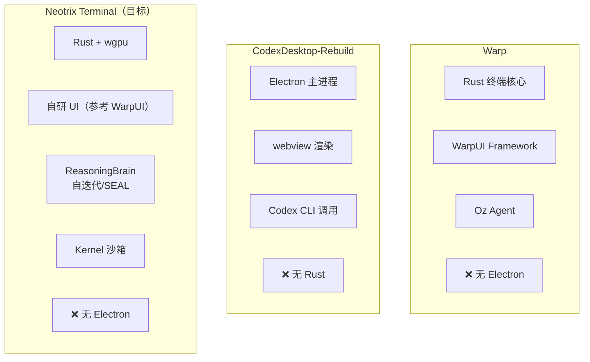
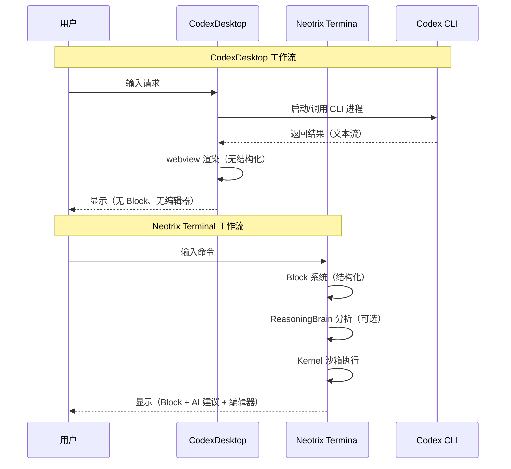
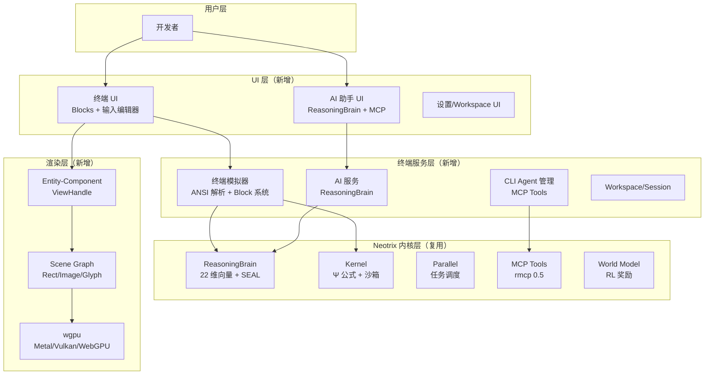

# Neotrix Terminal 完整竞品分析与整合方案
> 整合 Warp + CodexDesktop-Rebuild + Neotrix 内核，构建最终应用方案
> 最后更新：2026-04-29

---

## 1. 竞品全景对比

### 1.1 三足鼎立
| 维度 | Warp | CodexDesktop-Rebuild | Neotrix Terminal（设计） |
|------|------|---------------------------|------------------------|
| **定位** | AI 原生终端（Block 系统） | Codex CLI 桌面壳 | AI 终端 + ReasoningBrain 内核 |
| **技术栈** | Rust + Metal/OpenGL/WebGL | Electron + JavaScript | Rust + wgpu + Neotrix 内核 |
| **AI 能力** | Oz（GPT）+ 第三方 CLI Agent | Codex（OpenAI）单模型 | ReasoningBrain（22 维向量 + SEAL 自迭代） |
| **终端模拟** | 自研（NuShell/Alacritty 基础） | 无（调用外部终端） | 自研（Kernel 沙箱 + SCL） |
| **UI 框架** | WarpUI（Entity-Component） | Electron webview | 自研（参考 WarpUI，MIT） |
| **跨平台** | macOS ✅ / Linux ⚠️ / Windows ⚠️ | ✅ 全平台（Electron） | ✅ 全平台（wgpu） |
| **许可证** | AGPL v3（部分 MIT） | Apache-2.0 | MIT（完全） |
| **存储** | Diesel+SQLite + Warp Drive | 无（依赖 Codex CLI） | ReasoningBank + Neotrix 持久化 |
| **自进化** | 无（Oz 固定 GPT） | 无 | ✅ SEAL 循环 + RL 奖励 |
| **代码行数** | ~370MB, 4992 文件 | ~小（Electron 壳） | 目标 <10MB（核心 Rust） |

### 1.2 架构本质区别


**关键洞察**：
- **Warp**：重写终端，但 AI 能力固定（Oz 仅 GPT）
- **CodexDesktop**：不重写终端，只是给 CLI 套壳，无终端创新
- **Neotrix Terminal**：结合两者优势——终端创新（Block 系统）+ 更强 AI（ReasoningBrain）

---

## 2. CodexDesktop-Rebuild 深度分析

### 2.1 项目本质
**不是终端模拟器，而是 Codex CLI 的 Electron 包装器**：
```
CodexDesktop-Rebuild =
    Electron 主进程（管理窗口、IPC）+
    webview 渲染（显示 Codex 输出）+
    Codex CLI 进程调用（实际执行）
```

### 2.2 技术架构
| 层次 | 实现 | 说明 |
|------|------|------|
| **打包工具** | Electron Forge | 简化 Electron 打包、发布 |
| **主进程** | `src/.vite/build/` | Electron main，管理生命周期 |
| **渲染进程** | `src/webview/` | 前端界面，显示 Codex 输出 |
| **CI/CD** | GitHub Actions | 自动构建 macOS/Windows/Linux |
| **二进制** | `@cometix/codex` | 实际 Codex CLI 二进制 |

### 2.3 优势与劣势
**优势**：
1. **快速跨平台**：Electron 天生支持全平台
2. **复用 Codex**：直接调用官方 CLI，无需重写 AI 逻辑
3. **轻量壳**：代码量少，维护成本低

**劣势**：
1. **无终端创新**：不提供终端模拟，依赖外部终端或简单 webview
2. **AI 能力受限**：仅 Codex，无法切换模型或集成其他 Agent
3. **性能**：Electron 内存占用高（~100-200MB 基础）
4. **无自进化**：不包含 AI 模型微调或自迭代能力

---

## 3. 为什么 Neotrix Terminal 更好

### 3.1 技术路线对比
| 方面 | CodexDesktop（Electron 壳） | Neotrix Terminal（Rust 原生） |
|------|--------------------------|--------------------------------|
| **启动速度** | 慢（Electron 冷启动 ~2-3s） | 快（Rust 原生 ~0.3s） |
| **内存占用** | 高（~150MB+） | 低（~30-50MB） |
| **终端能力** | 无（依赖外部或简单 webview） | ✅ 完整 Block 系统 + 输入编辑器 |
| **AI 能力** | 单模型（Codex） | ✅ ReasoningBrain（多模型 + 自迭代） |
| **自进化** | 无 | ✅ SEAL 循环 + ReasoningBank |
| **终端执行** | 调用外部 CLI | ✅ Kernel 沙箱（安全） |
| **许可证** | Apache-2.0（但依赖 Closed Codex） | ✅ MIT（完全开源） |

### 3.2 用户体验对比


---

## 4. 整合后的最终架构

### 4.1 完整技术栈


### 4.2 核心优势总结
1. **终端创新**：Block 系统（Warp 启发）+ 输入编辑器
2. **AI 强大**：ReasoningBrain（超越 Warp Oz + Codex）
3. **原生性能**：Rust + wgpu，无 Electron 开销
4. **自进化**：SEAL 循环，越用越聪明
5. **完全开源**：MIT 许可证，无 AGPL 限制

---

## 5. 详细实施计划（整合版）

### 阶段 1：内核适配（1-2 天）
> 目标：让 Neotrix 内核能处理终端命令
1. 定义终端命令的 `Signal` 类型：
   ```rust
   // signal.rs 新增
   pub struct TerminalCommand {
       pub input: String,
       pub output: Vec<u8>,  // ANSI 转义序列
       pub exit_code: i32,
   }
   ```
2. 实现 ANSI 转义序列解析（参考 NuShell/Alacritty）
3. 验证：运行 `cargo check --lib` 零错误

### 阶段 2：渲染引擎（2-3 天）
> 目标：实现 wgpu 渲染管线
1. 集成 wgpu，创建 `render/` 模块
2. 实现三种图元（Rect/Image/Glyph），参考 Warp Scene Graph
3. 实现 Layer 系统和 RTree 命中检测
4. 验证：渲染一个红色矩形到窗口

### 阶段 3：UI 框架（2-3 天）
> 目标：Entity-Component-Handle 模式
1. 实现 `EntityId`（复用 `reasoning_brain/core.rs` 原子自增）
2. 实现 `ViewHandle<T>` + `WeakViewHandle<T>`
3. 实现事件系统（发布-订阅，参考 Warp）
4. 验证：`cargo test --lib ui_framework` 通过

### 阶段 4：终端模拟器（3-5 天）
> 目标：Block 系统 + 输入编辑器
1. 实现 Block 结构（关联 `Signal<TerminalCommand>`）
2. 实现输入编辑器（多行、光标、选择）
3. 集成到渲染管线，显示 Blocks
4. 验证：输入 `ls -la`，正确显示输出 Block

### 阶段 5：AI 集成（2-3 天）
> 目标：ReasoningBrain + MCP Tools
1. 对接 ReasoningBrain 到终端 UI
2. 实现 AI 建议（输入时实时提示）
3. 集成 MCP Tools，支持 Claude Code/Codex/Gemini CLI
4. 验证：输入命令，AI 给出建议

### 阶段 6：跨平台 + 优化（3-5 天）
1. 测试 macOS（Metal）、Linux（Vulkan）、Windows（Vulkan）
2. 性能优化：启动 <1s，渲染 60fps
3. 打包：`.app`、`.deb`、`.exe`、`.rpm`
4. 最终验证：`cargo test --lib` 全部通过

---

## 6. 风险与应对（更新版）

| 风险 | 应对方案 |
|------|---------|
| wgpu 学习曲线 | 仅实现三种图元，参考 Warp Scene Graph 简化 |
| Electron 竞品快速迭代 | 强调原生性能 + AI 自进化，差异化竞争 |
| ANSI 解析兼容性 | 复用 NuShell/Alacritty 成熟逻辑 |
| ReasoningBrain 集成复杂度 | 直接复用，无需修改内核 |
| 跨平台驱动兼容性 | wgpu 自动选择后端，优先测试 macOS |

---

## 7. 最终交付物

### 7.1 用户可下载
- **macOS**：`Neotrix Terminal.app.zip`（Universal Binary）
- **Linux**：`neotrix-terminal.deb` + `neotrix-terminal.rpm`
- **Windows**：`Neotrix-Terminal-Setup.exe`

### 7.2 开发者可得
- 完整源代码（MIT 许可证）
- 架构文档（`docs/NEOTRIX_TERMINAL_MASTER_PLAN.md`）
- 竞品分析（`docs/WARP_ANALYSIS_REPORT.md` + `docs/CODEX_DESKTOP_ANALYSIS.md`）

---

## 8. 参考资料（全部整合）

### 8.1 本地文件
| 文件 | 内容 |
|------|------|
| `AGENTS.md` | 操作流程、检查项 |
| `SOUL.md` | 声音规则（简洁、无安慰） |
| `USER.md` | ReasoningBrain 22 维向量、SEAL 循环 |
| `docs/WARP_CLONE_DESIGN.md` | Warp 复刻初稿 |
| `docs/NEOTRIX_TERMINAL_MASTER_PLAN.md` | 主计划（本文档前身） |

### 8.2 互联网资源
| 来源 | 核心要点 |
|------|---------|
| Warp GitHub | 34.1k stars、Rust、AGPL v3 |
| Warp 官方博客 | UI 框架难点、Block 系统、产品哲学 |
| CodexDesktop-Rebuild | Electron 壳、1076 stars、Apache-2.0 |
| wgpu.rs | Rust GPU 跨平台库 |
| Electron Forge | Electron 打包工具 |
| ANSI 转义序列 | VT100 标准、终端兼容性 |

---

*本文档整合 Warp、CodexDesktop-Rebuild、Neotrix 内核所有信息*
*最终方案：Rust 原生 + ReasoningBrain + wgpu，超越 Electron 壳和固定 AI 终端*
