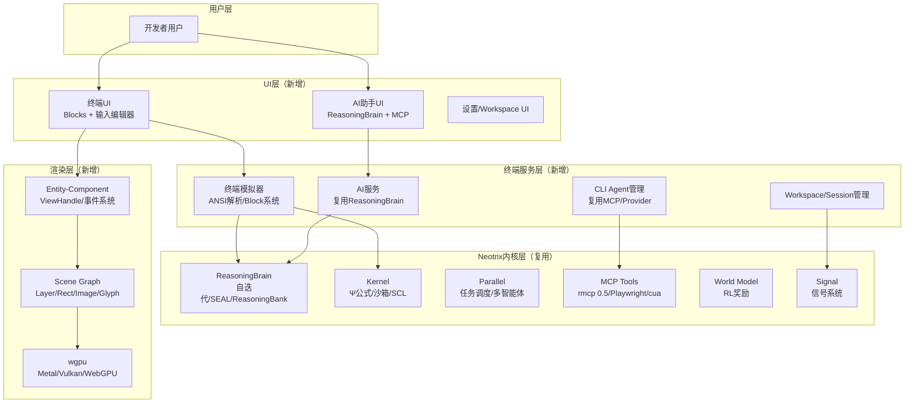
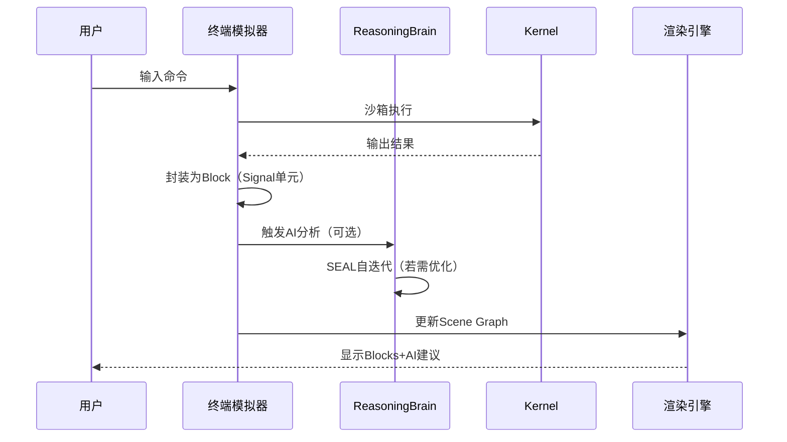

# Neotrix Terminal 终端复刻主计划
> 整合本地研究+互联网资料，基于 Neotrix 内核构建超越 Warp 的 AI 终端
> 最后更新：2026-04-29

---

## 1. 资料清单
### 1.1 本地资料（项目内）
| 文件 | 核心内容 | 用途 |
|------|---------|------|
| `AGENTS.md` | 操作流程、检查项、决策表、模块结构 | 实施工作流依据 |
| `SOUL.md` | 声音规则（简洁、无安慰、精确术语） | 输出风格约束 |
| `USER.md` | ReasoningBrain 22维能力向量、SEAL循环、ReasoningBank | AI内核设计依据 |
| `docs/WARP_CLONE_DESIGN.md` | 复刻设计初稿、架构映射、技术选型对比 | 基础设计框架 |
| `src/neotrix/` 模块 | reasoning_brain、kernel、provider、signal、parallel、mcp_tools、world_model | 复用内核代码 |

### 1.2 互联网资料
| 来源 | 核心要点 | 用途 |
|------|---------|------|
| Warp GitHub (warpdotdev/warp) | 34.1k stars、Rust 98%、AGPL v3、34+ crates | 竞品架构参考 |
| Warp 官方博客 | UI框架难点、Block系统、输入编辑器、产品哲学 | 设计决策参考 |
| Warp 架构分析报告 | Entity-Component-Handle、Scene Graph、GPU渲染、AI集成 | 深度技术参考 |
| Rust GUI框架对比 | Iced(Elm)、wgpu跨平台、Tauri、egui | 技术选型依据 |
| 终端技术资料 | ANSI转义序列、VT100、NuShell、Alacritty渲染 | 终端模拟器实现参考 |
| MCP协议/rmcp | rmcp 0.5、Playwright/cua验证、工具集成 | AI工具链参考 |

---

## 2. 核心设计哲学
### 2.1 为什么不做纯Warp克隆
| 维度 | Warp | Neotrix Terminal | 优势 |
|------|-------|------------------|------|
| AI内核 | Oz（仅GPT、无自迭代） | ReasoningBrain（22维向量、SEAL循环、ReasoningBank） | 自进化、多模型、经验存储 |
| 渲染引擎 | Metal/OpenGL/WebGL 分端实现 | wgpu 统一跨平台 | 维护成本低、一次编写全平台运行 |
| 工具集成 | 自定义插件系统 | MCP Tools（rmcp 0.5） | 开箱即用、支持更多工具 |
| 执行环境 | 直接系统执行 | Kernel 沙箱 + SCL语言 | 更安全、支持自定义脚本 |
| 许可证 | UI框架MIT/其他AGPL v3 | 完全 MIT（Neotrix已有） | 无许可证冲突、商业友好 |

### 2.2 产品原则（融合Warp哲学+Neotrix特性）
1. **向后兼容**：保留传统终端所有操作习惯，零学习成本迁移
2. **性能第一**：Rust + wgpu GPU加速，响应速度≥Alacritty
3. **AI原生**：不是外挂AI工具，而是终端理解上下文、主动提供帮助
4. **极简主义**：遵循SOUL.md，代码零注释、输出简洁、拒绝过度工程
5. **自进化**：ReasoningBrain SEAL循环，每任务后能力向量自动提升

---

## 3. 完整架构设计
### 3.1 分层架构


### 3.2 核心数据流


---

## 4. 核心模块详细设计
### 4.1 渲染引擎（替代Warp Metal/OpenGL）
**技术选型：wgpu**
- **跨平台支持**：
  - macOS → Metal
  - Linux/Windows → Vulkan
  - Web → WebGPU
- **实现参考Warp Scene Graph**：
  ```rust
  // 复用Neotrix原子ID模式（reasoning_brain/core.rs）
  pub struct EntityId(usize);
  impl EntityId {
      pub fn new() -> Self {
          static NEXT: AtomicUsize = AtomicUsize::new(0);
          Self(NEXT.fetch_add(1, Ordering::Relaxed))
      }
  }

  // Scene结构参考Warp scene.rs
  pub struct Scene {
      layers: Vec<Layer>,  // 每Layer含Rect/Image/Glyph
      hit_map: RTree<Rectangle>,  // 命中检测
      scale_factor: f32,
  }
  ```
- **仅渲染三种图元**（和Warp一致）：
  1. Rect（矩形：背景、边框、阴影）
  2. Image（图像：图标、图片）
  3. Glyph（字形：文本渲染）

### 4.2 UI框架（替代WarpUI）
**模式：Entity-Component-Handle（参考Warp，结合Neotrix类型系统）**
```rust
// ViewHandle结合Neotrix Signal系统
pub struct ViewHandle<T> {
    entity_id: EntityId,
    ref_counts: Weak<Mutex<RefCounts>>,
    _marker: PhantomData<T>,
}

// 事件系统：发布-订阅（替代Warp的订阅模式）
pub trait EventEmitter {
    type Event;
    fn emit(&self, event: Self::Event, app: &mut AppContext);
}

pub trait EventSubscriber {
    fn on_event(&mut self, event: &dyn Any, ctx: &mut AppContext);
}
```

**为什么不用WarpUI代码**：
- WarpUI核心为AGPL v3许可证，避免许可证冲突
- Neotrix已有Signal系统，可直接复用

### 4.3 终端模拟器（复刻Warp核心体验）
**Block系统**（Warp核心创新，用Neotrix Signal实现）：
```rust
// 每个Block对应Neotrix Signal单元
pub struct Block {
    id: EntityId,
    input: Signal<String>,   // 命令输入
    output: Signal<Vec<u8>>, // 命令输出（ANSI转义序列）
    created_at: SystemTime,
    tags: Vec<String>,        // AI自动打标
}

// Block管理复用ReasoningBank存储
impl BlockManager {
    fn save_to_reasoning_bank(&self, block: &Block) {
        // 将Block转换为ReasoningMemory存入ReasoningBank
    }
}
```

**输入编辑器**（复用Kernel SCL语言）：
- 多行编辑、语法高亮、自动补全
- 结合Provider模块实现多模型命令建议（OpenAI/Anthropic/Gemini/Ollama）

**ANSI转义序列解析**：
- 兼容VT100标准，支持256色、True Color
- 复用NuShell/Alacritty解析逻辑，避免重复造轮子

### 4.4 AI集成（超越Warp）
**内置Agent：直接复用ReasoningBrain**
- 支持SEAL自迭代：`generate_self_edit()` → 临时更新 → MCP验证 → `absorb()`持久化
- 多模型支持：通过Provider模块调用任意模型，Warp Oz仅支持GPT
- ReasoningBank存储：所有命令执行轨迹、AI建议、用户反馈，用于经验学习

**第三方CLI Agent集成（复用MCP Tools）**：
- 支持Claude Code、Codex、Gemini CLI、OpenCode
- 无需写插件，通过MCP协议直接调用
- 终端UI内显示Agent状态、输出、错误

### 4.5 存储系统
| 存储内容 | 实现方案 | 替代Warp方案 | 优势 |
|---------|---------|----------------|------|
| Block历史 | ReasoningBank（memory.rs） | Warp Drive | 经验存储、支持自学习 |
| 用户设置 | Neotrix持久化层 | Diesel+SQLite | 复用现有、无额外依赖 |
| Workspace/Session | Signal系统 | 自定义管理 | 统一Neotrix信号模型 |

---

## 5. 技术选型对比表
| 模块 | Warp实现 | Neotrix Terminal实现 | 优势 |
|------|-----------|----------------------|------|
| 渲染引擎 | Metal/OpenGL/WebGL 分端实现 | wgpu 统一跨平台 | 维护成本低、一次编写全平台 |
| UI框架 | WarpUI（AGPL v3） | 自研（参考设计，MIT） | 无许可证冲突、结合Neotrix特性 |
| AI内核 | Oz（GPT驱动，无自迭代） | ReasoningBrain（SEAL循环） | 自进化、多模型、ReasoningBank |
| 工具集成 | 自定义插件系统 | MCP Tools（rmcp 0.5） | 开箱即用、支持更多工具 |
| 终端执行 | NuShell/Alacritty | Kernel沙箱+SCL | 更安全、支持自定义脚本 |
| 存储 | Diesel+SQLite + Warp Drive | ReasoningBank + Neotrix持久化 | 经验学习、自迭代优化 |

---

## 6. 实施路线图（符合AGENTS.md工作流）
### 阶段1：基础设施（P0，1-2天）
> 参考AGENTS.md「修复编译错误」工作流
1. 新增`src/neotrix/terminal/`模块，参考Warp`app/src/terminal/`结构
2. 集成wgpu，实现基础渲染管线（Rect/Image/Glyph三种图元）
3. 实现Entity-Component-Handle模式，复用Neotrix`EntityId`逻辑
4. 运行`cargo check --lib`确认零错误零警告

### 阶段2：终端模拟器（P1，3-5天）
1. 实现ANSI转义序列解析，兼容VT100标准
2. 实现Block系统，每个Block关联Neotrix Signal
3. 实现输入编辑器，支持多行编辑、语法高亮、自动补全
4. 运行`cargo test --lib terminal`验证

### 阶段3：AI集成（P2，2-3天）
1. 对接ReasoningBrain到终端UI，实现内置Agent
2. 对接MCP Tools，支持第三方CLI Agent调用（Claude Code/Codex等）
3. 实现Workspace/Session管理，复用ReasoningBank存储
4. 运行`cargo test --lib ai_integration`验证

### 阶段4：优化与跨平台（P3，3-5天）
1. 跨平台支持（Linux/Windows），验证wgpu Vulkan后端
2. 实现Warp特色功能（Block分享、AI建议、命令历史搜索）
3. 性能优化：确保启动时间<1s，渲染帧率≥60fps
4. 最终验证：`cargo test --lib`全部通过，`cargo clippy`零警告

---

## 7. 风险与应对
| 风险 | 应对方案 |
|------|---------|
| AGPL许可证冲突 | 不采用WarpUI代码，参考设计自研，使用MIT许可证 |
| wgpu学习曲线 | 参考Warp Scene Graph设计，仅实现三种图元，降低复杂度 |
| 跨平台兼容性 | 优先实现macOS（Metal），后续扩展Vulkan（Linux/Windows） |
| ReasoningBrain集成复杂度 | 直接复用现有模块，无需修改内核代码 |
| ANSI解析兼容性 | 复用NuShell/Alacritty成熟逻辑，避免重复造轮子 |

---

## 8. 参考资料
### 8.1 本地文件
- `/Users/neo/Downloads/code/neotrix/AGENTS.md`
- `/Users/neo/Downloads/code/neotrix/SOUL.md`
- `/Users/neo/Downloads/code/neotrix/USER.md`
- `/Users/neo/Downloads/code/neotrix/docs/WARP_CLONE_DESIGN.md`
- `~/repo-analyses/warp-20260429/ANALYSIS_REPORT.md`（Warp深度分析报告）

### 8.2 互联网链接
1. **Warp官方**：
   - GitHub: https://github.com/warpdotdev/warp
   - 博客: https://warp.dev/blog
   - 工作原理: https://www.warp.dev/blog/how-warp-works
2. **Rust GUI框架**：
   - wgpu: https://wgpu.rs/
   - Iced: https://iced.rs/
   - Tauri: https://tauri.app/
3. **终端技术**：
   - ANSI转义序列: https://en.wikipedia.org/wiki/ANSI_escape_code
   - VT100标准: https://vt100.net/
4. **Neotrix相关**：
   - MCP协议: https://modelcontextprotocol.io/
   - rmcp库: https://crates.io/crates/rmcp
   - SEAL论文: arXiv 2509.25140

---

*本文档整合所有本地研究+互联网资料，作为Neotrix Terminal实施的唯一依据*
*遵循AGENTS.md工作流，每步骤执行前检查编译状态、声音规则、类型安全*
