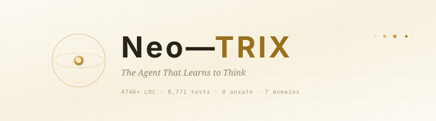

<p align="center">
  <picture>
    <source media="(prefers-color-scheme: dark)" srcset="docs/public/logo-animated.svg">
    
  </picture>
</p>

<p align="center">
  <b>The open-source agent that measures, analyzes, and improves its own reasoning.</b>
</p>

<p align="center">
  Not an IDE plugin. Not an LLM wrapper. A cognitive operating system.
</p>

<p align="center">
  <a href="https://img.shields.io/badge/license-MIT%2BProprietary-green"></a>
  <a href="#"></a>
  <a href="#"></a>
  <a href="#"></a>
  <a href="#"></a>
  <a href="#"></a>
  <a href="https://github.com/neo-trixs/NeoTrix/stargazers"></a>
</p>

<p align="center">
  <a href="https://github.com/neo-trixs/NeoTrix#-quick-start"><strong>Quick Start</strong></a> ·
  <a href="https://github.com/neo-trixs/NeoTrix#-architecture"><strong>Architecture</strong></a> ·
  <a href="https://github.com/neo-trixs/NeoTrix#-why-neotrix"><strong>Why NeoTrix</strong></a> ·
  <a href="https://github.com/neo-trixs/NeoTrix#-roadmap"><strong>Roadmap</strong></a> ·
  <a href="https://github.com/neo-trixs/NeoTrix/issues"><strong>Issues</strong></a>
</p>

---

## ✨ Quick Start

**CLI** (macOS / Linux — auto-detects OS + architecture):

```bash
curl -fsSL https://neotrix.ai/install | bash
```

**Desktop app** (Tauri):

```bash
brew install neotrix-desktop        # macOS
# or grab the installer from the releases page
```

**From source:**

```bash
cargo build --release
cargo run
```

**Stats at a glance**

| Metric | Value |
|---|---|
| Source files | 1,121+ Rust files |
| Test functions | 8,771 |
| Unsafe code | **0** |
| Architecture | 7 domains · 10 layers · 47+ subsystems |
| CLI commands | 50+ command modules |
| Desktop commands | 59 Tauri command modules |
| Version | 0.18.0 |

---

## 🧠 Why NeoTrix?

Every existing code agent — Claude Code, Codex, OpenCode, Cursor, Aider — follows the
same pattern: send a prompt to an LLM, parse the response, apply diffs. None of them
evaluate their own reasoning quality. None of them learn from past trajectories. None
of them get better over time.

NeoTrix is built on a different premise: **an agent that cannot inspect and improve its
own reasoning is a tool, not an agent.**

| Capability | NeoTrix | Everyone Else |
|---|---|---|
| Self-improving reasoning | SEAL loop + E8 | Static prompt→response |
| Cognitive metrics | Phi / FCS / USK | None |
| Knowledge representation | 4096-dim VSA HyperCube | No persistent knowledge |
| Attention routing | GWT (11 specialists) | No routing |
| Trajectory analysis | ClawBench | No self-diagnosis |
| Knowledge base | SQLite + FTS5 + embeddings + BM25 | No persistent KB |
| GEO Intelligence layer | Scorer / Visibility / Extractability | None |
| WASM tool sandbox | Fuel-metered, timeout-gated | None |
| Open source | MIT + proprietary exceptions | Mixed |
| Model agnostic | Any LLM | Vendor-locked |
| Language | Rust (0 unsafe) | Python / TypeScript |

---

## 🏗 Architecture

NeoTrix is organized as **7 domains** (factions) across **10 implementation layers**
(L1 Body → L10 Transcendent):

```
┌──────────────────────────────────────────────────────────────┐
│                    NT-CORE  (E8 引导者)                       │
│   E8 Hexagram engine · GWT attention · VSA HyperCube · Self   │
└──────────────────────────────────────────────────────────────┘
                             ↕
┌──────────────┬────────────────┬─────────────────┬─────────────┐
│  NT-WORLD    │  NT-MEMORY     │   NT-ACT        │  NT-SHIELD  │
│  (虚空探索者)  │  (知识守护者)   │   (行动执行者)   │   (影卫)     │
│  crawlers    │  SQLite KB     │   MCP tools     │  sandbox    │
│  fetchers    │  FTS5 search   │   autonomy      │  stealth    │
│  classifiers │  embeddings    │   orchestration │  fingerprint│
└──────────────┴────────────────┴─────────────────┴─────────────┘
                             ↕
┌──────────────────────────────────────────────────────────────┐
│                     NT-MIND  (进化工匠)                        │
│   SEAL self-evolution · distillation · skill crystallization  │
└──────────────────────────────────────────────────────────────┘
                             ↕
┌──────────────────────────────────────────────────────────────┐
│                     NT-IO  (界面使徒)                          │
│   LLM providers · CLI · web server · ACP · LSP · Tauri GUI   │
└──────────────────────────────────────────────────────────────┘
```

The stack is strictly layered: knowledge retrieval routes through GWT attention, which
feeds the E8 reasoning engine, which drives the SEAL loop, which is evaluated by
awakening metrics. Each layer has observable outputs that feed back upward.

### Core engines

| Engine | What it does |
|---|---|
| **E8 Reasoning Engine** | Deterministic 64-state reasoning space mapped through the E8 Lie algebra. 6 binary reasoning axes (Abstraction, Scope, Method, Depth, Mode, Stance). An Observer classifies each step as Productive, Oscillating, Stuck, or DeadEnd. |
| **SEAL Self-Iterating Loop** | 27-stage pipeline: snapshot → gap analysis → self-edit → apply → reward → absorb → store. Each stage can skip, promote a new champion, or roll back. |
| **VSA HyperCube** | 4096-dimension vector-symbolic knowledge store. MAP operations (bind / bundle / permute) for compositional knowledge representation and associative recall. |
| **GWT Attention Router** | Global Workspace Theory attention routing. 11 specialist modules compete for the global workspace via salience computation, with coalition formation and decay. |
| **ConsciousnessTree** | 11-branch meta-cognition loop (Soil → Roots → Trunk → Branches → Fruits → Core) tracking cross-domain health, module maturity, and evolution velocity. |
| **Awakening Metrics** | Phi / FCS / USK derived from Integrated Information Theory. Tracks `awakening_speed` as the EMA derivative of Phi. |
| **NT-SHIELD** | Zero-unsafe security layer: sandboxing, credential vault, proxy pool, fingerprint management, reasoning trace protection (PII / injection / divergence scans). |

---

## 🎯 Feature Highlights

- **E8 reasoning** — not probabilistic next-token prediction; a deterministic state
  machine over a geometrically meaningful state space. No neural network. No sampling.
- **Self-evolution** — the SEAL loop applies mutations, measures reward, learns
  rejections, and gets better without human retraining.
- **Dual-license open source** — MIT for the public core; proprietary exceptions only
  for the security layer (NT-SHIELD), meta-cognition core, and VSA engine.
- **Model-agnostic gateway** — any LLM provider via a pluggable provider interface;
  OpenAI-compatible server mode for OpenCode/Aider integration.
- **Persistent knowledge base** — SQLite-backed with FTS5 full-text search, KB
  embeddings, BM25 ranking, and quality-ranked retrieval with retraction support.
- **Governance safety** — triple-gated self-modification (BallVerifier + PCC Gate +
  Health Patrol). No override. No prompt-injection bypass.
- **WASM tool sandbox** — fuel-metered, timeout-gated, zero unsafe in core.

---

## 🚀 Roadmap

- **CLI release** — first public binary releases (macOS / Linux, x86_64 / aarch64)
  via the install script, Homebrew, and GitHub Releases.
- **Desktop app release** — Tauri-based GUI with command catalog, agent view,
  and live awareness panels.
- **LSP / ACP integrations** — language-server protocol and Agent Client Protocol
  surfaces for editor-native workflows.
- **Self-healing production loop** — daemonized background loop with 60s tick
  for absorption, repair, and governance checks.

> Release blockers and platform distribution tasks (code signing, sandboxing,
> package formats) are tracked in the
> [Release Checklist](docs/4-GUIDES/release-checklist.md).

---

## 📚 Documentation

- [Getting Started](docs/4-GUIDES/getting-started.md)
- [CLI Reference](docs/4-GUIDES/cli.md)
- [Desktop App](docs/4-GUIDES/desktop.md)
- [Configuration](docs/4-GUIDES/configuration.md)
- [API Overview](docs/3-API/overview.md)
- [Release Checklist](docs/4-GUIDES/release-checklist.md)

---

## 🤝 Get Involved

- **Star us** — helps more developers find NeoTrix
- **Try it**: `cargo run` and watch the SEAL loop iterate
- **Contribute**: Issues, PRs, and discussions welcome
- **Cite us**: `@misc{neotrix2026, title={NeoTrix: A Self-Evolving Cognitive Architecture}, url={https://github.com/neo-trixs/NeoTrix}}`

---

## 📄 License

Dual-licensed:

- **MIT License** — applies to the public portions of the codebase (CLI, GUI,
  frontend, integration code, and documentation). See [LICENSE](LICENSE).
- **Proprietary exceptions** — the NT-SHIELD security layer, ConsciousnessTree
  meta-cognition core, and VSA HyperCube engine are proprietary. See
  [LICENSE-EXCEPTIONS.md](LICENSE-EXCEPTIONS.md).

For commercial licensing of proprietary modules, contact via the
[GitHub repository](https://github.com/neo-trixs/NeoTrix).

---

<p align="center">
  
</p>
<p align="center">
  <em>Built with Rust. Driven by capability vectors. Evolving one SEAL loop at a time.</em>
</p>
<p align="center">
  <em>We think agents should be able to think about how they think.</em>
</p>
