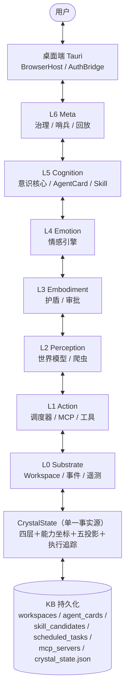
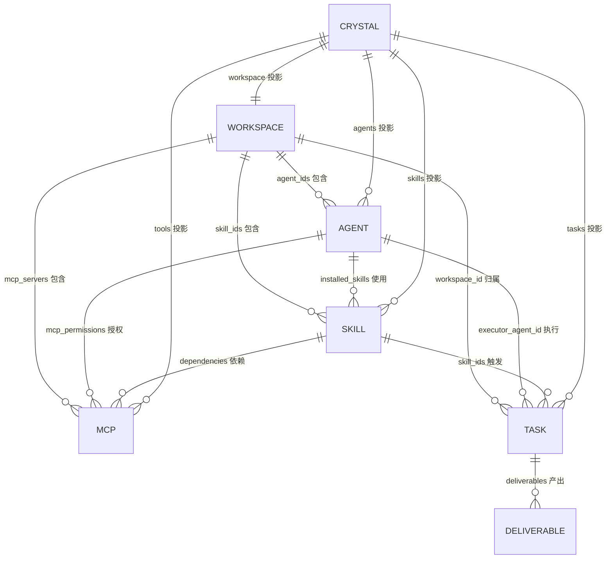
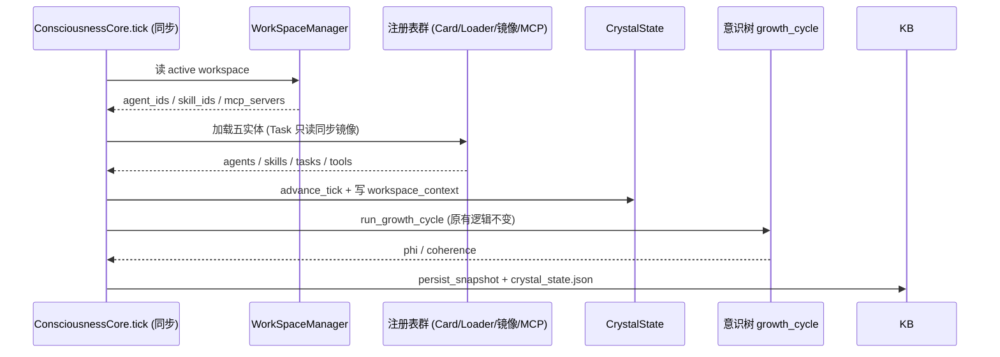
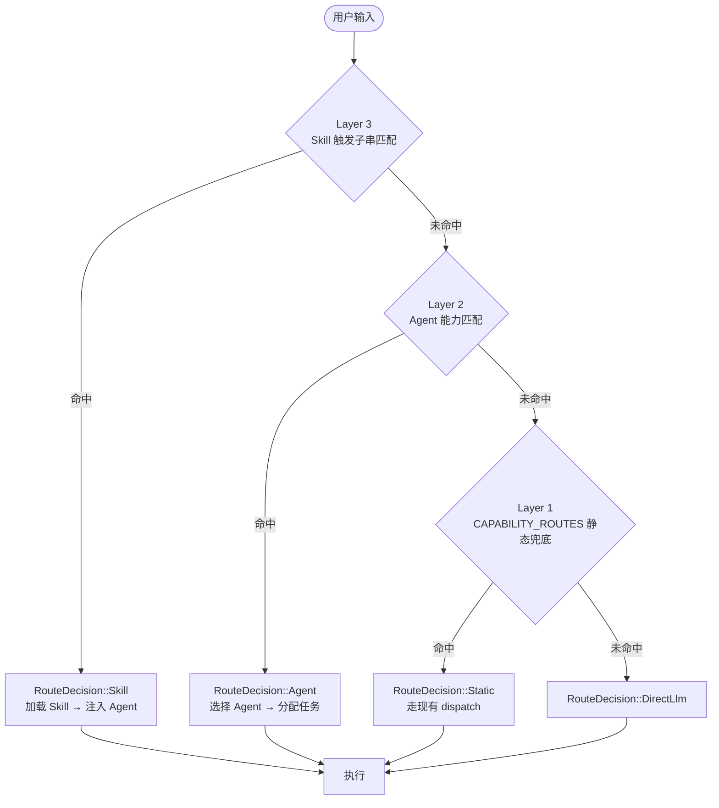
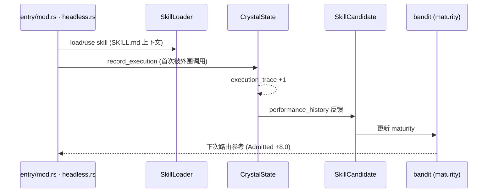
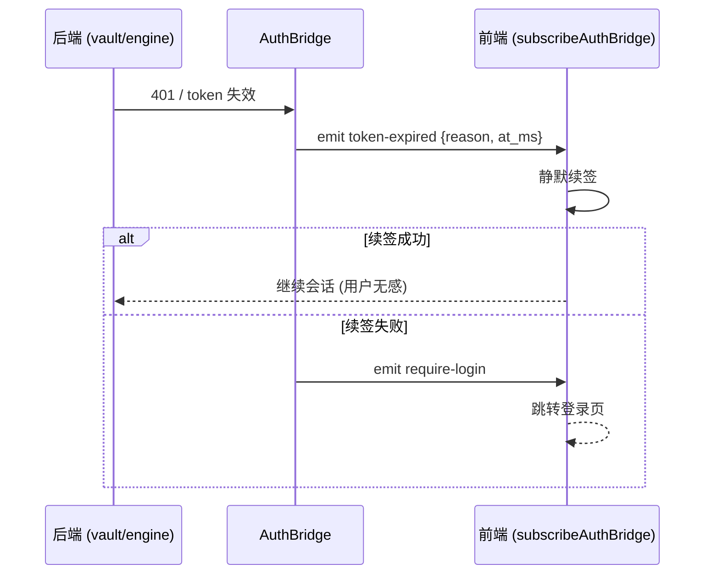
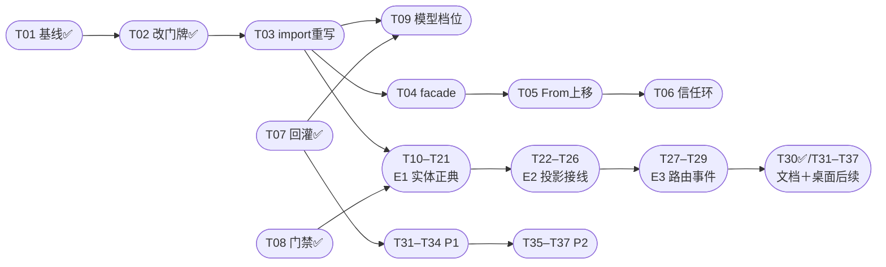

# NeoTrix 五实体架构图

> 图表即代码（Mermaid）。正典蓝图：`FIVE-ENTITY-BLUEPRINT-V3.md`；任务清单：`FIVE-ENTITY-TASK-CHECKLIST.md`。
> 对应代码版本：2026-09-22（含 P0-3/P0-2/E0.0 已落地项）。

---

## 图1 全景：六层＋晶体内核＋桌面端

## 图2 五实体关系（ER）

## 图3 tick 接线时序（E2）

## 图4 三层路由（E3）

## 图5 首条数据流（E2 最小闭环）

## 图6 401 回灌链（P0-3 ✅已落地）

## 图7 实施路线依赖（T01–T37）

---

## 图例与状态（2026-09-22）

- ✅ 已落地：T01 / T07 / T08 / T30（P0-2 门禁逻辑 2/2 独立通过；P0-3 tsc exit 0）
- ⬜ 下一個：T02 ✅（本窗刚完成）→ T03 → T09
- 约束：tick 同步（Scheduler 异步墙→同步镜像）；新增字段 `#[serde(default)]`；生产禁 unwrap；`nt_` 前缀。
