# NeoTrix 总蓝图：按图施工手册

> **版本**: 1.5.9 | **日期**: 2026-09-21 | **状态**: 可执行 (Executable)
> **变更记**: v1.6.0 EQ-04 执行（死守卫删除 175 行＋13/13 实跑绿＋注册表 8→6；
> SIM-35 建档）。v1.5.9 EQ-01/02/03 闭环（B1 本地 3/3＋ADR-0002 关闭＋ADR-0003 死守卫退役决议；SIM-34 建档）。
> v1.5.8 提交清场＋暂存竞态记录＋结尾标记归一（SIM-33 建档）。
> v1.5.7 有序执行清单（EQ-01~20＋完成定义＋阻塞边；SIM-32 建档）。
> v1.5.6 B2 守卫落地（ConfidenceLabelFitness＋6 单测，14/14 实跑绿；
> 死守卫发现 Layer/Core 扫不存在目录；SIM-31 建档）。v1.5.5 门禁复测＋聚合器（12 组／111 持平零进展；`make audit-all`；
> SIM-30 建档）。v1.5.4 提交清场＋V 构件定级＋R-P111 指针落地（SDB-REGISTRY v0.5；
> SIM-29 建档）。v1.5.3 SDB 调用链追踪收敛（loops 系脚手架，活 P 点仅 dispatcher；
> SDB-REGISTRY v0.4；SIM-28 建档）。v1.5.2 A组收尾＋B1合入CI见证（层脚本去注水真数197／SDB v0.3／阅读索引；
> P1-05 类型＋3单测待CI首绿，ADR-0002；SIM-27 建档）。v1.5.1 实施影响面分析（5–8% 广度／<10 行为点；SDB 烘焙要求进 P1-03；
> SIM-26 建档）。v1.5.0 第六轮吸收（API 治理/Judge 去偏/故障注入/Diátaxis；SIM-25 建档）。v1.4.0 全域审计＋第五轮吸收（2191 文件/719k 行快照；sysctl 特许登记；
> NTS-E09/D09/B13；DORA 进仪表盘；SIM-24 建档）。v1.3.5 核心建议修复轮（R-P 打捞 19+1＋31 悬空；他人 4 错证灭；
> hook -j4 抗 OOM；lib/test 双 profile 实跑绿；SIM-23 建档）。v1.3.4 经验吸收＋全量总验收尾（12 教训成文；围栏总验唯一例外 ARCHITECTURE.md
> 转 finding 不越权修；7 核心建议；SIM-22 建档）。v1.3.3 cli 升级残留审计（100 文件删除零悬空；4 错归属他人进行中；
> 脚本位 4/4；SIM-21 建档）。v1.3.2 P0 门 override 提交事件（环境 OOM＋他人 4 错；§0.1 首战；
> SIM-20＋ADR-0001 双证；CI 兜底）。v1.3.1 过期信息清理（TODO 基线挂 STALE＋全仓占位符盘点为零 action；
> 有意删 0 行代码；SIM-19 建档）。v1.3.0 全图审计重绘（D-00 纳入 D-13/D-14/正典轨；D-02 补 H-08 行；
> D-04 纳入 V-1 评分；D-05 标 P3/P4 门；新增 §19 D-15 治理接线；SIM-18 建档）。
> v1.2.8 旧口径清零（宪法注释/SKILL 换正典口径；E0689 系 kill 残留污染，重编即消；
> 11/11 单测；SIM-17 建档）。v1.2.7 意识指导为先（宪法加载器接正典NT-STD＋旧引用替换＋§0.1 优先级教义；
> 11/11 单测实跑绿，含治愈先前已红项；SIM-16 建档）。v1.2.6 登记表时序重排＋Dependabot 补 cargo＋deny 三重奏复核（维持分工，FLAG 留 P3；
> SIM-15 建档）。v1.2.5 旧规则归档＋新模板套件切换（archive 双文件＋桩＋templates×4＋SKILL 指针；
> SIM-14 建档）。v1.2.4 规则熔炼为 NT-STD 1.0 标准版（64 条款＋三附录；SIM-13 建档；
> 发现 R-P111–160 无正本→SUSPENDED）。v1.2.3 吸收 Round4（ABSORPTION-ROUND4.md +
> R-P254–R-P257 + release.yml 路径修复 + SIM-12 建档；互操作/评估/发布/Prompt 四机制）。v1.2.2 吸收 Round3（ABSORPTION-ROUND3.md +
> R-P250–R-P253 + fuzz-ready 脚本 + SIM-11 建档；路由/遥测/记忆/fuzz 四机制）。v1.2.1 吸收 Round2（ABSORPTION-ROUND2.md +
> R-P246–R-P249 + build-surface 脚本 + ADR 模板 + SDB v0.2 评分制）；SIM-10 建档。v1.2.0 新增 SIM-first 制度（§18 D-14 +
> SIM-PROTOCOL.md + R-P241–R-P245），D-03 接入 SIM-preview 状态；SIM-09 试跑 P1-04。
> v1.1.0 新增 §15 模拟日志 (SIM-01~SIM-08) 与 D-13 能力补齐矩阵；
> 修正 P0 基线（T1 清单过期，首步改为重跑 check 生成新清单）；新增 SDB-REGISTRY 与 Makefile 门禁 targets 落点。
> **定位**: 本文件是全部架构工作的**唯一图纸索引**。不动手先看图，动手只做图上标出的那一块。
> **渲染**: 所有流程图使用 Mermaid (GitHub 原生渲染)。纯文本环境看 ASCII 摘要即可。
> **配套**: NEOTRIX-IMPLEMENTATION-ROADMAP.md (WHEN/WHO/DONE) / PYRAMID (WHERE) /
> REFACTORING-GUIDE (WHAT) / ABSORPTION-GRAPHIFY (HOW) / dev-rules (纪律)

---

## 使用方法：按图施工四步

```
STEP 1  定位  -> 查 §1 图索引表，按任务类型找到图编号 (D-01~D-12)
STEP 2  读图  -> 只读该图 + 其下索引表，不读全文
STEP 3  填充  -> 按索引表逐格填充：文档引用 -> 代码路径 -> 验证命令
STEP 4  消项  -> 该图索引表全绿 + 门禁通过，方可进入下一图
```

**铁律**: 图上没有的节点不做；索引表没有验证命令的任务不开工；
一次只填充一张图的一格。

---

## §1 图索引总表

| 图号 | 图名 | 回答的问题 | 配套文档章节 | 配套代码/脚本 |
|------|------|-----------|-------------|--------------|
| D-00 | 总图：图纸之间关系 | 先看哪张，后看哪张 | 本文件 §2 | — |
| D-01 | 金字塔层级与依赖方向 | 我动的是哪一层，能依赖谁 | PYRAMID §3 | scripts/check-layer-deps.sh |
| D-02 | 越层热点地图 | 违规集中在哪几个文件 | ROADMAP §1.2 | check-layer-deps.sh 实测输出 |
| D-03 | 任务生命周期状态机 | 任务现在处在哪个状态 | ROADMAP §5-§6 | .github/workflows/*.yml |
| D-04 | SDB 时序 | LLM 提议如何变成系统动作 | REFACTORING §3.3 | nt_core_policy / nt_core_gate |
| D-05 | CI 八门流水线 | 代码要过哪几道门 | ROADMAP §8.2 | ci.yml / deny.yml / security-scan.yml |
| D-06 | 流水线阶段模式 | 新流水线怎么拆阶段 | GRAPHIFY §2.2 | nt_core_event / 各 pipeline |
| D-07 | 阶段甘特 | 现在是第几周，该交付什么 | ROADMAP §5-§6 | TODO.md |
| D-08 | 节点卡索引 | 哪张卡归谁，何时做 | ROADMAP §7 | 各层目录 |
| D-09 | 数据流 | 请求从进到出走哪条路 | REFACTORING §5.1 | nt_action_facade / gateway |
| D-10 | 质量追溯链 | 需求→ADR→代码→测试→门→指标 | REFACTORING §2 | ADR / fitness / llvm-cov |
| D-11 | 上帝视角决策树 | 每个动作的三问怎么过 | ROADMAP §0.2 | PR 模板检查单 |
| D-12 | 回滚流程 | 改坏了怎么退回去 | ROADMAP §7 各卡回滚行 | git + re-export 别名 |
| D-14 | SIM 预演环 | 动手前怎么证伪与补齐 | SIM-PROTOCOL.md 全文 | SIM 登记表 |
| D-15 | 治理运行时接线 | 宪法加载了什么规则 | SIM-PROTOCOL.md §14 | nt_core_self_constitution.rs |

---

## §2 D-00 总图：图纸之间关系

### 目的
一张图讲清 16 张图的分工与阅读顺序。新人只看本图即可开工。

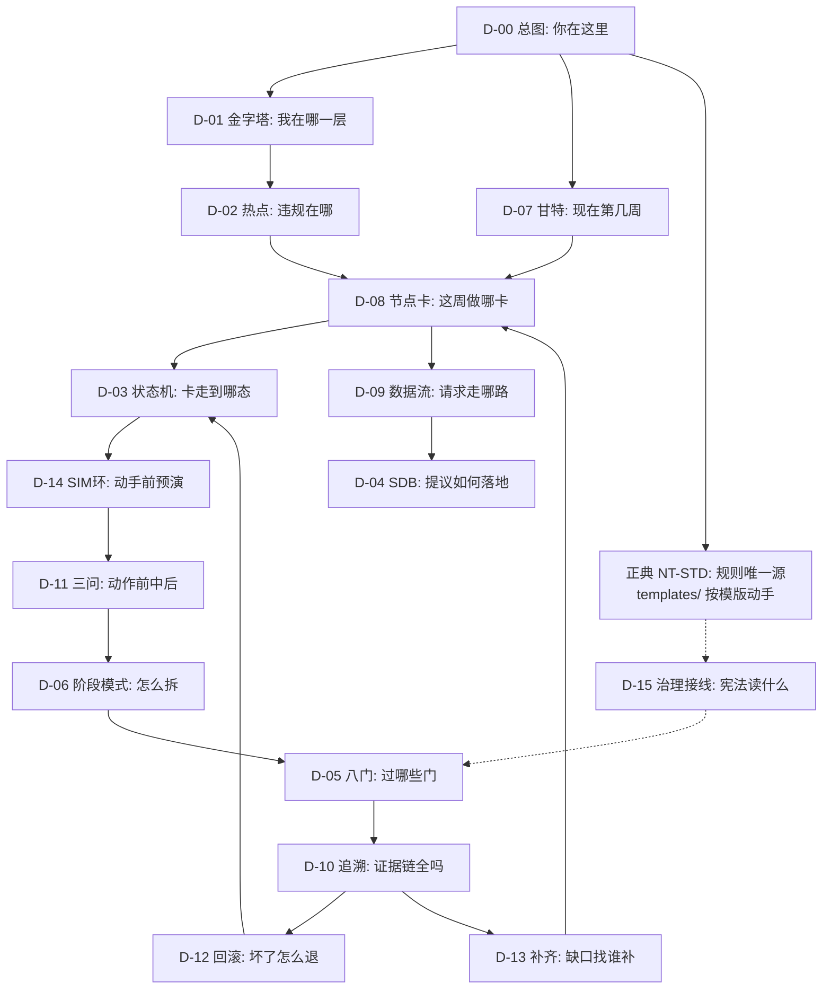

### 索引

| 节点 | 含义 | 下一步 |
|------|------|--------|
| D-00 | 入口，总览 | 按任务类型跳 D-01 或 D-07 |
| D-01/D-02 | 空间定位：层＋热点 | 跳 D-08 领卡 |
| D-07/D-08 | 时间定位：周＋卡 | 跳 D-03 跟踪状态 |
| D-03/D-14/D-11 | 执行：状态＋预演＋三问 | 跳 D-06/D-04 动手 |
| D-05/D-10 | 验证：门＋证据 | 跳 D-12 兜底 / D-13 补齐 |
| D-15/正典 | 治理：宪法读什么＋规则唯一源 | 实现前确认接线与模版 |

ASCII 摘要：定位(层/周) → 领卡 → 跟踪态 → 三问 → 动手 → 过门 → 留证 → 可滚。

---

## §3 D-01 金字塔层级与依赖方向

### 目的
任何代码改动先回答：我在 L 几？能 import L 几？答案只能是"本层及以下"。

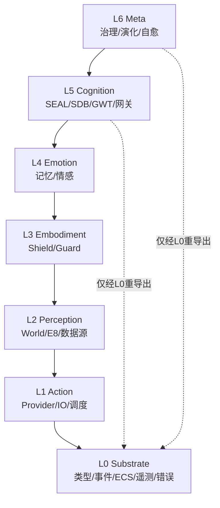

### 索引

| 层 | 目录 | 唯一出口 | 允许依赖 | 验证 |
|----|------|---------|---------|------|
| L0 | neotrix-core/src/l0_substrate/ | 无（被依赖） | 无外部 | cargo deny |
| L1 | neotrix-core/src/l1_action/ | nt_action_facade | L0 | check-layer-deps.sh |
| L2 | neotrix-core/src/l2_perception/ | 注册表 | L1,L0 | architecture_constraints |
| L3 | neotrix-core/src/l3_embodiment/ | l1_facade 转出 | L2,L1,L0 | security-scan |
| L4 | neotrix-core/src/l4_emotion/ | 模块级 | L3以下 | memory_pipeline tests |
| L5 | neotrix-core/src/l5_cognition/ | nt_cognition_facade | L4以下 | SDB tests + deny |
| L6 | neotrix-core/src/l6_meta/ | 模块级 | L5以下 | healing tests |

例外通道（仅 3 条，季度复审）：nt_core_cross_layer / nt_core_kb_primitives / nt_core_memory_asset。

---

## §4 D-02 越层热点地图（实测基线 2026-09-21）

### 目的
把抽象的"不要越层"变成具体的文件清单。P1 消减按此图逐点拔除。

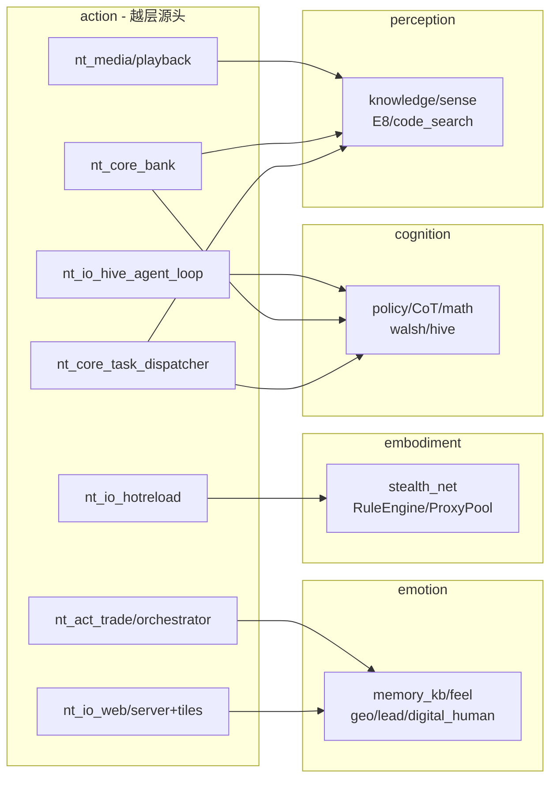

### 索引（逐点处置，三选一：下沉 L0 / 走 Facade / L0 重导出）

| 热点 | 源文件 | 目标层 | 推荐处置 | 对应卡 |
|------|--------|--------|---------|--------|
| H-01 | nt_core_task_dispatcher.rs | L2+L5 | 政策/CoT 接口下沉 L0 | NODE-L1 |
| H-02 | nt_core_bank/* (6 处 TaskType) | L2 | TaskType 下沉 L0 | NODE-L1 |
| H-03 | nt_io_web/server+tiles+proxy | L4 | 经 memory Facade，不直引 | NODE-L1 |
| H-04 | nt_io_hotreload | L3 | 经 shield Facade，不直引 | NODE-L1 |
| H-05 | nt_media/playback | L2 | source 类型下沉 L0 | NODE-L1 |
| H-06 | nt_io_hive_agent_loop | L5 | hive 接口下沉 L0 或 Facade | NODE-L1 |
| H-07 | nt_act_trade/orchestrator | L4 | lead 类型下沉 L0 | NODE-L1 |
| H-08 | bank/search(余弦×3)+bank/mod(Walsh) | L5(math 实住 L5) | 纯函数优先下沉 L0，索引走 Facade | NODE-L1(P1-02 首批) |

规则：每点独立 ADR 行项；改完一点跑一次层脚本；周环比数必须下降。
H-08 落在上图 B→T5 边上（T5 含 math），不另画边，见 §17。

---

## §5 D-03 任务生命周期状态机

### 目的
任何任务在任意时刻只能处于一个状态。状态推进只能走箭头，不能跳。

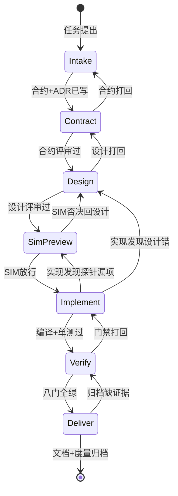

### 索引

| 状态 | 进入条件 | 出口条件 | 证据 | 负责 |
|------|---------|---------|------|------|
| Intake | 有问题描述 | 有合约草案+ADR 号 | issue/ADR 草案 | Owner |
| Contract | 合约草案齐 | 合约评审签字 | 合约文件+签字 | Architect |
| Design | 合约已冻 | 设计评审签字 | 边界 ADR+阶段表 | Architect |
| SimPreview | 设计已冻 | SIM放行(GO/附条件) | SIM记录+证据+缺口+落点 | Dev |
| Implement | SIM已放行 | 编译+单测绿 | check+test log | Dev |
| Verify | 代码已交 | 八门全绿 | CI 全绿截图 | QA |
| Deliver | 门禁全绿 | 文档+度量归档 | README+仪表盘 | Owner |

打回不丢人：打回箭头是正常路径，跳过箭头才是事故。

---

## §6 D-04 SDB 时序（L5 刚性契约）

### 目的
LLM 的一句话变成系统动作，必须经过四步＋评分。缺任何一步 = BLOCKER；二值糊弄 = BLOCKER。
现状（SIM-27）：P 实点 3（dispatcher），V/C/R 实现 0——以上是目标态，进度见 SDB-REGISTRY v0.3。

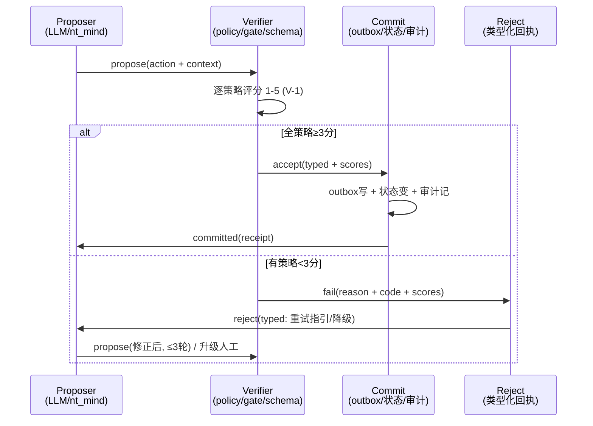

### 索引

| 步骤 | 代码落点 | 必须物 | 禁止物 |
|------|---------|--------|--------|
| Propose | nt_mind / SEAL | 上下文+预算(步数/token/时长) | 无预算裸调 |
| Verify | nt_core_policy / nt_core_gate / schema | schema+策略+状态机谓词三件套 | 跳过验证直写 |
| Commit | nt_core_event + persistence + audit | outbox+状态+审计原子 | 先副作用后记账 |
| Reject | nt_core_error / gate | 类型化错误码+重试指引 | 字符串抛错 |
| Score | SDB-REGISTRY v0.2 §Verifier |逐策略1-5分,<3修订,风险分级深度 | 二值糊弄过去 |

SDB 登记表（P1-03）：枚举全部 LLM→动作点，每点填四格，空一格即 BLOCKER。

---

## §7 D-05 CI 八门流水线

### 目的
代码合入前要过的八道门。门是串行的，前门红后面不用看。

```mermaid
graph TD
    PR[PR 提交] --> G1[G1 编译<br/>cargo check]
    G1 -->|绿| G2[G2 依赖<br/>deny+audit]
    G1 -->|红| STOP[阻断: 不可合入]
    G2 -->|绿| G3[G3 单测<br/>nextest lib]
    G2 -->|红| STOP
    G3 -->|绿| G4[G4 架构<br/>fitness+层脚本+约束测试]
    G3 -->|红| STOP
    G4 -->|绿| G5[G5 安全<br/>clippy严+secret+SBOM]
    G4 -->|红| STOP
    G5 -->|绿| G6[G6 集成<br/>tests全套+混沌周]
    G5 -->|红| STOP
    G6 -->|绿| G7[G7 性能<br/>criterion 回退>5%阻断<br/>(P3起卡点)]
    G6 -->|红| STOP
    G7 --> G8[G8 文档<br/>README+ADR+API docs<br/>(P4起卡点)]
    G8 --> MERGE[合入]
```

### 索引

| 门 | 命令 | 位置 | 红灯处置 |
|----|------|------|---------|
| G1 | cargo check --lib -p neotrix | pre-commit+CI | 修编译，TODO T1 |
| G2 | cargo deny check / audit | deny.yml/security-audit | 升级替换或豁免 ADR |
| G3 | cargo nextest run --lib | ci.yml test | 补单测 |
| G4 | fitness + check-layer-deps + architecture_constraints | ci.yml/自测 | 按 D-02 消减 |
| G5 | clippy -D warnings / gitleaks / cyclonedx | lint/security-scan | 修 lint/换密钥 |
| G6 | cargo test --test constraints/integration + 红队对子 (NTS-E09, P3) | ci.yml | 修集成/混沌复现/拒答率 |
| G7 | criterion (P3 起卡点) | bench/performance | 优化或 ADR 豁免 |
| G8 | doc 检查 (P4 起卡点) | docs-deploy | 补 README/ADR |

---

## §8 D-06 流水线阶段模式（新建流水线照此拆）

### 目的
graphify 模式：阶段独立、 plain 类型通信、无共享可变状态。可独立测试/缓存/重放。


### 索引

| 阶段 | 输入→输出 | 模块 | 约束 |
|------|-----------|------|------|
| Detect | 原始 → 扫描摘要 dict | nt_core_detect (L0) | 只读扫描，不改源 |
| Extract | 路径 list → nodes+edges | nt_core_extract (L1) | schema 校验 (validate) |
| Build | 抽取 → 图 | nt_core_graph (L1) | 无环检查 |
| Analyze | 图 → 分析结果 | nt_core_analyze (L2) | 纯函数，无 IO |
| Report | 图+分析 → 报告 | nt_core_report (L5) | 置信标签保留 |
| Export | 图+报告 → 目标格式 | nt_core_export (L1) | 单格式一函数 |

新流水线评审问题：阶段能单独测吗？通信是 plain struct 吗？能重放吗？三否一定即打回。

---

## §9 D-07 阶段甘特（20 周）

### 目的
时间轴上只看三件事：现在第几周、本周交付什么、里程碑过没过。

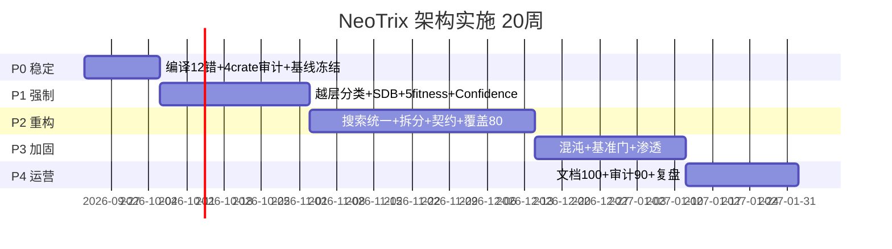

### 索引

| 里程碑 | 日期 | 退出标准速查 |
|--------|------|-------------|
| M0 基线冻结 | W2 末 | check 绿 + 快照入仓 + CI 层检查可见 |
| M1 方向受控 | W6 末 | 越层全分类 + SDB 登记 100% + 新 fitness 绿 |
| M2 结构收敛 | W12 末 | 去重归零 + 拆分 ADR + 覆盖 80% |
| M3 反脆弱证明 | W16 末 | MTTR 可复现 + 基准/覆盖门 + 安全零 BLOCKER |
| M4 可移交 | W20 末 | 文档 100% + 审计 90 + 复盘归档 |

今天是第几周 → 看甘特 → 找对应 P → 开 §10 的卡。

---

## §10 D-08 节点卡索引

### 目的
8 张卡，一卡一主。领卡前确认：前置卡 done，本卡有 Owner。

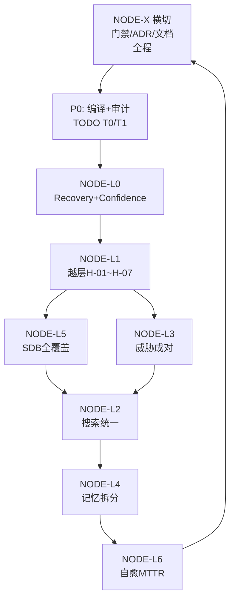

### 索引

| 卡 | Owner | 前置 | 本期动作 | Done 定义 |
|----|-------|------|---------|-----------|
| NODE-X | Architect | — | 八门接线+ADR 模板 | CI 全绿 |
| P0 | Dev | X | 12 错+4 审计+快照 | check 绿+表更新 |
| NODE-L0 | L0 owner | P0 | Recovery+Confidence+validate | 单测+deny |
| NODE-L1 | L1 owner | L0 | H-01~H-07 逐点 | 层脚本递减 |
| NODE-L5 | L5 owner | L1 | SDB 登记+测试 | 登记 100% |
| NODE-L3 | L3 owner | L1 | 威胁表+逃逸测 | BLOCKER 零 |
| NODE-L2 | L2 owner | L5/L3 | 搜索统一+E8 | 去重归零 |
| NODE-L4 | L4 owner | L2 | 拆分+耐久 | 恢复测试过 |
| NODE-L6 | L6 owner | L4 | 混沌+MTTR | <30s 可复现 |

详细任务见 ROADMAP §7 各卡（目标/输入/输出/任务/门禁/验证/回滚）。

---

## §11 D-09 数据流（请求从进到出）

### 目的
线上请求只有一条主路。偏离此路的新链路需 ADR。

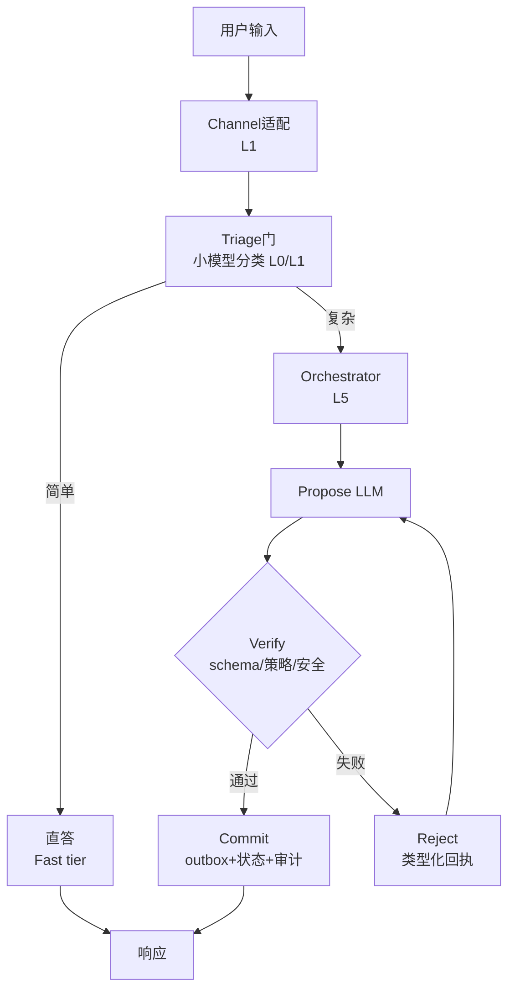

### 索引

| 段 | 层 | 关键约束 | 观测 |
|----|----|---------|------|
| 适配 | L1 | 输入 7 阶段防御 (R-P161) | 审计日志 |
| 分流 | L0/L1 | 小模型先行，省 80% 算力 | 分流比 |
| 编排 | L5 | 步数/token/时长三预算 | trace |
| 验证 | L5/L3 | 见 D-04 | verifier verdict |
| 提交 | L1/L0 | 先记账后副作用 | outbox+审计 |

---

## §12 D-10 质量追溯链（证据链）

### 目的
任何指标都能一键追到：谁要求的、谁决定的、代码在哪、测试在哪、门怎么过的。


### 索引

| 环 | 载体 | 完整性规则 |
|----|------|-----------|
| QR | ROADMAP §9 表头+REFACTORING §2 场景 | 每个指标有 SMART 定义 |
| ADR | 附录 B 六项 + ISO 标签 | 无标签不评审 |
| CODE | NODE 卡任务行 | 引用路径精确到文件 |
| TEST | 各层测试文件 | 安全缓解必成对 (R-P239) |
| GATE | D-05 八门 | 红灯有处置记录 |
| MET | §9 仪表盘 | 缺数标 TBD，不填 0 |

抽查法：随机抽一个指标，5 分钟内走完六环，走不完即追溯断裂，开任务补。

---

## §13 D-11 上帝视角决策树（每动作必过）

### 目的
把"上帝视角"变成可执行的三次 yes/no。任一 NO 即停手。

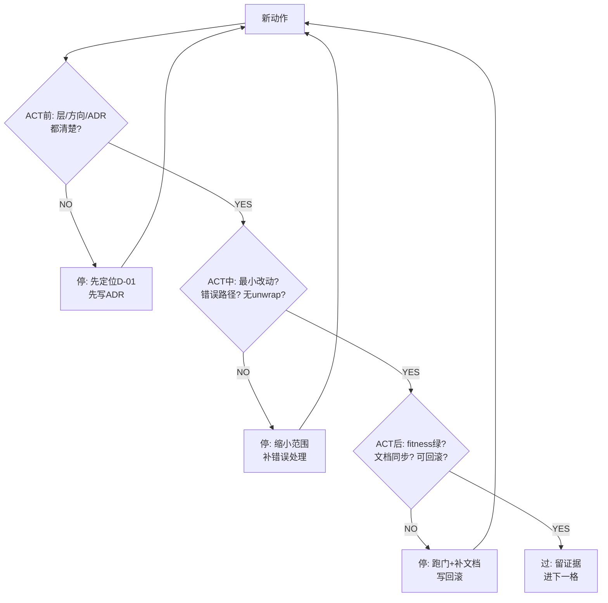

### 索引

| 问 | 检查项（PR 模板原文） | 不过的代价 |
|----|---------------------|-----------|
| ACT 前 | 层与方向 / ADR+标签 / 影响面 | 越层返工 ×10 |
| ACT 中 | 最小改动 / 错误路径 / 无 unwrap / 无阻塞 async | 线上事故 |
| ACT 后 | fitness+层脚本 / 文档同步 / 可回滚 / 度量更新 | 漂移+不可退 |

---

## §14 D-12 回滚流程（兜底）

### 目的
每个改动都有退路。回滚也是正常路径，不是失败。

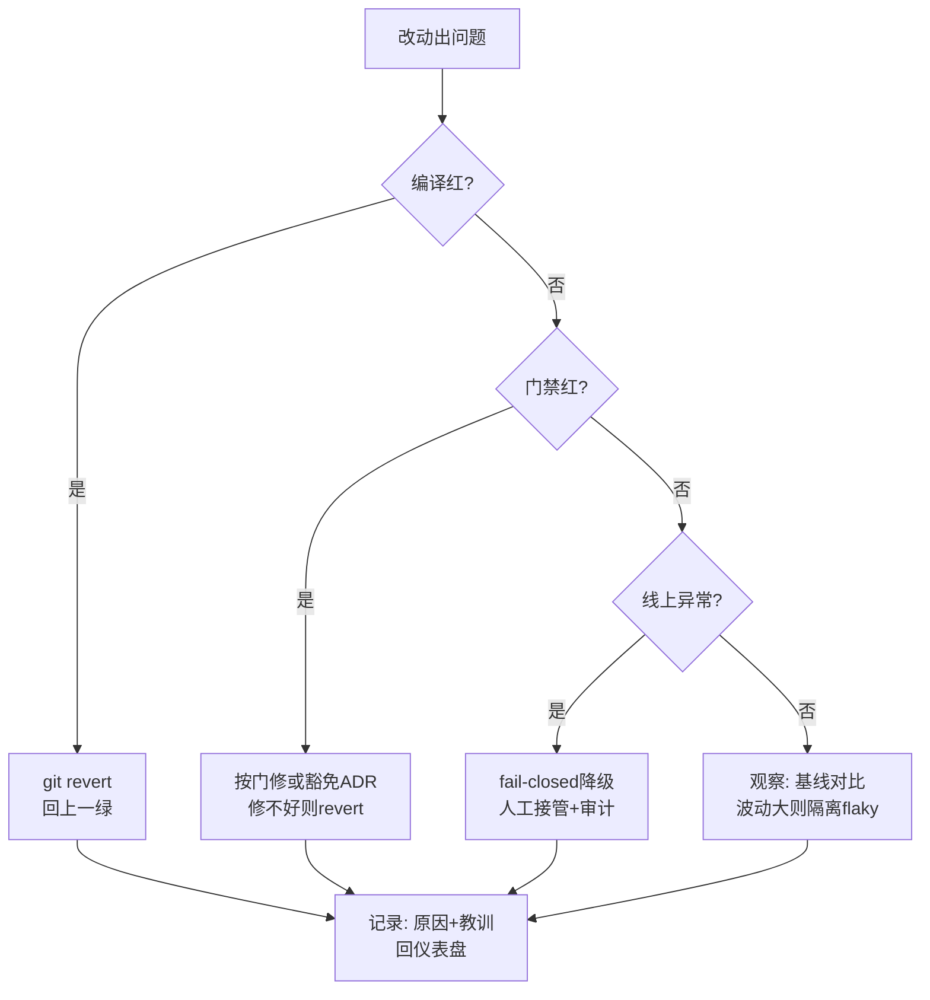

### 索引

| 情形 | 首选动作 | 时限 | 事后 |
|------|---------|------|------|
| 编译红 | revert | 即时 | 原因入 ADR |
| 门禁红 | 修/豁免二选一 | 24h | 豁免需签字 |
| 线上异常 | 降级+接管 | 分钟级 | 事故复盘 |
| 性能波动 | 隔离观察 | 3 次复跑 | 标 flaky |

回滚手段预置：re-export 别名一周期 / 存储格式版本化 / verifier 默认 fail-closed / 策略只紧不松。

---

## 附录：图纸—文档—代码总对照

| 图 | 精读文档位 | 动手代码位 | 验证命令 |
|----|-----------|-----------|---------|
| D-01 | PYRAMID §3 | 各层目录 | check-layer-deps.sh |
| D-02 | ROADMAP §1.2 | D-02 索引 7 热点文件 | rg 实测 |
| D-03 | ROADMAP §5-§6 | .github/workflows | CI 状态页 |
| D-04 | REFACTORING §3.3 | policy/gate/event/error | SDB tests |
| D-05 | ROADMAP §8.2 | CI 8 门 | 全绿截图 |
| D-06 | GRAPHIFY §2.2 | 各 pipeline | 单阶段单测 |
| D-07 | ROADMAP §5-§6 | TODO.md | 里程碑签字 |
| D-08 | ROADMAP §7 | 各层目录 | 卡 Done 定义 |
| D-09 | REFACTORING §5.1 | facade/gateway | trace |
| D-10 | REFACTORING §2 | ADR/fitness/cov | 5 分钟抽查 |
| D-11 | ROADMAP §0.2+§8.1 | PR 模板 | 检查单全勾 |
| D-12 | ROADMAP §7 回滚行 | git/别名/版本 | 回滚演练 |
| D-14 | SIM-PROTOCOL.md | SIM 登记表 | 放行判定 |
| D-15 | SIM-PROTOCOL.md §14 | nt_core_self_constitution.rs | 11 单测 |

**维护规则**: 图与索引表同生共死——改图必改表，改表必改图；图号永久稳定，增图只增不重排。
（D-13 起为新增预留。）

---

---

## §15 模拟日志：按图施工一遍会遇到什么 (v1.1.0 新增)

> 方法：不凭空推演，对 P0–P4 每阶段做一次最小实测（读文件、跑脚本、数结果），
> 把卡点记为 SIM，按"证据 → 缺口 → 外部方案 → 落点"四列闭环。
> 本次模拟后蓝图从 v1.0.0 升 v1.1.0，新增 D-13，所有修正均有证据编号。

### SIM-01 P0 编译基线过期（高）

- 证据：TODO.md T1 列 12 个编译错误（2026-09-20）；2026-09-21 抽查 10 项，
  T1-1（store.rs 的 l4 引用）已消失、T1-2/3（vsa_tag）已解析到
  `crate::l5_cognition::vsa_tag`、T1-4（nt_consciousness）已消失、
  T1-9（AttackStrategy）已删除、T1-10（ChainConfig）已迁移到 `chain_config` 模块。
  至少 6 项已修复，12 错误基线不可信。
- 缺口：P0-01 若照抄 TODO 修，会修空气、浪费工时。
- 修正：P0-01 第一步改为"重跑 `cargo check --tests -p neotrix` 生成新清单"，
  TODO.md T1 标记为 STALE 待刷新。ROADMAP §1.1 同步此结论。
- 落点：ROADMAP §1.1（待同步标注）、D-07 M0 退出标准加"清单新鲜度 ≤7 天"。

### SIM-02 P0 审计 T0 依然成立（中）

- 证据：4 个 crate（consciousness/tauri/nt-lang/capability_tree）无 check 记录，
  全量 check 超时（120s+），无法本地快速验证。
- 缺口：缺"单 crate 快检"能力。
- 外部方案：无（内部解决）。
- 修正：P0-02 拆分为 4 个独立任务（一次一 crate，超时单独标），
  命令：`cargo check -p <crate> --all-targets`，超时即记 PENDING+原因，不硬等。
- 落点：D-08 P0 卡任务行。

### SIM-03 P1 越层比图纸更深（高）

- 证据：check-layer-deps.sh 实测 L1→L2/L3/L4/L5 全 FAIL；
  另发现 `nt_core_math` 实际住在 L5（`l5_cognition::nt_core_math`），L1 经
  `bank/search.rs` 等 3 处引用它——属于 L1→L5 越层。
- 缺口：D-02 的 7 热点漏了 math 一项。
- 修正：D-02 追加 H-08（math 下沉 L0，P1-02 首批）；P1-02 任务行加
  "cosine_similarity_f64 等纯函数优先下沉"。
- 落点：本文件 D-02 索引（v1.1.0 已追加 H-08，见下）。

### SIM-04 P1-SDB 无登记只有散件（高）

- 证据：verifier 散件存在 5 处（checker/auditor/oracle_gate/prm verifier/
  behavioral_verifier），但无统一四件套；outbox 仅 hive 域 4–5 文件有，
  非全系统 commit 通道。
- 缺口：P1-03 若直接"补齐"，无登记即无验收标准。
- 修正：P1-03 拆两步——先登记（SDB-REGISTRY.md v0.1，候选 7 站点，覆盖率 0%），
  再补齐；登记 100% 是 M1 退出标准的前置。
- 落点：docs/architecture/SDB-REGISTRY.md（已落地 v0.1）。

### SIM-05 P2 搜索重复确认且可量化（中）

- 证据：`struct SearchResult` 10 文件、`fn rrf_fuse` 8 文件（比 TODO 称的 7 还多 1）。
- 缺口：无，任务成立。
- 修正：P2-01 验收改为硬数字：SearchResult 10→1、rrf_fuse 8→1；
  先立新统一类型（deprecated 别名过渡），再逐点迁移。
- 落点：ROADMAP §5 P2-01 行（数字已修正）。

### SIM-06 P3 基准/覆盖门有外部现成方案（中）

- 证据：bench.yml 只上传不比对；coverage 只上传不卡点；全仓无
  udeps/geiger/critcmp/fail-under 痕迹。
- 外部方案（已验证存在）：
  - 基准：`benchmark-action/github-action-benchmark`（tool: cargo，
    `--output-format bencher`，alert-threshold 110%，先 `fail-on-alert: false`
    烘焙 1 周再翻转；mnem 项目同款配置）/ 本地 `critcmp main pr` /
    Criterion FAQ 警告云 runner 噪声大、判读以本地为准。
  - 覆盖：`cargo llvm-cov --fail-under-lines N`（需配 --lcov/--json；
    tickerforge-rs 同款：lint 与 test 分 job，test job 内卡 80）。
  - unsafe：`cargo geiger --forbid-only`（免编译快门，适合 CI）+ 全量定期审。
  - 未用依赖：`cargo-machete`（stable 可用；udeps 需 nightly，CI 不友好，否决）。
- 落点（本次已落地）：Makefile 新增 `coverage-gate`（过渡值 70，P2 提 80）、
  `bench-baseline`/`bench-compare`（critcmp）、`geiger`、`machete`；
  CI 烘焙门 YAML 片段见 D-13 索引，P3 接线（本次不动 CI 执行态，只备能力）。

### SIM-07 纪律：pre-commit 比预期好，缺的是新规则（中）

- 证据：.githooks/pre-commit 实际有 AGENTS 守恒 + `cargo check --tests` 双门，
  质量高于早期评估；但 R-P230+（doc-drift/confidence/security-mitigation）零检查；
  实测 111 个 nt_ 文件缺 `//!`（R-P232 缺口量化）。
- 落点（本次已落地）：scripts/check-doc-drift.sh（advisory 默认/--strict 可选，
  基线 111 头注释固化）+ Makefile `doc-drift`/`doc-drift-strict`；
  confidence/security-mitigation 检查待 fitness 编码后接（P1-04）。

### SIM-08 工具链：macOS bash 3.2 坑（低）

- 证据：check-doc-drift.sh 初版 `$( )` 内 `case…continue` 在 bash 3.2 报
  syntax error；check-layer-deps.sh 因无此结构一次通过。
- 缺口：脚本规范未声明 shell 基线。
- 修正：新增脚本规范——所有 scripts/*.sh 必须 bash-3.2-safe
  （禁命令替换内 case/continue，优先 rg globs + 临时文件循环），
  `bash -n` 为提交前必跑项。
- 落点：本条即规范；已重写 doc-drift 并验证通过。

---

## §16 D-13 能力补齐矩阵（v1.1.0 新增）

### 目的
每个能力缺口：从哪发现 → 外部方案是什么 → 落到哪 → 何时变硬门。一图查全。

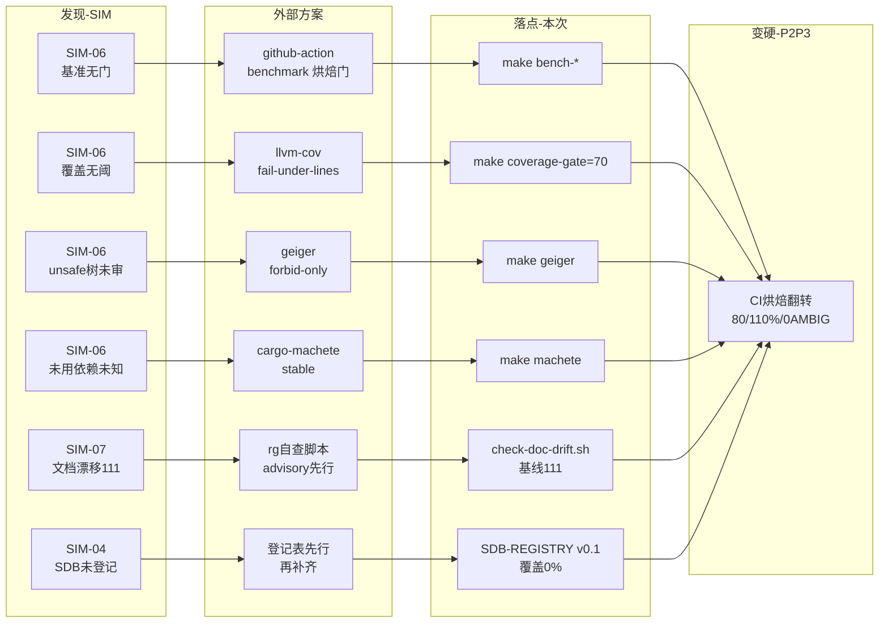

### 索引

| 缺口 | 外部方案出处 | 本次落点 | 变硬条件 (P2/P3) |
|------|-------------|---------|-----------------|
| 基准无门 | benchmark-action + mnem 烘焙配置 + Criterion FAQ 噪声警告 | make bench-baseline/compare | gh-pages 基线烘焙 1 周 → fail-on-alert:true, threshold 110% |
| 覆盖无阈 | llvm-cov fail-under-lines + tickerforge 分 job 模式 | make coverage-gate=70 | P2 清理后提 80；多 crate 用 cargo-coverage-gate per-package |
| unsafe 树 | geiger forbid-only 快门 | make geiger | CI 新增 job；全量 geiger 月审 |
| 未用依赖 | cargo-machete（否决 nightly udeps） | make machete | CI 月检 |
| 文档漂移 | 自研 rg 脚本（graphify 无现成） | check-doc-drift.sh 基线 111 | 归零后 --strict 进 CI |
| SDB 未登记 | 自研登记表（SDB 论文只有契约无工具） | SDB-REGISTRY v0.1 | 登记 100% → M1 放行 |

---

## §17 D-02 补遗 H-08（v1.1.0）

| 热点 | 源文件 | 目标层 | 推荐处置 | 对应卡 |
|------|--------|--------|---------|--------|
| H-08 | nt_core_bank/bank/search.rs:236,281,601（cosine_similarity_f64）+ bank/mod.rs:12（WalshMemoryIndex） | L5（nt_core_math 实住 L5） | 纯函数优先下沉 L0；Walsh 索引走 Facade | NODE-L1（P1-02 首批） |

---

---

## §18 D-14 SIM 预演环（v1.2.0 新增）

### 目的
D-03 中 SIM-preview 状态的放大图。任何 P1+ 任务动手前走完此环。

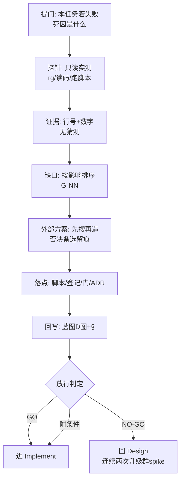

### 索引

| 环段 | 时间盒 | 输出物 | 反模式 |
|------|--------|--------|--------|
| 提问 | 15min | 失败死因 3 条（premortem 式） | 空泛"可能失败" |
| 探针 | ≤3h | 命令+文件行段清单 | 写生产代码、改 CI |
| 证据 | 随探针 | 数字+路径 | "我觉得""大概" |
| 缺口 | 30min | G-NN 排序表 | 无 Owner 的缺口 |
| 方案 | 1h | 外部出处+否决理由 | 直接造轮子 |
| 落点 | 30min | 路径精确到文件 | 落到"后续再说" |
| 回写 | 30min | D-NN+§号 | 模拟完不写回（theater） |
| 放行 | 15min | GO/附条件/NO-GO + tripwire | 口头放行 |

先例：SIM-09（P1-04 预演）走完此环发现顺序反转（P1-05 先行），见 SIM-PROTOCOL.md §6。

---

## §19 D-15 治理运行时接线（v1.3.0 新增）

### 目的
回答"宪法运行时到底读了什么"——SIM-16 把接线从 2 源改成 4 源，此图是唯一准确记录。

```mermaid
graph TD
    AG[AGENTS.md<br/>指针层(无Dev节)]
    STUB[dev-rules.md<br/>桩:解析失败跳过]
    ARC[archive R-P<br/>84子弹免门解析]
    STD[NT-STD 1.0<br/>64条款免门解析]
    LOAD[load_from_file<br/>or_insert合并+派生清零重建]
    CONS[Constitution<br/>rules+向量索引]
    SELFTEST[GovernanceSelfTest<br/>非空+违规可检]
    AG --> LOAD
    STUB -.->|跳过| LOAD
    ARC --> LOAD
    STD --> LOAD
    LOAD --> CONS
    CONS --> SELFTEST
```

### 索引

| 源 | 路径 | 解析 | 贡献键 |
|----|------|------|--------|
| 主文件 | 调用方传入 (AGENTS.md) | 有节解析，无节则空 | R-P 若有 |
| 伴生桩 | 同目录 dev-rules.md | 失败只警告 | 无（保链不断） |
| archive | 上溯 docs/standards/archive/dev-rules-legacy-R-P1-110.md | 免门 R-P 子弹 | R-P42/48 等连续性 |
| 正典 | 上溯 docs/standards/NEOTRIX-STD-1.0.md | 免门 NTS 子弹 | NTS-A01 等 64 条款 |

实测：11/11 单测绿（含治愈先前已红的 load_real_agents_md）。分类：NTS 按 part 字母
（G 演进 1.0 置顶）；派生 vec 重建前清零（categorize 非幂等）。

---

*End of Master Blueprint v1.6.0*
