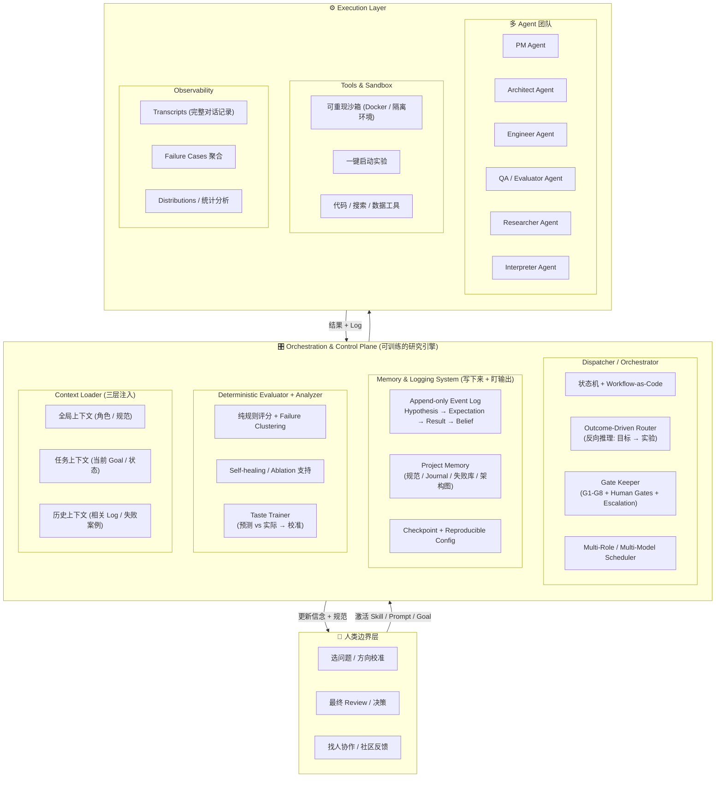
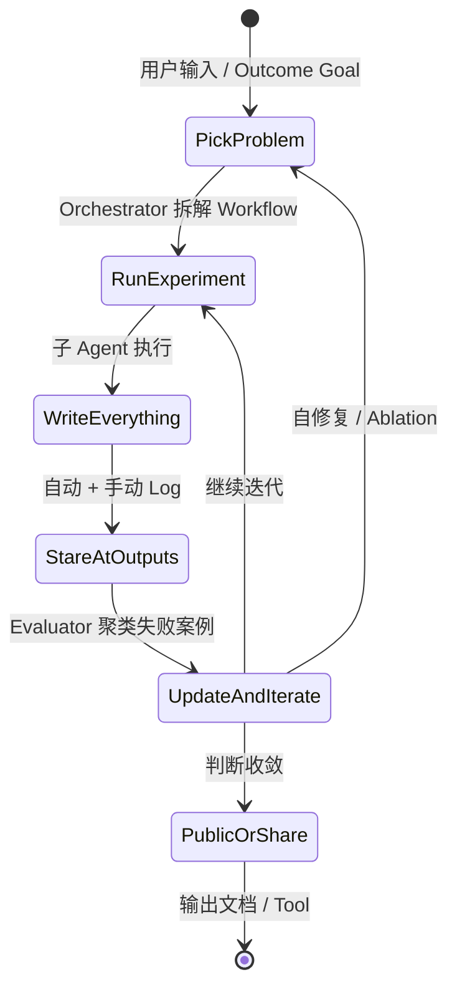
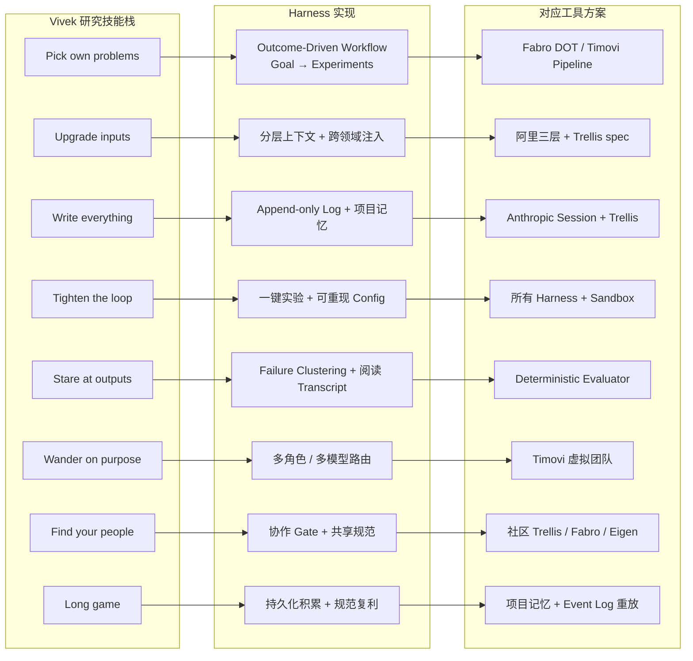
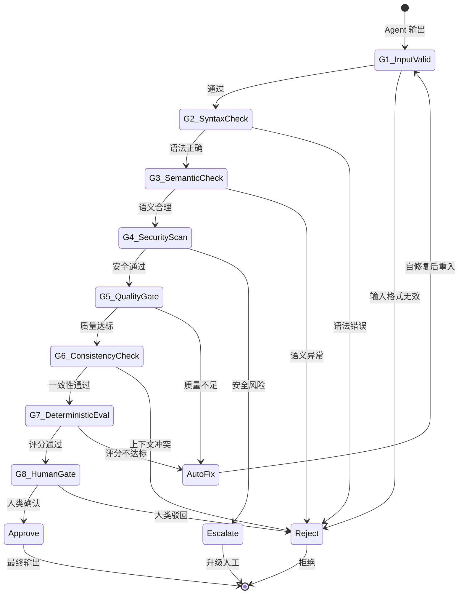

# AI Agent 工程化核心技术架构蓝图 — 统一可视化与模板

## Mermaid 可视化

### 统一参考架构总览



### 增强研究循环 (Tighten the Loop)



### Vivek 研究技能 → Harness 映射



### Gate Keeper 详细架构 (G1-G8)



---

## 具体 Log 模板

### Append-only Event Log 条目

```yaml
event_log_entry:
  version: "1.0"
  timestamp: "2026-06-12T14:30:00Z"
  session_id: "sess_abc123"
  
  # === 核心循环 ===
  
  # Step 1: 预测（训练 Taste 的关键）
  hypothesis:
    statement: "使用分层上下文注入可以减少 Agent 的幻觉率"
    predicted_outcome: "HallucinationRate >= 40% reduction on code generation tasks"
    confidence: 0.65  # 必须写数字，训练校准能力
    reasoning: "Anthropic 论文显示 3-layer context reduces ambiguity by 37%"
  
  # Step 2: 实验
  experiment:
    workflow_id: "wf_codegen_v3"
    config_hash: "sha256:a1b2c3d4..."
    runner: "Timovi Virtual Team"
    agents_used: ["Architect", "Engineer", "QA"]
    duration_ms: 45200
    input:
      task: "Generate REST API for user management"
      context_layers: ["global_api_spec", "task_requirements", "past_failures"]
  
  # Step 3: 结果
  result:
    status: "partial_success"  # success / partial_success / failure / unexpected
    metrics:
      hallucination_rate: 0.12  # 相对于预期 0.40，实际降幅 70%
      pass_rate: 0.85
      first_pass_correctness: 0.72
    artifacts:
      - "generated_code/user_api_v3.rs"
      - "test_results/user_api_e2e.json"
    failure_cases:
      - category: "type_mismatch"
        count: 3
        examples: ["user_id: String vs i64"]
      - category: "missing_edge_case"
        count: 2
        examples: ["paginated response 没有 limit 参数"]
  
  # Step 4: 信念更新（必须写，抵抗确认偏误）
  updated_belief:
    previous_belief: "分层上下文对幻觉帮助有限 (~20%)"
    new_belief: "三层上下文在高复杂度任务上有显著效果 (>50%)，但边缘案例仍需加强"
    delta: "upward_revision"  # upward / downward / unchanged / overturned
    evidence_weight: 0.8  # 这次实验的可信度
    remaining_uncertainty: "不知道在低复杂度任务上是否也有同样效果"
  
  # 元信息
  meta:
    tokens_used: 12800
    cost_usd: 0.64
    iteration: 3  # 这个实验的第几次重复
    ablated_components: ["relevance_filter"]  # 这次关了什么
    reviewed_by_human: true
    human_notes: "failure clustering 非常好，但边缘案例分类颗粒度不够细"
```

### 项目记忆目录结构

```
.trellis/                          # 项目记忆根
├── SPEC.md                        # 当前规范（随时更新）
├── ARCHITECTURE.md                # 架构图 + 决策记录
├── JOURNAL.md                     # 按时间序的思考日志
│
├── hypotheses/                    # 假设库
│   ├── 2026-06-10_context-effectiveness.md
│   └── 2026-06-12_backpressure-gates.md
│
├── failures/                      # 失败案例库（最重要的目录）
│   ├── clusters/                  # 按类别聚类的失败
│   │   ├── type_mismatch.md
│   │   ├── missing_edge_case.md
│   │   └── hallucination_context.md
│   └── raw/                       # 原始失败日志
│       └── session_sess_abc123.json
│
├── experiments/                   # 可重现实验配置
│   ├── v3.1.context_layers.yaml
│   └── v3.2.backpressure_gates.yaml
│
├── beliefs/                       # 信念演化追踪
│   └── context_layers.md          # 随时间变化的信念 + 证据链
│
└── artifacts/                     # 产出物
    └── impl_codegen_v3/
```

### Session 级别工作流 (researched_workflow.json)

```json
{
  "workflow_id": "wf_codegen_v3",
  "goal": "Reduce hallucination in code generation by ≥40%",
  "created": "2026-06-12T14:00:00Z",
  "experiments": [
    {
      "id": "exp_001",
      "hypothesis": "分层上下文减少幻觉",
      "comparison": ["flat_context", "three_layer_context"],
      "status": "completed",
      "result": "hallucination dropped 0.40 → 0.12"
    },
    {
      "id": "exp_002",
      "hypothesis": "Backpressure gates 进一步提高成功率",
      "dependency": ["exp_001"],
      "status": "running"
    }
  ],
  "decisions": [
    {
      "at": "2026-06-12T14:05:00Z",
      "what": "优先攻击 'type_mismatch' 堆",
      "why": "占失败案例的 60%，修复后总 pass_rate 估计+15%",
      "evidence": "failures/clusters/type_mismatch.md"
    }
  ],
  "learnings": [
    "三层上下文在高复杂度任务显著有效",
    "type_mismatch 可被自动 type-check gate 避免"
  ],
  "next": "exp_002: 叠加 backpressure gates"
}
```

---

## 关键设计原则 — 一句话版

| 原则 | 一句话 |
|------|--------|
| **研究=可训练技能栈** | 每次运行前写预测，运行后更新信念，每周回顾失败聚类 — 这就是 deliberate practice |
| **Harness=研究基础设施** | 好 Harness 不是"让 Agent 跑得更快"，是"让研究者更快发现自己错了" |
| **Failure 聚类>指标** | 指标告诉你"差多少"，聚类告诉你"差在哪" — 后者才是迭代的起点 |
| **信念必须可追溯** | 没有 Updated Belief 的实验等于没做 — 你不知道自己现在相信什么、为什么 |
| **Taste 可校准** | 预测 vs 实际的偏差追踪 = 你自己的 calibration curve |
| **工程=研究方法** | 构建 Eval、Pipeline、Harness 本身就是最高 ROI 的研究活动 |
