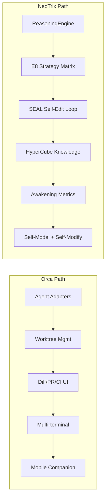

# 2026 Code Agent 全景对比：Orca vs NeoTrix vs 开源生态

> 基于 2026-05-28 实时数据。聚焦 Orca (stablyai/orca) 架构分析，对比 NeoTrix 设计哲学差异，映射 2026 年 OSS 生态的付费特性与架构趋势。

---

## 一、全景：2026 开源 Code Agent 三国杀

2026 年 5 月的格局可归纳为 **三种范式**：

| 范式 | 代表 | 定位 | 核心抽象 |
|------|------|------|----------|
| **单 Agent CLI** | OpenCode, Aider, AgentCode | 终端原生 AI 编程助手 | Provider + Tools + Session |
| **多 Agent 编排器** | Orca, AO, Cmux, Symphony | 人类监督多 Agent 并行 | Worktree + Agent Adapter |
| **Agent IDE** | Cursor, Windsurf, T3 Code | 集成开发环境 + AI | Editor + Inline + Chat |

Orca 处于第二范式，NeoTrix 则是一个**跨设计面的异类**——既有代码 Agent 基础设施（ReasoningEngine/SEAL），又内置了认知架构（E8/HyperCube/GWT/觉醒测量），定位更接近 **AgentOS**。

---

## 二、Orca 深度架构分析

### 2.1 一句话

> Orca = Electron 桌面壳 + Git worktree 隔离 + Agent 适配器层 + CLI/移动端三面同数据模型。

### 2.2 核心抽象

**Worktree-per-task 是 Orca 的"进程模型"**。传统 IDE 的隔离单元是 tab，Orca 的隔离单元是 git worktree。每个 agent 任务 = 一个独立 worktree = 独立分支 + 独立终端进程 + 独立 diff。

```mermaid
graph TB
    subgraph Orca Desktop
        WS[Worktree Sidebar]
        TP[Terminal Panes]
        DV[Diff Viewer]
        GH[GitHub Panel]
        BR[Browser Preview]
    end
    
    subgraph Agent Adapters
        CC[Claude Code]
        CX[Codex CLI]
        OC[OpenCode]
        GC[Gemini CLI]
        ...
    end
    
    subgraph Worktrees
        W1[feature/login<br/>worktree]
        W2[fix/api-bug<br/>worktree]
        W3[refactor/core<br/>worktree]
    end
    
    Agent Adapters --> W1
    Agent Adapters --> W2
    Agent Adapters --> W3
    WS --> W1
    TP --> W1
    W1 --> DV
    W1 --> GH
```

### 2.3 关键设计决策

| 决策 | 选择 | 代价 |
|------|------|------|
| **隔离模型** | Git worktree（vs Docker/jackin'） | 无运行时隔离，agent 以 host 用户权限运行，可触及整个文件系统 |
| **语言/框架** | Electron + TypeScript（v1.4.31，2300+ TS 文件，56 万行） | 内存占用高，启动慢，562K 行 TS 中测试占 30% |
| **Agent 集成** | 每 agent 适配器（解析 stdout → 统一状态机） | 适配器随 agent 更新而脆弱，21+ agent 的维护成本 |
| **UI 布局** | Ghostty 风格终端 + shadcn/ui 组件 | 更像「多终端管理器」而非 IDE，文件编辑能力弱 |
| **通信** | Orca CLI（agent 驱动 IDE） | 倒置控制：agent 调用 IDE API 而非 IDE 驱动 agent |
| **移动端** | iOS + Android 伴侣 app | 第一个在 code agent 领域认真做移动端的项目，差异化的赌注 |
| **定价** | MIT 开源 + BYOK agent 订阅 | 自身不产生直接收入，生态价值依赖于上游 agent |
| **安全性** | agent-trust-presets（3 级权限预测） | 两层权限（agent 自身 + Orca），复杂且用户困惑 |

### 2.4 架构亮点

1. **Agent 适配器层**（`src/main/agents/` 每个子目录一个 agent）—— 每个 agent 输出格式不同，适配器负责规范化。Claude Code 的进度标记和 Codex 的输出结构完全不同，适配器将它们统一为"working/waiting/done/errored"四种状态。
2. **Orca CLI 倒置控制**—— agent 可以通过 CLI 回调操控 IDE：`orca pane new --type terminal`，`orca worktree switch <name>`。这比传统 IDE→agent 单向控制更灵活，但也增加了攻击面。
3. **Per-worktree 嵌入式浏览器** —— 每个 worktree 有一个 Chromium 实例预览应用，Design Mode 允许点击 UI 元素直接注入 agent 上下文（无需截图/复制选择器）。

### 2.5 架构缺陷

1. **无运行时隔离**。agent 以 host 用户权限运行，对比 jackin' 的 Docker 容器隔离，安全性差一到两个量级。
2. **测试代码占比过高**。2300 个 TS 文件，562K 行，但 `*.test.ts` 超过 170K 行（30%+）。核心业务逻辑（agent 适配器、worktree 管理）实测少于 200K 行。
3. **移动端与桌面端模型同步**—— 数据模型跨桌面（Electron store）+ 移动端（iOS/Android）+ CLI，三面同步的复杂性没有在 README 中说明，可能是未公开的痛点。
4. **Agent 适配器的 API 脆弱性**—— Claude Code 或 Codex 更新 CLI 输出格式时，Orca 的适配器会断裂。这不是理论问题：该 repo 476 次 release 中很多是适配器热修复。

---

## 三、Orca vs NeoTrix：两种完全不同的设计哲学

| 维度 | Orca | NeoTrix |
|------|------|---------|
| **定位** | ADE（Agent Development Environment） | AgentOS（自省推理引擎 + 桌面壳） |
| **核心问题** | "如何让多个 code agent 并行工作而不冲突？" | "如何让 agent 具备自我意识和持续进化能力？" |
| **隔离单元** | Git worktree | Rust 进程 + 模块边界 |
| **Agent 模型** | 代理外部 CLI agent（Claude Code/Codex） | 自研 Rust reasoning engine（轻量） |
| **推理引擎** | 无（依赖外部 agent 的 LLM 调用） | 有（ReasoningEngine + E8 + SEAL loop） |
| **认知架构** | 无 | E8 推理轨迹 + HyperCube VSA + GWT 注意力路由 + 觉醒度量 |
| **编程语言** | TypeScript (Electron) 56 万行 | Rust (~93K) + TypeScript (~2.5K) |
| **开源协议** | MIT | MIT |
| **编译体积** | 562K 行 TS，2300+ 文件 | 93K 行 Rust，370 文件 |
| **外部依赖** | 依赖 Claude Code/Codex/OpenCode 等 CLI | 依赖 LLM provider API（Anthropic/OpenAI/等） |
| **文件编辑** | 内置文件编辑器 + diff viewer | 前端代码编辑器（Monaco/CodeMirror 路线） |
| **Git 集成** | 原生 worktree/PR/CI 集成 | 通过 Agent Protocol（基础） |
| **测试** | ~170K 行测试（占 30%） | ~1,675 测试，占 ~2% |
| **发布频率** | 476 次 release（v1.4.31） | 单一 binary |
| **商业模式** | 开源（MIT）+ BYOK | 开源（MIT）+ BYOK |
| **移动端** | iOS + Android 伴侣 app | 无 |
| **Star** | 3.6K | 0（私有项目） |

### 3.1 关键差异深度分析

**Orca 是"横向"的，NeoTrix 是"纵向"的。**

Orca 的核心假设是：**瓶颈在协调**——已经有 Claude Code、Codex、OpenCode 等优秀的单 agent CLI，Orca 只做编排层。不涉及模型选择、推理策略、记忆管理。

NeoTrix 的核心假设是：**瓶颈在能力**——agent 的推理质量和自我进化能力决定一切。为此构建了完整的认知栈：
- 底层：VSA HyperCube（4096 维向量空间）作知识表示
- 中层：E8 推理策略矩阵（64 种 entry 点） + SEAL 自迭代循环
- 顶层：觉醒度量（Φ、FCS、PID）监控系统自身状态

**Orca 选了更宽、更浅的路径；NeoTrix 选了更窄、更深的路径。**

### 3.2 两种路径的权衡



| 决策维度 | Orca 的答案 | 风险 | NeoTrix 的答案 | 风险 |
|---------|------------|------|----------------|------|
| Agent 做不做自己的推理 | 不做（依赖外部 agent） | 同质化，无差异化 | 做（自研推理引擎） | 需要持续投入 |
| 隔离方案 | Git worktree | 无运行时安全 | 模块化 Rust | 缺乏 worktree 的天然分支隔离 |
| 认知能力 | 零 | 被上游 agent 的智力天花板限制 | E8 + HyperCube | 需要自证有用性 |
| 代码量 | 56 万行（30% 测试） | 维护负担重 | 9 万行 | 功能覆盖窄 |
| 社区 | 3.6K stars, 476 releases | 需要持续获客 | 无社区 | 无外部反馈 |

---

## 四、2026 开源 Code Agent 付费特性全景

下表覆盖了 2026 年主要 OSS code agent 项目的**付费墙后的功能**（即开源版本缺失、需订阅/购买）：

### 4.1 OpenCode (156K stars, MIT)

| 付费特性 | 价格 | 开源版本替代方案 |
|----------|------|------------------|
| Zen 托管推理（免配置 API Key） | Zen: 按量付费; Black: $200/m | 自带 API Key（Anthropic/OpenAI 等） |
| 桌面 app（beta） | 免费 | TUI 终端界面 |
| 优先支持 | 包含在订阅中 | 社区 Discord |
| 企业 SSO/SAML | 未公开 | 无 |
| 高级权限管理 | 未公开 | 基本权限系统 |

### 4.2 Codex CLI (80K stars, Apache 2.0)

| 付费特性 | 价格 | 开源版本替代方案 |
|----------|------|------------------|
| ChatGPT/Codex 云执行 | $20/m Plus 或 $200/m Pro | 本地 CLI 执行（免费） |
| codex exec（后台异步运行） | 仅 Pro | 本地同步执行 |
| 云沙箱/远程执行 | 仅 Pro | 无 |
| Slack/GitHub 集成 | 包含在 Pro | 手动配置 |
| 团队配置共享 | 未公开 | `codex.json` 本地配置 |
| 仅 OpenAI 模型 | 锁定 | 社区支持 Ollama |

### 4.3 Pi (45K stars, MIT)

| 付费特性 | 价格 | 开源版本替代方案 |
|----------|------|------------------|
| Pi Pro（高级功能） | 未公开（bootstrapped） | 全部免费？ |
| 托管推理 | 未公开 | BYOK（15+ 提供商） |
| 桌面 app | 免费 | CLI TUI |

### 4.4 Orca (3.6K stars, MIT)

| 付费特性 | 价格 | 开源版本替代方案 |
|----------|------|------------------|
| 桌面二进制 | 免费（MIT） | 自构建 |
| 移动端 iOS app | 免费（App Store） | Android APK 从 release 下载 |
| Orca CLI | 免费（内置） | 无 |
| 嵌入式浏览器 | 免费 | 无 |
| Design Mode | 免费 | 无 |
| 企业部署 | 未公开 | 自构建 + 配置 |
| **实际 Orca 所有功能都免费**（MIT + BYOK agent 订阅） | — | — |

### 4.5 商业/闭源 Code Agent

| 产品 | 基础价格 | 付费墙后功能 |
|------|---------|-------------|
| Claude Code (Anthropic) | $20/m Pro, $100-200/m Max | Claude-only 模型访问、子 agent、scheduled workflows、CI 集成 |
| Cursor | $20/m Pro | 多模型切换、inline edit、Agent mode、IDE 集成 |
| GitHub Copilot | $10/m | AI 补全、Copilot Chat、CLI agent |
| Factory | $200M 融资 | BYOK + multiplier 定价、Droid agent |
| Amp | 未公开 | Mode-based 路由（Smart/Deep/Oracle）、无 BYOK |
| Command Code | $5M seed | 10+ providers、BYOK |
| AgentCode | 免费 | CLI + VS Code extension，完全免费 |

### 4.6 核心洞察

**2026 年 OSS code agent 的付费特性集中在三个方向：**

1. **托管推理 / Zero-Config API**（OpenCode Zen, Codex 云执行）—— 用户不想配置 API Key 就付费
2. **多表面 / 跨设备**（Orca Desktop + Mobile, Codex CLI + App + Cloud）—— 桌面免费，企业/团队功能付费
3. **安全 / 合规 / 企业治理**（SOC 2、SSO、审计日志）—— OpenHands $18.8M Series A，Cline SOC 2

**趋势信号**：
- **模型灵活度成为付费分水岭**：Claude Code 和 Codex（单一模型族）必须降价/增值维持用户，OpenCode/Pi/Aider（BYOK 全模型）天然免锁
- **编排层没有商业护城河**：Orca (3.6K stars) 功能比 OpenCode (156K stars) 丰富得多，但 stars 差两个数量级——因为编排层容易替代
- **本地推理正在零化"付费必要性"**：通过 Ollama 运行 DeepSeek-Coder 或 Qwen-Coder，整体成本为 $0（仅电费）

---

## 五、NeoTrix 的差异化定位与机会

### 5.1 当前 NeoTrix 与生态的差距

| 生态标准功能 | NeoTrix 状态 | 优先级 |
|-------------|-------------|--------|
| 多 Provider 支持 | ✅（Anthropic/OpenAI/Gemini/Ollama） | 已满足 |
| 终端 TUI | ❌（只有桌面 app） | P2 |
| Git worktree 集成 | ❌ | P2 |
| 并行 agent 执行 | ⚠️（sub-agent 系统，非 worktree 模式） | P2 |
| 文件编辑 | ⚠️（前端编辑器 + diff） | P1 |
| 移动端 | ❌ | P3 |
| 嵌入式浏览器 | ❌（无） | P3 |
| Diff Review → Agent 反馈 | ⚠️（DiffViewer 组件） | P1 |

### 5.2 NeoTrix 独有的核心资产

| 资产 | 复杂度 | 生态同类 | 差异化潜力 |
|------|--------|---------|-----------|
| E8 推理策略矩阵 | ★★★★★ | 无 | 🔥 独有——没有其他 OSS 项目有 64 态推理 |
| SEAL 自迭代循环 | ★★★★☆ | 无 | 🔥 独有——agent 自动改进自身推理策略 |
| HyperCube VSA (4096-dim) | ★★★★★ | 无 | 🔥 独有——结构化知识表示引擎 |
| GWT 注意力路由 | ★★★★☆ | 无 | 🔥 独有——意识启发的注意力竞争 |
| 觉醒度量 (Φ/FCS/PID) | ★★★★★ | 无 | 🔥 独有——系统自我监控框架 |
| ReasoningEngine (统一推理) | ★★★★☆ | 类似（OpenCode provider 层） | ⭐ 差异化（E8 嵌入） |
| GoalLoop (目标追踪) | ★★★☆☆ | 类似（AO pipeline） | ⭐ 差异化 |
| 背景循环 (14 tickers) | ★★★★☆ | 类似（Claude Code scheduled workflows） | ⭐ 差异化 |
| ClawBench 轨迹分类 | ★★☆☆☆ | 新加入（EV-01） | 🟡 补全基准 |
| AgentAtlas 六态控制 | ★★★☆☆ | 新加入（EV-03） | 🟡 补全控制模型 |
| EvalMonitor | ★★★☆☆ | 新加入 | 🟡 补全自我评估 |
| 山海经 UI 主题 | ★☆☆☆☆ | 普通 | 🟢 装修层，非核心 |

### 5.3 战略建议

**不要追逐 Orca 的编排层**。NeoTrix 的核心价值在"深度"不在"广度"。以下几件事优先级更高：

1. **开源自证**：将 E8、HyperCube、SEAL 等核心概念文档化（英文 + 中文），证明它们不只是学术概念而是真实工作的代码。
2. **推理 Benchmark**：基于 ClawBench + EvalMonitor，建立 NeoTrix 推理质量的量化基准。这是说服用户的"数据刀"。
3. **OpenCode / Aider 适配器**：让 NeoTrix 的 ReasoningEngine 可以作为标准 provider 被 OpenCode/Aider 调用。这样 NeoTrix 获得生态流量，OpenCode 获得更强的推理引擎。
4. **专注"自改进"叙事**：NeoTrix 的独特卖点（USP）应该是 "The only open-source agent that improves its own reasoning"（唯一能自我改进推理的开源 agent）。没有其他项目在竞争这个叙事。

**不做什么**：
- 不做 Orca 式的多 agent 编排（那是不同品类）
- 不做 Claude Code 式的企业安全合规
- 不做 OpenCode 式的 75+ provider 覆盖（4-5 个主要 provider 足够）

---

## 六、可吸收的 Orca 特性

尽管 NeoTrix 不应模仿 Orca 的编排层，以下几项 Orca 特性值得借鉴：

| Orca 特性 | 吸收方式 | 工作量 |
|----------|---------|--------|
| **Worktree-per-task** | Agent Protocol 增加 `git worktree` 支持，ReasoningEngine 输出分支指令 | M |
| **Diff Annotation → Agent** | 现有 DiffViewer 升级为可标注 + 反馈回 Agent | S |
| **Agent 状态统一面板** | 现有 StatusBar 增强（显示每个 sub-agent 状态） | S |
| **Design Mode（点击→注入上下文）** | 需嵌入式 browser，大工程 | XL |
| **Orca CLI 式倒置控制** | 现有 Agent Protocol 增强 | L |
| **移动端伴侣** | 最小可行：telegram bot + Tauri mobile | L |
