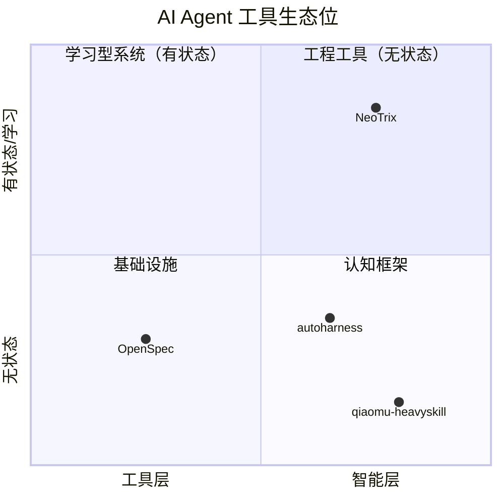
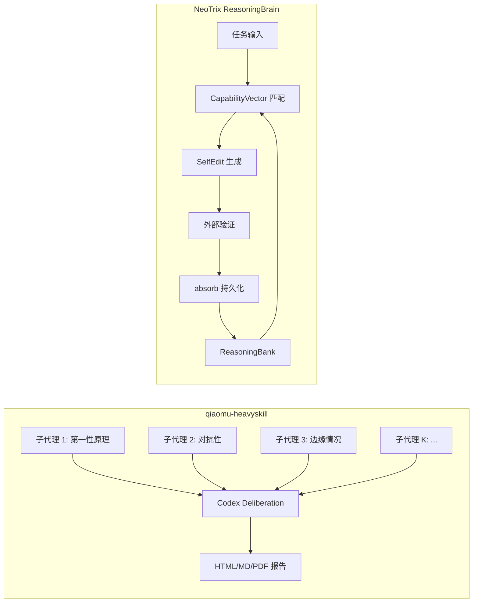
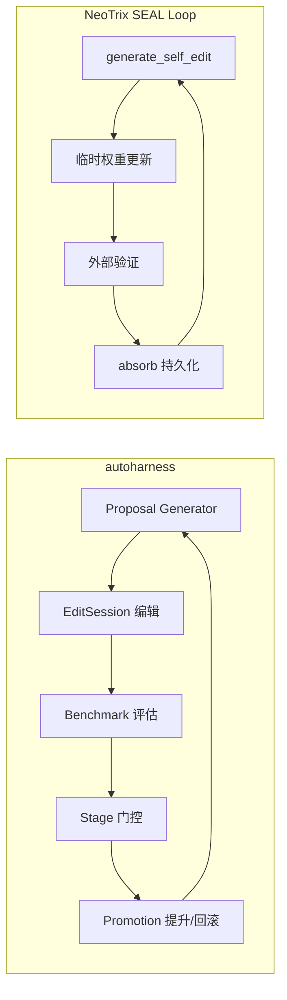
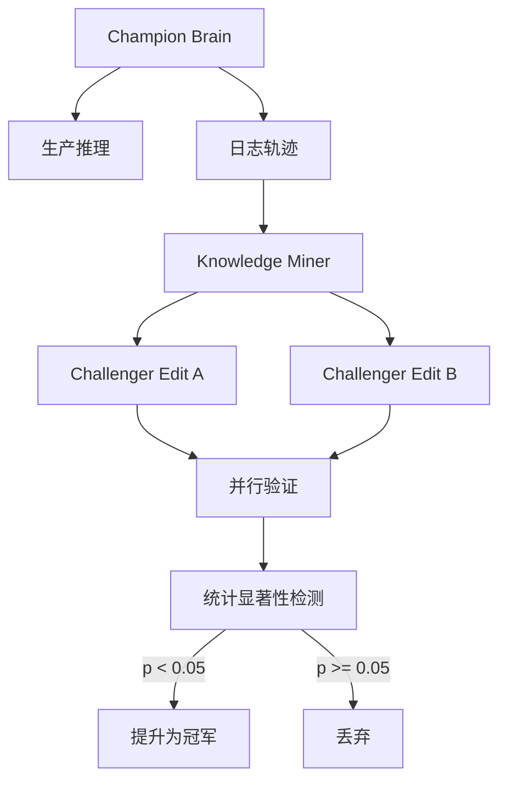
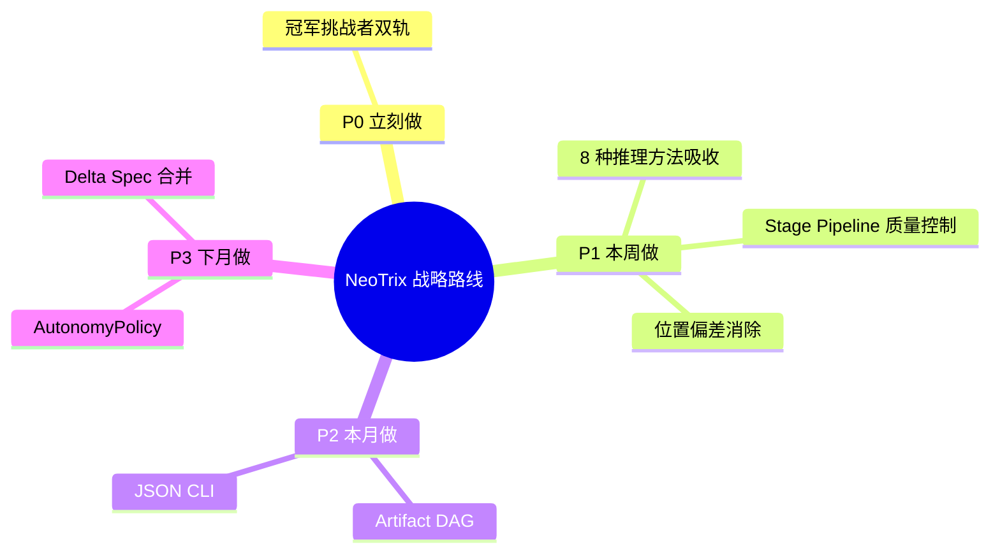

# NeoTrix 生态位分析：三项目深度对比与战略建议

> 分析日期：2026-05-13
> 目标：将 qiaomu-heavyskill、autoharness、OpenSpec 与 NeoTrix 对比，识别可吸收的设计和战略方向

---

## 第一部分：四项目全景定位



| 项目 | 本质 | 代码规模 | 心智模型 | 核心机制 |
|------|------|---------|---------|---------|
| **qiaomu-heavyskill** | LLM 推理增强技能 | ~1,100 行（声明式） | 并行隔离代理 + 审议合成 | K 个独立子代理 → Codex deliberation → 报告 |
| **autoharness** | Agent Harness 优化控制面 | ~71,900 行 Python | AutoML for agent prompts/code | 提案→评估→冠军/挑战者→提升 |
| **OpenSpec** | 规范驱动开发框架 | ~51,600 行 TypeScript | 需求即代码 | Spec DAG → AI 执行 → archive 合并 |
| **NeoTrix** | 持续进化的推理大脑 | ~47,700 行 Rust | 代数化认知架构 | CapabilityVector × SEAL 循环 |

---

## 第二部分：每个项目的深度对比

### 2.1 qiaomu-heavyskill vs NeoTrix



**核心差异**：

| 维度 | qiaomu-heavyskill | NeoTrix |
|------|-------------------|---------|
| **状态** | 无状态，每次独立 | 有状态，跨会话学习 |
| **记忆** | 无 | ReasoningBank + brain.json |
| **多样性来源** | 固定 8 种推理方法/视角透镜 | 动态 KnowledgeSource + CapabilityVector |
| **输出** | 一次性报告 | 持续进化的能力 |
| **验证** | Codex 4 步内部协议 | 外部编译/测试/MCP（更可靠） |
| **学习** | 无 | SEAL 循环 + RL 奖励 |

**NeoTrix 可吸收的设计**：
1. **8 种推理方法的提示模板** — NeoTrix 的 `reasoning_engine.rs` 已覆盖 4 种推理类型，但缺少 heavyskill 中精美的第一性原理/对抗性/边缘情况提示模板，可直接复用到 `ReasoningTrace` 的生成中
2. **Heavy-Pass@K 验证协议** — arXiv:2605.02396 的 HP@K >= HM@K >= Vote@K 不等式可作为 NeoTrix 的 `CriticNode` 的数学基础
3. **位置偏差消除** — 在 `SelfIteratingBrain` 的迭代中使用随机洗牌，防止 LLM 对早期轨迹的注意力偏向
4. **"所有代理都有缺陷→重新推导"协议** — NeoTrix 的 `loop_impl.rs:714` 的 SEAL 循环缺少此类熔断机制

### 2.2 autoharness vs NeoTrix



**核心差异**：

| 维度 | autoharness | NeoTrix |
|------|------------|---------|
| **优化对象** | 外部 Harness（prompt/code/config） | 内部 CapabilityVector（能力向量） |
| **评价指标** | Benchmark 分数（promotion 阈值） | RL 奖励（外部验证信号） |
| **编辑粒度** | 文件级：search/replace/write_file | 向量级：learning_rate × gradient |
| **多候选** | 冠军/挑战者模式，多轨道并行 | 单轨道 Sequential SEAL |
| **回滚** | EditSession 事务性回滚 | brain.json.bak 快照回滚 |
| **确定性** | 统计性（Wilson CI, paired t-test） | 阈值判断（min_score_threshold） |
| **目标** | "让生产 agent 不再犯错" | "让推理大脑持续进化" |

**NeoTrix 可吸收的设计**：

1. **冠军/挑战者模式** — NeoTrix 目前是单轨 SEAL 循环（一次只测试一个 self-edit）。可以引入双轨：当前冠军在产线上运行，挑战者在沙箱中并行验证。性能超过阈值后自动切换。

2. **Statistical Significance Gate** — autoharness 的 `stats.py` 实现了 Wilson 置信区间和配对均值置信区间，NeoTrix 目前只有简单的 `reward > threshold` 判断。引入统计显著性门控可以避免在噪音数据上做出错误的 absorb 决策。

3. **Stage Pipeline** — autoharness 的四阶段管线（筛选→验证→保留→迁移）提供了比 NeoTrix 更细粒度的质量控制。NeoTrix 的 `absorb()` 是二元的（接受/拒绝），缺少多阶段评估。

4. **Intervention 模式** — autoharness 的 `Intervention` 类定义了结构化优化假设（目标、动作、优化级别），这与 NeoTrix 的 `SelfEdit` 概念高度兼容，但结构更清晰。

5. **EditSession 事务性回滚** — NeoTrix 的快照回滚机制（`brain.json.bak`）比 autoharness 的 `EditSession` 粗粒度。引入文件级事务支持可以让 SEAL 循环更安全。

6. **AutonomyPolicy 渐进信任** — proposal → bounded → full 的自主度递进，很适合 NeoTrix 的 `Orchestrator`：新技能先在 proposal 模式运行，验证通过后逐步提升权限。

### 2.3 OpenSpec vs NeoTrix

| 维度 | OpenSpec | NeoTrix |
|------|---------|---------|
| **解决的问题** | "AI 无视需求乱写代码" | "Agent 无法跨任务持续学习" |
| **核心抽象** | Spec = 真理源, Change = 提案 | CapabilityVector = 能力画像, SEAL = 学习循环 |
| **状态管理** | openspec/specs/ + openspec/changes/ | brain.json + ReasoningBank |
| **工作流** | propose → apply → sync → archive | generate_self_edit → verify → absorb |
| **AI 集成** | 27 个工具适配器 + 技能文件 | 内置 MCP 桥 + LLM Provider 抽象 |
| **扩散** | npm install，28k+ stars | cargo build，早期项目 |
| **模式** | 人+AI 协作规范驱动 | AI 自主自迭代进化 |

**NeoTrix 可吸收的设计**：

1. **Artifact Dependency Graph** — OpenSpec 的制品 DAG（proposal → specs → design → tasks）定义了清晰的依赖关系。NeoTrix 的 `Orchestrator` 的 `PlannerNode` 可以引入类似的 DAG 来管理子任务间的依赖。

2. **Delta Spec 合并协议** — `## ADDED` / `## MODIFIED` / `## REMOVED` 标记规范变更。NeoTrix 的 `SelfEdit` 当前是直接的向量更新，缺少"delta 语义"。引入 spec-level delta 可以让能力向量更新更精确。

3. **Tool Adapter 系统** — OpenSpec 为 27 个 AI 工具提供适配器，每个约 20-50 行代码。NeoTrix 的 `mcp_tools.rs` 目前只集成了少数 MCP 工具，可以借鉴这个轻量级适配器模式。

4. **双使用模型（Human + AI）** — OpenSpec 提供了人类用 CLI 命令和 AI 用 `--json` 标志的对称接口。NeoTrix 的 CLI 层（`cli/commands/`）可以增加 `--json` 输出模式，方便被其他 AI agent 调用。

5. **可恢复的 Workflow** — OpenSpec 的归档机制确保即使中断也能恢复。NeoTrix 的 SEAL 循环如果中断，当前的 `brain.json` 快照可能不完整。引入类似 OpenSpec 的原子 artifact 写入机制可提高可靠性。

---

## 第三部分：核心战略建议

### 建议一：引入 Champion/Challenger 双轨 SEAL（优先级：P0）

**问题**：NeoTrix 当前 SEAL 循环是单轨的，一次只测试一个 self-edit，无法对比多个候选方案。

**方案**：借鉴 autoharness 的冠军/挑战者模式：



**具体改动**：
- `SelfIteratingBrain` 增加 `champion: Arc<ReasoningBrain>` 和 `challengers: Vec<EditCandidate>`
- `run_seal_loop()` 支持并行验证多个候选
- 引入 `StatisticalTest::wilson_confidence_interval()` 在 `stats.rs`
- 冠军提升触发 `brain.json` 原子写入 + 旧冠军归档

### 建议二：引入 Stage Pipeline 质量控制（优先级：P1）

**问题**：`absorb()` 是二元决策（接受/拒绝），缺少细粒度验证。

**方案**：Stage 管线替换当前的单一阈值判断：

| Stage | 检查项 | 阻断条件 | 对应 autoharness 概念 |
|-------|--------|---------|---------------------|
| **Screening** | 编译检查 + 类型检查 | 任何编译 error | filter stage |
| **Validation** | 测试通过率 + 旧任务回测 | 通过率 < 85% | validation stage |
| **Stability** | 多次运行方差检查 | 方差 > 容忍阈值 | stability gate |
| **Promotion** | 与 Champion 对比 | 无统计显著改进 | retention/migration |

### 建议三：消耗 heavyskill 的推理多样性协议（优先级：P1）

**问题**：NeoTrix 的 `reasoning_engine.rs` 只覆盖 4 种推理类型，缺少多视角综合能力。

**方案**：
- 将 heavyskill 的 8 种推理方法 + 8 种视角透镜作为 `ReasoningTrace` 的子类型枚举
- 在 `generate_self_edit()` 中引入随机洗牌消除位置偏差
- 引入 "所有视角都有缺陷 → 重新推导" 的熔断逻辑
- 将 `Heavy-Pass@K` 形式化验证协议嵌入 `CriticNode`

```rust
// 在 reasoning_engine.rs 中新增
enum ReasoningMethod {
    Direct,
    FirstPrinciples,
    Adversarial,
    EdgeCaseFocus,
    ConstraintPropagation,
    ReverseEngineering,
    HistoricalEmpirical,
    Analogical,
}

enum PerspectiveLens {
    Builder,       // 交付速度、实用性
    Architect,     // 长期可维护性
    Skeptic,       // 风险、失败模式
    User,          // 体验、清晰度
    Economist,     // 投资回报率
    Historian,     // 先例
    Contrarian,    // 被忽视的角度
    Ethicist,      // 二阶效应
}
```

### 建议四：OpenSpec 的 Artifact DAG 作为 Orchestrator 的基础（优先级：P2）

**问题**：`Orchestrator` 的 `PlannerNode` 目前是线性的任务分解，缺少依赖图引擎。

**方案**：引入 `PlannerDag` 替代当前简单的任务列表：

```rust
struct PlannerDag {
    artifacts: Vec<ArtifactNode>,
    edges: Vec<(NodeId, NodeId)>,  // (prerequisite, dependent)
}

struct ArtifactNode {
    id: String,
    artifact_type: ArtifactType,  // Proposal | Spec | Design | Task | Code
    state: ArtifactState,         // Pending | Ready | InProgress | Done
    generates: String,            // 文件路径
}

impl PlannerDag {
    fn topo_sort() -> Vec<NodeId>        // Kahn 算法
    fn ready_nodes() -> Vec<&ArtifactNode>  // 可执行的下一个节点
    fn mark_done(id: NodeId) -> Result<()>  // 完成后自动解锁下游
}
```

### 建议五：双模式 CLI（人类 + AI）（优先级：P2）

**问题**：NeoTrix CLI 目前只面向人类用户，缺少 machine-readable 输出。

**方案**：所有 CLI 命令增加 `--json` 标志，输出结构化数据：

```bash
neotrix brain stats --json
# → {"capability_vector": {...}, "iteration_count": 42, "bank_size": 128}

neotrix brain absorb --dry-run --json
# → {"proposed_delta": {...}, "projected_impact": {...}}
```

这与 OpenSpec 的双使用模型一致，让 NeoTrix 本身也可以被其他 AI agent 编排。

### 建议六：吸收 autoharness 的 AutonomyPolicy（优先级：P3）

**问题**：NeoTrix 的 `Orchestrator` 缺少权限分级，自编辑直接修改能力向量。

**方案**：引入 `AutonomyLevel` 枚举：

```rust
enum AutonomyLevel {
    Proposal,   // 只生成建议，需人类确认
    Bounded,    // 允许在已授权的 surface 内自动编辑
    Full,       // 完整自迭代（经过强化验证后）
}
```

CapabilityVector 的 `absorb()` 方法增加 `autonomy` 参数，不同级别应用不同的验证强度。

---

## 第四部分：吸收优先级矩阵

| 建议 | 复杂度 | 价值 | 风险 | 优先级 | 时间估计 |
|------|--------|------|------|--------|---------|
| 冠军/挑战者双轨 | 高 | 极高 | 中 | **P0** | 3-5 天 |
| Stage Pipeline | 中 | 高 | 低 | **P1** | 2-3 天 |
| 推理多样性协议 | 低 | 高 | 低 | **P1** | 1-2 天 |
| Artifact DAG | 高 | 中 | 中 | P2 | 3-4 天 |
| JSON CLI | 低 | 中 | 低 | P2 | 0.5 天 |
| AutonomyPolicy | 中 | 中 | 低 | P3 | 1-2 天 |

---

## 第五部分：总结



**一句话自画像**：

> NeoTrix 不是 heavyskill（一次性推理增强），不是 autoharness（外部 harness 优化），也不是 OpenSpec（规范驱动流程）。NeoTrix 是一个**持续学习的推理大脑** — 它的差异化是跨会话的能力向量进化 + 代数化的认知架构。

**三个项目各自解决了 NeoTrix 的一个短板**：
- **heavyskill** 补推理多样性（P0 需求，1 天可完成）
- **autoharness** 补质量管控（P1 需求，2 天可完成）
- **OpenSpec** 补流程规范（P2 需求，渐进式引入）

**最迫切的改进**：冠军/挑战者双轨 SEAL。这是从"试错"进化到"系统优化"的关键一步，也是 autoharness 最核心的设计贡献。
