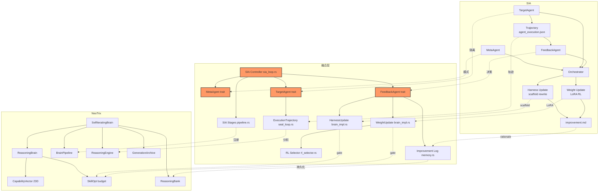

# SIA → NeoTrix 融合设计

> **日期**: 2026-05-29 | **来源**: SIA v0.1.0 (arXiv 2605.27276, 113⭐, MIT) | **语言**: Python 99% (Rust 吸收)
> **目标**: NeoTrix `neotrix-core/src/neotrix/reasoning_brain/self_iterating/` | **作者**: Agent 融合分析
> **核心结论**: SIA 是首个统一 harness-update + weight-update 的 Self-Improving AI 框架。其三体架构（MetaAgent→TargetAgent→FeedbackAgent）和双通道更新机制与 NeoTrix 的 SEAL 自迭代 + CapabilityVector 形成结构性互补。吸收价值极高，以设计模式吸收为主，RL weight update 部分需桥接外部 GPU 基础设施。
> **论文**: Hebbar et al., "SIA: Self Improving AI with Harness & Weight Updates" (arXiv:2605.27276)

---

## 1. 全景差距矩阵 (Panoramic Gap Matrix)

### 1.1 SIA 有 / NeoTrix 无 (吸收目标)

| # | 特性 | SIA 实现 | NeoTrix 差距 | 影响域 | 填补方式 |
|---|------|---------|--------------|--------|----------|
| G-01 | **三体 Agent 架构** (Meta→Target→Feedback) | `sia/orchestrator.py` — MetaAgent 从 task spec 生成初始 scaffold，TargetAgent 执行并记录轨迹，FeedbackAgent 分析后选择 H/W 更新 | `SelfIteratingBrain` 只有单层 iterate+absorb，无 MetaAgent 生成步骤、无 TargetAgent 执行隔离、无 FeedbackAgent 决策路由 | SEAL 架构 | 新 `sia_loop.rs` + 三体 trait 定义 |
| G-02 | **双通道更新决策** (harness vs weight) | FeedbackAgent 自动检测 harness 收益停滞 → 切换 weight update，两种 action 自由交错 (Figure 2) | `absorb()` 只更新 capability vector（类比 weight 单通道），无 harness 更新概念，无切换策略 | 自迭代 | 在 `brain_impl.rs` 添加 `harness_update()` + `weight_update()` 双通道 |
| G-03 | **Harness 更新** (scaffold rewrite) | FeedbackAgent 生成改进后的 `target_agent.py` (prompt/tools/retry logic/search procedure)，模型权重固定 | `BrainPipeline` 有 stage 概念但无 scaffold 改写机制，`generate_self_edit()` 只调维不调代码 | 代码生成 | 新 `HarnessUpdateStage` pipeline stage |
| G-04 | **Weight 更新** (LoRA RL post-training) | FeedbackAgent 动态选择 PPO/GRPO/EntropicAdvantage，更新 LoRA adapter 权重，scaffold 固定 | 无 RL 权重更新机制，capability 只通过向量更新和归一化演进 | RL 训练 | 新 `WeightUpdateStage` + `LoraAdapter` 类型桥接 |
| G-05 | **Trajectory 级反馈** (完整执行日志) | FeedbackAgent 接收 `agent_execution.json` — 每步 prompt/response/tool call/tool result | `run_seal_loop()` 只接收 scalar reward (external_reward: Option<f64>)，丢失结构信息 | 反馈信号 | 扩展 `_current_task` 为 `ExecutionTrajectory` |
| G-06 | **Generation 版本管理** | `runs/run_{id}/gen_{n}/target_agent.py` — 每代独立 artifact + diff | `ChangeArchive` 存在但无 generation 抽象，仅记录 edit 无版本演化 | 版本控制 | 新 `GenerationArchive` 在 `SelfIteratingBrain` |
| G-07 | **improvement.md 持久化** | gen 2+ 生成 prose 分析 diff rationale → `improvement.md` | `ReasoningBank` 存 memory 但无 diff rationale 结构化存储 | 知识持久化 | extension `improvement_log` 字段 + checkpoint |
| G-08 | **RL 算法选择策略** | 基于 reward 密度/分布自动选 PPO/GRPO/REINFORCE/Best-of-N/DPO (§7.3) | 无算法选择，`update_policy()` 只有简单 lr 调大调小 | 自适应 | 新 `RLAlgorithm` enum + `feedback_algorithm_selector()` |
| G-09 | **Benchmark 任务框架** | `--task gpqa/lawbench/longcot-chess/spaceship-titanic` 标准化 | 无内置 benchmark 任务 runner | 评测 | 新 `benchmarks/sia_tasks/` |
| G-10 | **Python sandbox 隔离** | 每 run 独立 venv + sandbox 执行 | `sandbox.rs` 存在但为通用执行，非 per-generation 隔离 | 执行 | 扩展 `sandbox.rs` 隔离级别 |

### 1.2 NeoTrix 有 / SIA 无 (优势保持)

| # | 特性 | NeoTrix | SIA 状态 |
|---|------|---------|----------|
| N-01 | **CapabilityVector 23D 精密更新** | 23 固定维度 + extension 扩展，cosine similarity 度量 | 只靠 scalar reward，无维度级因果追踪 |
| N-02 | **SEAL 自迭代循环** | Idea→Execute→Observe→Absorb 闭环 + 早停 + 停滞检测 (StagnationDetector) | 固定 max_gen 代数，无早停 |
| N-03 | **HyperCube VSA 知识表示** | 4096 维 MAP 超立方体 + bundle/bind/permute | 无结构化知识 |
| N-04 | **GWT 注意力意识路由** | GlobalWorkspace + salience 竞争 broadcast | 无注意力路由 |
| N-05 | **AgentTeam 多 Agent 协作** | 5 ProcessType + 4 SwarmMode + Coordinator | 单 agent 执行 |
| N-06 | **GoalLoop 目标引擎** | 24/7 自主目标追求 + RateLimiter + CircuitBreaker | 单次执行无持久 |
| N-07 | **元认知系统** | CodeScanner + WeaknessAnalyzer + MetaCognitiveLoop | 无元认知 |
| N-08 | **ReasoningEngine 统一推理** | 4 推理类型 + 自蒸馏 + E8 | 直接 LLM 调用无推理层 |
| N-09 | **BrainPipeline 灵活编排** | 可组合 stage + checkpoint + rollback | 固定 orchestrator.py 流程 |
| N-10 | **SkillOpt 文本学习率预算** | budget 消耗/补充控制 absorb 频率 (S22) | 无学习率预算 |
| N-11 | **AbsorbValidator + CriticNode** | 独立验证器门控吸收质量 | 无吸收质量门控 |
| N-12 | **Diff 预览 + safe_absorb** | `preview_absorb()` + 三阶段安全吸收 | 直接覆盖无 preview |

### 1.3 两者皆缺 (共同盲点)

| # | 盲点 | 说明 |
|---|------|------|
| B-01 | **跨任务迁移学习度量** | 两者都无结构化 transfer learning 评估（NeoTrix 有 `transfer_efficiency()` 但非核心） |
| B-02 | **外部分布验证** | 两者都在固定 test split 上优化，无 OOD robustness check |
| B-03 | **元-元学习 (学习如何改进)** | FeedbackAgent 选择策略固定（LLM prior），非 RL 训练的 selector (§9 Future Work) |
| B-04 | **耦合共同进化监控** | 两个 optimiser (H+W) 相互盲视，都可能产生 Goodhart (§8 Limitations) |

---

## 2. 优先级分类 (Priority × Impact × Urgency)

### 2.1 优先级矩阵

```
Impact ↑
  High  │ G-01, G-02              G-08, G-09
        │ (三体架构, 双通道)       (RL 算法选择, Benchmark)
  Med   │ G-03 (Harness Update)   G-04 (Weight Update)
        │ G-05 (Trajectory)       G-06 (Gen Version)
  Low   │ G-07 (improvement.md)   G-10 (Sandbox)
        └────────────────────────────────→ Urgency
              Immediate    1 month     3 months
```

### 2.2 P0 (立即吸收 — 本周)

| ID | 特性 | 理由 | 工作量估计 |
|----|------|------|-----------|
| F-01 | **KnowledgeSource: SIA** (G-01 前置) | 知识网关，所有吸收的前置条件 | ~100 行 + 枚举扩展 |
| F-02 | **三体 Agent 架构** (G-01) | SIA 最核心架构贡献 — MetaAgent + TargetAgent + FeedbackAgent 映射到 NeoTrix | ~600 行新代码 + traits |
| F-03 | **双通道更新决策** (G-02) | `absorb()` 扩展为 `harness_update()` + `weight_update()`，FeedbackAgent 选择 | ~400 行修改 |

### 2.3 P1 (1-2 周吸收)

| ID | 特性 | 理由 | 工作量估计 |
|----|------|------|-----------|
| F-04 | **Harness Update Stage** (G-03) | BrainPipeline stage 实现 scaffold 改写 | ~500 行 + 测试 |
| F-05 | **Trajectory 级反馈** (G-05) | 扩展 `_current_task` 为批量执行日志 | ~300 行 |
| F-06 | **Generation 版本管理** (G-06) | GenerationArchive + per-gen diff | ~300 行 |

### 2.4 P2 (3-4 周吸收)

| ID | 特性 | 理由 | 工作量估计 |
|----|------|------|-----------|
| F-07 | **Weight Update Stage** (G-04) | LoRA adapter 桥接 + RL 算法编排 (依赖外部 GPU) | ~800 行 + Modal 配置 |
| F-08 | **RL 算法选择器** (G-08) | 基于 reward 分布自动选 PPO/GRPO/REINFORCE | ~400 行 |
| F-09 | **improvement.md 持久化** (G-07) | ReasoningBank 扩展 diff rationale | ~200 行 |
| F-10 | **Benchmark 任务框架** (G-09) | SIA 风格标准化 benchmark runner | ~400 行 |

---

## 3. 集成点设计 (Integration Points)

### F-01: KnowledgeSource SIA 注册

**文件路径**: `neotrix-core/src/core/knowledge/types.rs` (KnowledgeSource 枚举)
**依赖**: 无

**设计**: 在枚举中新增 3 个变体：

```rust
pub enum KnowledgeSource {
    // ... 现有 75+ 变体
    // 🆕 2026-05-29: SIA self-improving AI
    SiaHarnessUpdate,       // scaffold 改写能力
    SiaWeightUpdate,        // RL weight 更新能力
    SiaFeedbackLoop,        // 三体反馈循环架构
}
```

**CapabilityVector 映射**:

| 知识源 | 核心维度 | extension 扩展维度 |
|--------|---------|-------------------|
| `SiaHarnessUpdate` | `experimental: 0.88, synthesis: 0.82` | `scaffold_rewrite: 0.90, prompt_engineering: 0.85` |
| `SiaWeightUpdate` | `inference_depth: 0.85, analysis: 0.80` | `rl_training: 0.88, lora_adaptation: 0.82` |
| `SiaFeedbackLoop` | `verification: 0.90, quality_gates: 0.85` | `trajectory_analysis: 0.92, improvement_rationale: 0.85` |

**Provenance**: `"sia:arxiv2605.27276:v0.1.0"`

**ReasoningBank 种子知识** (5 条注入):

| 描述 | TaskType | 置信度 |
|------|----------|--------|
| "SIA: 三体架构 — MetaAgent 初始化 scaffold, TargetAgent 执行并记录, FeedbackAgent 分析后选择 H/W 更新" | General | 0.95 |
| "SIA harness update: FeedbackAgent 重写 TaskAgent 的 prompt/tools/retry logic/search procedure, 模型权重固定" | CodeGeneration | 0.93 |
| "SIA weight update: FeedbackAgent 通过 PPO/GRPO/REINFORCE 更新 LoRA adapter, scaffold 固定" | Research | 0.90 |
| "SIA feedback trajectory: 完整执行日志 (每步 prompt/response/tool call/result) 替代 scalar reward" | Analysis | 0.92 |
| "Harness updates make the model agentic (如何搜索/行动), weight updates build domain intuition (模型知道什么)" | General | 0.88 |

---

### F-02: 三体 Agent 架构 `sia_loop.rs`

**文件路径**: `neotrix-core/src/neotrix/reasoning_brain/self_iterating/sia_loop.rs`
**依赖**: (自有)

**设计**:

```rust
use std::collections::HashMap;
use serde::{Serialize, Deserialize};

/// SIA 三体 Agent trait
pub trait MetaAgent {
    /// 从 task spec 生成初始 TargetAgent scaffold
    fn generate_initial_scaffold(&self, task_spec: &str) -> String;
}

pub trait TargetAgent {
    type Trajectory;
    /// 执行 task 并返回完整轨迹
    fn execute(&mut self, task_spec: &str, scaffold: &str) -> Trajectory;
}

pub trait FeedbackAgent {
    type Improvement;
    /// 分析轨迹 → 决定 H/W → 生成改进
    fn analyze_and_improve(&self, trajectory: &Trajectory, metrics: &ExecutionMetrics) -> Improvement;
}

/// 执行轨迹 (对应 SIA 的 agent_execution.json)
#[derive(Debug, Clone, Serialize, Deserialize)]
pub struct ExecutionTrajectory {
    pub steps: Vec<TrajectoryStep>,
    pub metrics: ExecutionMetrics,
    pub scaffold: String,
    pub generation: usize,
}

#[derive(Debug, Clone, Serialize, Deserialize)]
pub struct TrajectoryStep {
    pub prompt: String,
    pub response: String,
    pub tool_calls: Vec<ToolCallRecord>,
    pub result: String,
    pub timestamp: u64,
}

#[derive(Debug, Clone, Serialize, Deserialize)]
pub struct ToolCallRecord {
    pub tool_name: String,
    pub args: String,
    pub output: String,
    pub success: bool,
}

#[derive(Debug, Clone, Serialize, Deserialize)]
pub struct ExecutionMetrics {
    pub score: f64,
    pub instances_completed: usize,
    pub total_instances: usize,
    pub avg_time_ms: f64,
    pub error_count: usize,
}

/// SIA 改进建议 (对应 improvement.md)
#[derive(Debug, Clone, Serialize, Deserialize)]
pub enum SIAImprovement {
    HarnessUpdate {
        new_scaffold: String,
        rationale: String,
    },
    WeightUpdate {
        algorithm: RLAlgorithm,
        config: RLConfig,
        rationale: String,
    },
    /// 无改进空间，停止
    Converged,
}

/// RL 算法选择 (SIA §7.3 全套)
#[derive(Debug, Clone, Copy, PartialEq, Eq, Serialize, Deserialize)]
pub enum RLAlgorithm {
    PPOGAE,
    GRPO,
    EntropicAdvantage,
    REINFORCEKL,
    BestOfNBC,
    DPO,
}

#[derive(Debug, Clone, Serialize, Deserialize)]
pub struct RLConfig {
    pub learning_rate: f64,
    pub loja_rank: usize,
    pub num_rollouts: usize,
    pub kl_coeff: f64,
}

/// SIA loop 主控制器
pub struct SIAController {
    pub current_generation: usize,
    pub max_generations: usize,
    pub trajectories: Vec<ExecutionTrajectory>,
    pub improvements: Vec<SIAImprovement>,
    pub current_scaffold: String,
}
```

**集成点**: `SelfIteratingBrain` → `sia: Option<SIAController>` | `run_seal_loop()` → MetaAgent 步骤 | `ReasoningBrain` → `harness_state: Option<String>` | pipeline.rs → `SiaMetaStage` + `SiaFeedbackStage` | ReasoningEngine → FeedbackAgent 复用 |

---

### F-03: 双通道更新决策 `brain_impl.rs` 扩展

**文件路径**: `neotrix-core/src/neotrix/reasoning_brain/self_iterating/brain_impl.rs`
**依赖**: F-02

**设计**: 扩展 `ReasoningBrain` 添加双通道更新方法：

```rust
impl ReasoningBrain {
    /// Harness 更新 (scaffold 改写): 更新 prompt/tools/retry logic
    /// 类比 SIA: FeedbackAgent 生成改进后的 target_agent.py
    pub fn harness_update(&mut self, new_scaffold: &str) -> bool {
        let cost = (self.learning_rate * 0.15).max(0.02);
        if self.learning_rate_budget < cost {
            return false;
        }
        self.learning_rate_budget -= cost;

        // 保存 scaffold 历史
        self.harness_history.push(new_scaffold.to_string());
        self.harness_current = Some(new_scaffold.to_string());

        // harness 更新影响 capability 的 experimental 和 synthesis 维度
        if let Some(idx) = CapabilityVector::index_from_name("experimental") {
            self.capability.arr_mut()[idx] = (self.capability.arr()[idx] + 0.03).min(1.0);
        }
        if let Some(idx) = CapabilityVector::index_from_name("synthesis") {
            self.capability.arr_mut()[idx] = (self.capability.arr()[idx] + 0.02).min(1.0);
        }
        self.capability.normalize();
        self.total_absorb_count += 1;
        true
    }

    /// Weight 更新 (LoRA/RL): 更新模型权重
    /// 类比 SIA: RL 训练更新 adapter, scaffold 固定
    pub fn weight_update(&mut self, reward: f64) -> bool {
        let cost = (self.learning_rate * 0.2).max(0.03);
        if self.learning_rate_budget < cost {
            return false;
        }
        self.learning_rate_budget -= cost;

        // weight 更新影响 capability 的 inference_depth 和 domain_specificity
        let adjustment = (reward * 0.1).min(0.1);
        if let Some(idx) = CapabilityVector::index_from_name("inference_depth") {
            self.capability.arr_mut()[idx] = (self.capability.arr()[idx] + adjustment).min(1.0);
        }
        if let Some(idx) = CapabilityVector::index_from_name("domain_specificity") {
            self.capability.arr_mut()[idx] = (self.capability.arr()[idx] + adjustment).min(1.0);
        }
        self.capability.normalize();

        self.weight_history.push(WeightUpdateRecord {
            generation: self.total_absorb_count,
            reward,
            algorithm: None, // 外部选择器设置
            timestamp: Utc::now().timestamp() as u64,
        });
        self.total_absorb_count += 1;
        true
    }

    /// 自动决策: 检测 harness 是否停滞 → 切换 weight
    pub fn sia_should_switch_to_weight(&self, recent_rewards: &[f64]) -> bool {
        if recent_rewards.len() < 3 { return false; }
        let last3 = &recent_rewards[recent_rewards.len().saturating_sub(3)..];
        let avg_improvement: f64 = last3.windows(2)
            .map(|w| w[1] - w[0])
            .sum::<f64>() / (last3.len() - 1) as f64;
        avg_improvement.abs() < 0.01  // <1% improvement → stall
    }
}

#[derive(Debug, Clone, Serialize, Deserialize)]
pub struct WeightUpdateRecord {
    pub generation: u64,
    pub reward: f64,
    pub algorithm: Option<RLAlgorithm>,
    pub timestamp: u64,
}
```

**新增字段**: `ReasoningBrain` 添加：

```rust
pub harness_history: Vec<String>,
pub harness_current: Option<String>,
pub weight_history: Vec<WeightUpdateRecord>,
```

**集成点**:

| NeoTrix 现有方法 | 改造方式 |
|------------------|---------|
| `absorb()` (brain_impl.rs:259) | 保持向后兼容，添加 `harness_update()` 和 `weight_update()` 作为新通道 |
| `replenish_budget()` (brain_impl.rs:285) | 扩展补充逻辑 — harness update 成功后更多补充，weight 成功后少补 |
| `generate_self_edit()` (brain_impl.rs:299) | 区分 harness edit (scaffold 改写) vs weight edit (向量调整) |
| `apply_micro_edits()` (brain_impl.rs:358) | 添加 `MicroEdit::HarnessRewrite(String)` 变体 |

---

### F-04: Harness Update Pipeline Stage

**文件路径**: `pipeline.rs` | **依赖**: BrainStage 机制

**设计**: 新 `BrainStage` 实现 SIA harness update — 检测停滞 → 分析 trajectory → 生成新 scaffold → 应用 `harness_update()` → 记录 improvement rationale。使用 `ReasoningEngine.analyze_trajectory()` 作为 FeedbackAgent 分析引擎。Harness 收益 <1% 则 `StageDecision::Skip` 触发 weight 切换。

---

### F-05: Trajectory 级反馈

**文件路径**: `seal_loop.rs` | **依赖**: 扩展 `_current_task` 为结构化轨迹

**设计**: 新方法 `run_seal_loop_with_trajectory()` 包装原有 `run_seal_loop()`，在执行过程中从 `tool_traces` 收集 `TrajectoryStep` 列表，构建 `ExecutionTrajectory` (含 metrics)。存入 `sia_trajectory` 供 FeedbackAgent 使用。保持与原始 `run_seal_loop()` 的向后兼容。

---

### F-06: Generation 版本管理 `GenerationArchive`

**文件路径**: `self_iterating/changes.rs` (新) | **依赖**: 无

**设计**: `GenerationSnapshot` struct (generation, scaffold, CapabilityVector, metrics, improvement rationale) → `GenerationArchive` (snapshot Vec + `diff(gen_a, gen_b)` + `improvement_md(gen)`) — diff 输出 per-dimension 变化，格式类似 SIA 的 diff target_agent.py。

**集成点**:

| NeoTrix 现有模块 | 对接方式 |
|-----------------|----------|
| `SelfIteratingBrain` | 添加 `gen_archive: GenerationArchive` 字段 |
| `save_e8()` | 同时序列化 `gen_archive` |
| `ChangeArchive` | `GenerationArchive` 作为上层抽象，`ChangeArchive` 记录每次 edit 细节 |

---

### F-07: Weight Update Pipeline Stage (P2, 需外部 GPU)

**文件路径**: `pipeline.rs` | **依赖**: 外部 `RLExecutor` trait 桥接 Modal/H100 GPU

**设计**: 新 `BrainStage` (`frequency=3`)。流程: 1) 检查距上次 weight update ≥2 次迭代 2) FeedbackAgent 调用 `rl_selector::select_rl_algorithm()` (§7.3 条件) 3) 通过 `RLExecutor` trait 桥接外部 GPU 训练 4) reward → `weight_update()` → 记录 improvement。如无 RLExecutor，自动跳过。

---

### F-08: RL 算法选择器

**文件路径**: `sia/rl_selector.rs` | **依赖**: F-07

**设计**: 封装 SIA §7.3 六条件: `PPOGAE` (稠密 reward+稳定性), `GRPO` (廉价 rollout), `EntropicAdvantage` (右偏), `REINFORCEKL` (密集+回退风险), `BestOfNBC` (稀疏冷启动), `DPO` (排序信号)。`select_rl_algorithm(metrics, weight_history) → RLAlgorithm`。

---

### F-09: improvement.md 持久化扩展

**文件路径**: `memory.rs` | **依赖**: 无

**设计**: `ReasoningBank.store_improvement_log(improvement, task_type)` — 将 `SIAImprovement::HarnessUpdate` 的 rationale+scaffold 或 `WeightUpdate` 的 algorithm+config 格式化为 prose 字符串，存入 `ReasoningMemory`。

---

## 4. KnowledgeSource 注册总表

### 新增枚举变体

```rust
// neotrix-core/src/core/knowledge/types.rs (KnowledgeSource 枚举追加)
pub enum KnowledgeSource {
    // ... 现有 75+ 变体保持不动 ...

    // === SELF-IMPROVING AI (sia: arxiv 2605.27276, v0.1.0) ===
    SiaHarnessUpdate,        // scaffold 改写能力 (prompt/tools/retry)
    SiaWeightUpdate,         // RL weight 更新能力 (LoRA/PPO/GRPO)
    SiaFeedbackLoop,         // 三体反馈循环架构
}
```

### Source Weight

| KnowledgeSource | weight | 理由 |
|----------------|--------|------|
| SiaFeedbackLoop | 0.95 | 三体架构 = SIA 核心贡献 |
| SiaHarnessUpdate | 0.90 | scaffold 改写 = NeoTrix 完全缺失 |
| SiaWeightUpdate | 0.85 | weight 补充 SEAL 改进通道 |

---

## 5. Phase Plan

### Phase 1 (本周 — 核心架构 + 知识注入)

```
┌─────────────────────────────────────────────────────────────┐
│ Phase 1: 三体架构 + 双通道 (P0)                             │
├─────────────────────────────────────────────────────────────┤
│ F-01: KnowledgeSource SIA 注册 (前置)                        │
│   → core/knowledge/types.rs + capability_vector() 实现       │
│   → ~100 行                                                 │
├─────────────────────────────────────────────────────────────┤
│ F-02: 三体 Agent 架构                                       │
│   → self_iterating/sia_loop.rs (MetaAgent/TargetAgent/       │
│     FeedbackAgent traits + SIAController)                   │
│   → ~600 行 + 测试                                           │
├─────────────────────────────────────────────────────────────┤
│ F-03: 双通道更新决策                                         │
│   → brain_impl.rs: harness_update() + weight_update() +      │
│     sia_should_switch_to_weight() + WeightUpdateRecord       │
│   → ~400 行修改                                              │
├─────────────────────────────────────────────────────────────┤
│ cargo check --lib + cargo test --lib -- sia                  │
└─────────────────────────────────────────────────────────────┘
```

### Phase 2 (第 2 周 — Pipeline 集成 + Trajectory)

```
┌─────────────────────────────────────────────────────────────┐
│ Phase 2: Pipeline 集成 (P1)                                 │
├─────────────────────────────────────────────────────────────┤
│ F-04: Harness Update Pipeline Stage                         │
│   → pipeline.rs: SiaHarnessUpdateStage + 停滞检测           │
│   → ~500 行 + 测试                                           │
├─────────────────────────────────────────────────────────────┤
│ F-05: Trajectory 级反馈                                      │
│   → seal_loop.rs: run_seal_loop_with_trajectory() +          │
│     ExecutionTrajectory 类型                                  │
│   → ~300 行 + 测试                                           │
├─────────────────────────────────────────────────────────────┤
│ F-06: Generation 版本管理                                    │
│   → self_iterating/changes.rs: GenerationArchive             │
│   → ~300 行 + 测试                                           │
├─────────────────────────────────────────────────────────────┤
│ cargo check --features full --lib + cargo test               │
└─────────────────────────────────────────────────────────────┘
```

### Phase 3 (第 3-4 周 — Weight Update + Benchmark)

```
┌─────────────────────────────────────────────────────────────┐
│ Phase 3: Weight + Evaluation (P2)                           │
├─────────────────────────────────────────────────────────────┤
│ F-07: Weight Update Pipeline Stage (+ 外部 GPU 桥接)          │
│   → pipeline.rs: SiaWeightUpdateStage + RLExecutor trait     │
│   → ~800 行 + Modal 配置                                     │
├─────────────────────────────────────────────────────────────┤
│ F-08: RL 算法选择器                                          │
│   → sia/rl_selector.rs: 6 算法条件选择                       │
│   → ~400 行 + 测试                                           │
├─────────────────────────────────────────────────────────────┤
│ F-09: improvement.md 持久化                                   │
│   → memory.rs: store_improvement_log()                       │
│   → ~200 行 + 测试                                           │
├─────────────────────────────────────────────────────────────┤
│ F-10: Benchmark 任务框架                                     │
│   → benchmarks/sia_tasks/ (LawBench/Gpqa 模板)               │
│   → ~400 行                                                  │
├─────────────────────────────────────────────────────────────┤
│ cargo check --features full --lib + cargo test               │
│ TODO.md + Session Log + USER.md 更新                         │
└─────────────────────────────────────────────────────────────┘
```

---

## 6. SIA 与 SkillOpt 的互补关系

| 维度 | SkillOpt (S22) | SIA (本设计) | 互补方式 |
|------|---------------|-------------|---------|
| 核心机制 | 文本学习率预算控制 absorb 频率 | 双通道更新 (harness + weight) | SkillOpt 控"是否吸收", SIA 控"如何更新" |
| 影响范围 | `brain.learning_rate_budget` | `harness_update()` + `weight_update()` | SkillOpt gate 在 SIA 通道前执行 |
| 更新类型 | 仅有 capability vector | harness (scaffold) + weight (RL) | SkillOpt = SIA weight 的预算约束器 |
| 奖励反馈 | `replenish_budget(reward)` | trajectory → FeedbackAgent 分析 | SkillOpt scalar, SIA structured |

**融合**: `harness_update()` / `weight_update()` 内部调用 SkillOpt budget 检查 (`self.learning_rate_budget < cost`) → 预算不足返回 false。成功后 `replenish_budget(reward*0.15)` (harness) 或 `replenish_budget(reward*0.08)` (weight, 外部 GPU 成本高)。

---

## 7. 测试策略 (Per-Feature)

| 特性 | 关键单元测试 | 集成测试 | 验证方法 |
|------|------------|---------|----------|
| F-01 KS | `test_sia_*_vector` (3) | `test_sia_source_integration` | 验证 capability_vector 值 |
| F-02 三体 | `test_meta_agent_generate`, `test_feedback_agent_analyze`, `test_empty_trajectory` | `test_sia_loop_full_cycle`, `test_sia_loop_detects_stall` | Mock 完整 Mock → execute → analyze → H/W |
| F-03 双通道 | `test_harness_update_budget`, `test_weight_update_reward`, `test_switch_detection`, `test_budget_exhaustion` | `test_harness_and_weight_dual_cycle` | budget 消耗 + <1% 切换 + 维度变化 |
| F-04 Harness | `test_harness_stage_pass`, `test_harness_stage_skip_on_stall` | `test_harness_stage_in_pipeline` | Pipeline 集成 + 停滞跳过 |
| F-05 Traj | `test_trajectory_collection`, `test_trajectory_empty`, `test_trajectory_metrics` | `test_seal_loop_with_trajectory` | step数 = tool_call_count |
| F-06 Gen | `test_gen_archive_record`, `test_gen_archive_diff`, `test_gen_archive_max_gen_wrap` | — | diff 含维度变化 |
| F-07 Weight | `test_weight_stage_skip_too_soon`, `test_rl_algorithm_selection` | `test_weight_stage_rl_executor` | Mock RLExecutor |
| F-08 RL | `test_select_grpo`, `test_select_bestofn`, `test_select_entropic`, `test_select_ppogae` | — | 匹配条件验证 |
| F-09 .md | `test_store_improvement_log`, `test_improvement_log_harness_format` | `test_improvement_log_retrieval` | 写→读验证内容 |
| F-10 BM | `test_benchmark_runner` | `test_sia_lawbench_template` | 模板可执行 |

**运行**: `cargo test --lib -- sia` | `cargo test --lib -- trajectory` | `cargo check --features full --lib`

---

## 8. 架构关系图



---

## 9. 设计决策记录

| 决策 | 选择 | 放弃方案 | 理由 |
|------|------|---------|------|
| 三体架构实现 | Rust trait `MetaAgent`/`TargetAgent`/`FeedbackAgent` | 直接复用 Python 代码 | Rust 类型安全、与原架构集成 |
| Trajectory 类型 | Rust struct `ExecutionTrajectory` | JSON blob 字符串 | 强类型 + serde 序列化，可存储到 ReasoningBank |
| harness vs weight 存储 | `ReasoningBrain.harness_history` + `weight_history` | 统一 Vec | 两种更新的类型/频率/影响不同，分开追踪 |
| RL 算法选择 | 硬编码条件表 (§7.3) | Learned selector | SIA 论文明确说 "conditioned on trajectory observations"; 元-RL 列为 Future Work |
| Weight update 形式 | Trait 桥接外部 GPU | 内嵌 RL 训练 | NeoTrix 不内嵌 GPU 训练, 通过 `RLExecutor` trait 解耦 |
| Generation 版本管理 | `GenerationArchive` 内存 + 序列化 | 文件系统每个 gen 独立文件 | 内存版本用于分析, 序列化用于持久化, 简化流程 |
| 与 SkillOpt 关系 | SkillOpt budget gate 在 SIA 通道前 | 替换 SkillOpt | 两者正交; skillOpt 控频率, SIA 控方式 |
| Capability 扩展维度 | `scaffold_rewrite`, `rl_training`, `trajectory_analysis` | 复用现有维度 | SIA 引入三个全新维度的能力 |

---

## 10. 风险评估

| 风险 | 概率 | 影响 | 缓解 |
|------|------|------|------|
| 三体架构与现有 self_iterating 整合困难 | 中 | 高 | SIAController 作为可选插件，不改变 SEAL 循环 |
| Harness update 无外部 verifier | 高 | 中 | 依赖 ReasonEngine + PerformanceEvaluator 内部评估 |
| Weight update 外部 GPU 不可用 | 中 | 高 | WeightUpdateStage 无 RLExecutor 时自动跳过 |
| Trajectory 内存开销 | 低 | 低 | 限制 1000 步上限 |
| H/W 耦合 Goodhart (SIA §8) | 高 | 中 | 每次切换后 snapshot, 负 reward rollback |

---

> **最后更新**: 2026-05-29 | **状态**: 设计完成，待 Phase 1 实现
> **总计新增**: ~3600 行 Rust + ~100 行 seed knowledge
> **新增测试**: ~30 单元测试 + ~10 集成测试
> **与 SkillOpt 关系**: 互补 (SkillOpt gate 频率, SIA gate 类型)
