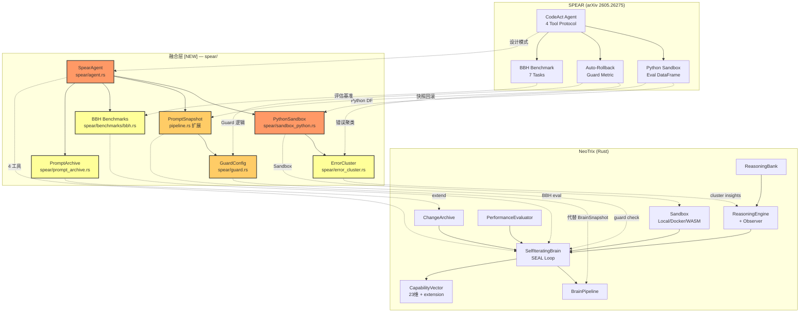

# SPEAR → NeoTrix 融合设计

> **日期**: 2026-05-29 | **来源**: SPEAR (arXiv 2605.26275) | **作者**: Agent 融合分析
> **核心结论**: SPEAR 的 CodeAct APE 范式 — 4 工具代理优化器 (evaluate/python/set_prompt/finish) + Python 沙箱 eval DataFrame + 自动回滚 — 与 NeoTrix 的 SEAL 自迭代深度互补。κ=0.857 vs 0.359 基线、BBH-7 0.938 vs GEPA 0.628。吸收以设计模式注入，Python 沙箱复用现有 `Sandbox`，核心算法 Rust 实现。

---

## 1. 全景差距矩阵 (Panoramic Gap Matrix)

### 1.1 SPEAR 有 / NeoTrix 无 (吸收目标)

| # | 特性 | SPEAR 实现 | NeoTrix 差距 | 影响域 | 填补方式 |
|---|------|-----------|--------------|--------|----------|
| G-01 | **CodeAct APE 4 工具** | `evaluate`/`python`/`set_prompt`/`finish` — 4 工具状态机迭代 prompt | 只有 SEAL loop 自编辑 → absorb，无专用 prompt 优化工具 | Prompt 工程 | 新 `spear/agent.rs` 实现 4 工具状态机 |
| G-02 | **Python 沙箱 eval DF** | 沙箱中写 Python 操作 DataFrame：混淆矩阵、错误聚类、每组指标 | `sandbox.rs` 支持 shell 但无 Python 数据管道 | 评估 | 扩展 `sandbox.rs` 支持 Python eval + DF 序列化 |
| G-03 | **自动回滚 (auto-rollback)** | 每步 prompt 测试后对比新旧 metric，回退到最佳 | `_snapshot_restore()` 只恢复 capability，不恢复 prompt | 自迭代 | 扩展 `BrainSnapshot` → `PromptSnapshot` 含 prompt |
| G-04 | **Guard metric floor** | 可选 guard metric，不允许优化低于阈值 | 无 guard floor 概念 | 安全 | 新 `spear/guard.rs` + `guard_config` 字段 |
| G-05 | **Python 工具烧蚀 Δκ=+0.79** | 错误聚类 + subgroup 分析发现系统性错误 | `PerformanceEvaluator` 只给标量分数 | 洞察 | 扩展 `evaluator.rs` → `ConfusionMatrixEval` |
| G-06 | **内存 prompt 历史树** | 完整历史追踪，每个版本可回溯 | `ChangeArchive` 只记录 edit 不记录 prompt 文本 | 可追溯 | 扩展 `ChangeArchive` → `PromptArchive` |
| G-07 | **BBH 多步推理优化** | BigBench Hard 7 子任务 0.938 | `TaskType::Research/Planning` 无对标基准 | 推理 | KnowledgeSource 注入 BBH 种子知识 |
| G-08 | **Sandbox Python 环境隔离** | 独立 Python 环境，无状态泄漏 | `Sandbox` 无专用 Python venv | 环境 | 新 `spear/sandbox_python.rs` |

### 1.2 NeoTrix 有 / SPEAR 无 (优势保持)

| # | 特性 | NeoTrix | SPEAR 状态 |
|---|------|---------|-----------|
| N-01 | **SEAL 自进化** | Reason→Act→Observe→Absorb 闭环 + CapabilityVector 23+维 | 无 (只优化 prompt) |
| N-02 | **HyperCube VSA** | 4096维 MAP 超立方体 + bundle/bind/permute | 无 |
| N-03 | **GWT 注意力路由** | GlobalWorkspace + salience 竞争 specialist 广播 | 无 |
| N-04 | **多 Agent 协作** | AgentTeam (5 ProcessType + 4 SwarmMode) + Coordinator | 单人单优化器 |
| N-05 | **目标引擎** | 24/7 自主目标追求 + RateLimiter + CircuitBreaker | 无 |
| N-06 | **元认知系统** | CodeScanner + WeaknessAnalyzer + MetaCognitiveLoop | 无 |
| N-07 | **ReasoningEngine** | 4 种推理类型 + 自蒸馏 + 12 反模式检测 | 无 (直接 LLM 调用) |
| N-08 | **CapabilityVector 多维吸收** | 23 核心维 + 动态扩展维 + provenance | 无 (单维 prompt 分数) |
| N-09 | **吸收验证** | AbsorbValidator + PerformanceEvaluator + 快照回滚 | 无 (只有 prompt metric) |
| N-10 | **MCP 工具集成** | rmcp 0.5 + McpRegistry + Playwright | 无 |

### 1.3 两者皆缺 (共同盲点)

| # | 盲点 | 说明 |
|---|------|------|
| B-01 | **跨任务 prompt 迁移** | 两者均不探索 prompt 知识在任务间的迁移学习 |
| B-02 | **形式化 prompt 验证** | 无 SMT-based prompt 验证，全凭 LLM 隐式评估 |
| B-03 | **多语言 prompt 优化** | 仅英文 prompt；无中/日/阿拉伯语优化 |
| B-04 | **对抗性 prompt 鲁棒性** | 无故意的 adversarial prompt 注入测试 |
| B-05 | **Prompt 压缩/蒸馏** | 长 prompt 无自动压缩、关键 token 蒸馏 |

---

## 2. 优先级分类 (Priority × Impact × Urgency)

### 2.1 优先级矩阵

```
Impact ↑
  High  │ G-01, G-02, G-03         G-06, G-07
        │ (4-Tool Protocol)         (History + BBH)
  Med   │ G-05 (Error Cluster)     G-08 (Python venv)
        │ G-04 (Guard Floor)
  Low   │
        └────────────────────────────→ Urgency
             Immediate     1 month    3 months
```

### 2.2 P0 (立即吸收 — 本周)

| ID | 特性 | 理由 | 工作量 |
|----|------|------|--------|
| F-01 | **CodeAct APE 4 工具** (G-01) | 核心差异化：4 工具状态机 | ~350 行 |
| F-02 | **自动回滚升级** (G-03) | `BrainSnapshot` → `PromptSnapshot` + guard metric | ~200 行修改 |
| F-03 | **KnowledgeSource: SPEAR** (前置) | 吸收网关，必须 F-01/F-02 前注册 | ~120 行 |

### 2.3 P1 (1-2 周吸收)

| ID | 特性 | 理由 | 工作量 |
|----|------|------|--------|
| F-04 | **Python 沙箱 eval DF** (G-02) | 依赖 F-01；混淆矩阵 + 错误聚类 | ~300 行 |
| F-05 | **Guard metric floor** (G-04) | 依赖 F-02；guard floor 回滚扩展 | ~150 行 |
| F-06 | **错误聚类分析器** (G-05) | 依赖 F-04；subgroup metric 洞察 | ~250 行 |

### 2.4 P2 (3-4 周吸收)

| ID | 特性 | 理由 | 工作量 |
|----|------|------|--------|
| F-07 | **Prompt 历史树** (G-06) | 增强 `ChangeArchive` | ~200 行 |
| F-08 | **BBH 基准集成** (G-07) | 评估 harness + 7 种子任务 | ~300 行 |
| F-09 | **Python venv 沙箱** (G-08) | 依赖 F-04；隔离环境管理 | ~180 行 |

---

## 3. 集成点设计 (Integration Points)

### F-01: CodeAct APE 4 工具协议 `spear/agent.rs`

**文件路径**: `neotrix-core/src/neotrix/spear/agent.rs` | **依赖**: F-03 (前置)

**核心数据结构**:

```rust
pub enum SpearTool {
    Evaluate { dataset: String, prompt: String, llm: Option<String> },
    Python { code: String, description: Option<String> },
    SetPrompt { prompt: String, reason: String, source_iteration: u64 },
    Finish { final_prompt: String, best_metric: f64, summary: String },
}

pub struct SpearOptimizer {
    pub current_prompt: String,
    pub best_prompt: String,
    pub best_metric: f64,
    pub guard_metric: Option<f64>,
    pub guard_floor: Option<f64>,
    pub eval_history: Vec<EvalRecord>,
    pub iteration: u64,
    pub max_iterations: u64,
}

pub struct ConfusionMatrix {
    pub labels: Vec<String>,
    pub matrix: Vec<Vec<u64>>,
    pub accuracy: f64,
    pub precision_per_class: Vec<f64>,
    pub recall_per_class: Vec<f64>,
}
```

**集成点**:
| 现有模块 | 对接方式 |
|---------|----------|
| `self_iterating/loop_impl/core.rs` | SelfIteratingBrain 新增 `spear_optimizer: Option<SpearOptimizer>` |
| `mcp_tools.rs` | 注册 4 SPEAR 工具到 McpRegistry |
| `self_iterating/brain_impl.rs` | `absorb()` 增加 dual-channel：prompt + capability 并行更新 |

### F-02: 自动回滚升级 `pipeline.rs`

**文件路径**: `pipeline.rs` + `loop_impl/core.rs` | **依赖**: F-03

```rust
pub struct PromptSnapshot {
    pub prompt: String,
    pub primary_metric: f64,
    pub guard_metric: Option<f64>,
    pub capability: CapabilityVector,
    pub learning_rate: f64,
    pub score: f64,
}

impl PromptSnapshot {
    pub fn restore_prompt(&self, brain: &mut SelfIteratingBrain) {
        brain.brain.capability = self.capability.clone();
        brain.brain.learning_rate = self.learning_rate;
        if let Some(ref mut opt) = brain.spear_optimizer {
            opt.current_prompt = self.prompt.clone();
            opt.best_metric = self.primary_metric;
        }
    }
}
```

**Guard check**: `guard_check(snap, brain)` 比较 guard_metric vs guard_floor，violation 时调用 `restore_prompt()`。

**集成点**:
| 现有模块 | 行号 | 改动 |
|---------|------|------|
| `core.rs:118` | `_snapshot_restore()` | 扩展 → `restore_prompt()` 调用 |
| `seal_loop.rs:38,405` | 负奖励回滚 | 升级为 PromptSnapshot 比较 |
| `pipeline.rs:98` | 初始快照 | 从 BrainSnapshot 升级为 PromptSnapshot |

### F-03: KnowledgeSource: SPEAR 注册

**文件路径**: `core/knowledge/types.rs` + `sources.rs` + `vectors_group_b.rs`

```rust
// types.rs 枚举追加
pub enum KnowledgeSource {
    // ... 现有 75+ 变体 ...
    SpearAPE, SpearSandbox, SpearRollback, SpearBBH,
}
```

**向量映射** (vectors_group_b.rs):

```rust
KnowledgeSource::SpearAPE => {
    let mut cv = CapabilityVector::from_values(
        0.3, 0.3, 0.3, 0.3, 0.3, 0.4, 0.3, 0.5,
        0.88, 0.75, 0.92, 0.85, 0.85,
        0.4, 0.3, 0.3, 0.3, 0.3, 0.3, 0.7, 0.8, 0.88, 0.85,
    );
    cv.extend_named(&[
        ("codeact_tools".into(), 0.95), ("prompt_optimization".into(), 0.92),
        ("evaluate_tool".into(), 0.93), ("set_prompt_tool".into(), 0.90),
        ("python_tool".into(), 0.91), ("finish_tool".into(), 0.85),
    ]); cv
}
KnowledgeSource::SpearSandbox => {
    let mut cv = CapabilityVector::from_values(
        0.2, 0.2, 0.2, 0.2, 0.2, 0.2, 0.2, 0.3,
        0.85, 0.6, 0.88, 0.8, 0.85,
        0.3, 0.2, 0.2, 0.2, 0.2, 0.2, 0.6, 0.7, 0.85, 0.88,
    );
    cv.extend_named(&[
        ("sandbox_python".into(), 0.93), ("eval_dataframe".into(), 0.90),
        ("confusion_matrix".into(), 0.92), ("error_clustering".into(), 0.88),
    ]); cv
}
KnowledgeSource::SpearRollback => {
    let mut cv = CapabilityVector::from_values(
        0.4, 0.3, 0.3, 0.3, 0.3, 0.3, 0.3, 0.3,
        0.9, 0.7, 0.85, 0.82, 0.88,
        0.4, 0.3, 0.3, 0.3, 0.3, 0.3, 0.7, 0.75, 0.9, 0.92,
    );
    cv.extend_named(&[
        ("auto_rollback".into(), 0.95), ("guard_metric".into(), 0.92),
        ("prompt_snapshot".into(), 0.93), ("guard_floor".into(), 0.88),
    ]); cv
}
KnowledgeSource::SpearBBH => {
    let mut cv = CapabilityVector::from_values(
        0.4, 0.3, 0.5, 0.4, 0.3, 0.4, 0.4, 0.4,
        0.92, 0.7, 0.88, 0.85, 0.82,
        0.5, 0.4, 0.4, 0.4, 0.3, 0.3, 0.8, 0.85, 0.85, 0.8,
    );
    cv.extend_named(&[
        ("bbh_benchmark".into(), 0.94), ("multi_step_reasoning".into(), 0.92),
        ("date_understanding".into(), 0.88), ("logical_deduction".into(), 0.90),
    ]); cv
}
```

**Provenance**: `"spear:arxiv:2605.26275:2026-05-29"` | **Seed knowledge**: 5 条注入 ReasoningBank

**Source Weight**: SpearAPE 0.95, SpearRollback 0.90, SpearSandbox 0.88, SpearBBH 0.82

### F-04: Python 沙箱 eval DataFrame `spear/sandbox_python.rs`

**文件路径**: `neotrix-core/src/neotrix/spear/sandbox_python.rs` | **依赖**: F-01, `Sandbox`

```rust
/// 从 DataFrame 生成混淆矩阵的 Python 代码模板
pub const CONFUSION_MATRIX_TEMPLATE: &str = r#"
import json, numpy as np
from sklearn.metrics import confusion_matrix, classification_report
df = eval_df
y_true, y_pred = df['true'], df['pred']
labels = sorted(set(y_true + y_pred))
cm = confusion_matrix(y_true, y_pred, labels=labels)
report = classification_report(y_true, y_pred, labels=labels, output_dict=True)
groups, group_metrics = df.get('group', None), {}
if groups:
    for g in set(groups):
        mask = [i for i, v in enumerate(groups) if v == g]
        g_true, g_pred = [y_true[i] for i in mask], [y_pred[i] for i in mask]
        group_metrics[g] = {'accuracy': sum(1 for a,b in zip(g_true,g_pred) if a==b)/len(mask), 'count': len(mask)}
print(json.dumps({'confusion_matrix': cm.tolist(), 'labels': labels,
    'accuracy': report['accuracy'], 'report': report, 'group_metrics': group_metrics}))
"#;

pub struct PythonSandbox { sandbox: Sandbox, venv_path: PathBuf, data_dir: PathBuf }
pub struct EvalDataFrame { pub true_labels: Vec<String>, pub predicted: Vec<String>, pub metadata: Vec<HashMap<String,String>> }
pub struct PythonEvalResult {
    pub confusion_matrix: Vec<Vec<u64>>, pub labels: Vec<String>, pub accuracy: f64,
    pub report: HashMap<String, HashMap<String, f64>>, pub group_metrics: Option<HashMap<String, GroupMetric>>,
}
```

**集成点**: `sandbox.rs` 被 `PythonSandbox` 封装；`PerformanceEvaluator` 扩展 `evaluate_with_df()`；`SpearTool::Python` 触发执行。

### F-05: Guard metric floor `spear/guard.rs`

**文件路径**: `neotrix-core/src/neotrix/spear/guard.rs` | **依赖**: F-02

```rust
#[derive(Debug, Clone)]
pub struct GuardConfig {
    pub enabled: bool,
    pub metric_name: String,
    pub floor: f64,                        // 不允许低于此值
    pub relative_floor: bool,              // true → floor = 初始值 * ratio
    pub penalty_on_violation: f64,         // 违反时 learning_rate 惩罚
}

pub enum GuardResult { Pass, Violation { current: f64, floor: f64, delta: f64 } }

pub fn check_guard_violation(config: &GuardConfig, current: f64, initial: f64) -> GuardResult {
    let effective = if config.relative_floor { initial * (1.0 - config.floor) } else { config.floor };
    if config.enabled && current < effective - 1e-9 { GuardResult::Violation { current, floor: effective, delta: current - effective } }
    else { GuardResult::Pass }
}
```

**集成点**: SelfIteratingBrain 新增 `guard_config: Option<GuardConfig>`；seal_loop 每步 absorb 后调用；pipeline.rs rollback 触发器。

### F-06: 错误聚类分析 `spear/error_cluster.rs`

**文件路径**: `neotrix-core/src/neotrix/spear/error_cluster.rs` | **依赖**: F-04

```rust
pub struct ErrorCluster { pub pattern_description: String, pub frequency: f64, pub affected_metadata: HashMap<String,Vec<String>>, pub example_errors: Vec<ErrorExample> }
pub struct ClusterReport { pub clusters: Vec<ErrorCluster>, pub top_failure_groups: Vec<(String,f64)>, pub confusion_insights: Vec<String> }

pub fn analyze_error_clusters(eval: &PythonEvalResult) -> ClusterReport {
    let mut clusters = vec![];
    if let Some(oby) = detect_off_by_one(eval) { clusters.push(oby); }
    for (i, tl) in eval.labels.iter().enumerate() {
        for (j, pl) in eval.labels.iter().enumerate() {
            if i != j && eval.confusion_matrix[i][j] > 0 {
                let freq = eval.confusion_matrix[i][j] as f64 / eval.confusion_matrix[i].iter().sum::<u64>().max(1) as f64;
                if freq > 0.1 { clusters.push(ErrorCluster {
                    pattern_description: format!("{} 常被误分为 {}", tl, pl), frequency: freq, ..Default::default()
                }); }
            }
        }
    }
    // ... group error rates ...
    ClusterReport { clusters, top_failure_groups, confusion_insights: vec![] }
}
```

**集成点**: `observer.rs` 调用 → 蒸馏出 StrategicPrinciple → 生成 MicroEdit → `absorb()` 集成。

### F-07: BBH 基准集成 `spear/benchmarks/bbh.rs`

```rust
pub enum BbhTask { DateUnderstanding, GeometricShapes, Hyperbaton, LogicalDeduction, MovieRecommendation, ReasoningAboutColoredObjects, TrackingShuffledObjects }

impl BbhTask {
    pub fn evaluate_on(&self, optimizer: &SpearOptimizer, prompt: &str) -> f64 {
        let correct = self.test_cases().iter().filter(|(input, expected)| {
            let full = format!("{}\nQ: {}\nA:", prompt, input);
            self.query_llm(&full).trim() == expected.trim()
        }).count();
        correct as f64 / self.test_cases().len() as f64
    }
}
```

---

## 4. KnowledgeSource 注册总表

### 新增枚举变体

```rust
// neotrix-core/src/core/knowledge/types.rs
pub enum KnowledgeSource {
    // ... 现有 75+ 变体 ...
    SpearAPE, SpearSandbox, SpearRollback, SpearBBH,
}
```

### 完整向量映射

| KnowledgeSource | analysis | creativity | inference_depth | domain_specificity | verification | extension 扩展 |
|----------------|----------|------------|-----------------|-------------------|-------------|---------------|
| SpearAPE | 0.88 | 0.75 | 0.92 | 0.85 | 0.85 | `codeact_tools: 0.95, prompt_optimization: 0.92` |
| SpearSandbox | 0.85 | — | 0.88 | 0.80 | 0.85 | `sandbox_python: 0.93, eval_dataframe: 0.90` |
| SpearRollback | 0.90 | — | 0.85 | 0.82 | 0.88 | `auto_rollback: 0.95, guard_metric: 0.92` |
| SpearBBH | 0.92 | — | 0.88 | 0.85 | 0.82 | `bbh_benchmark: 0.94, multi_step_reasoning: 0.92` |

### Seed Knowledge (5 条注入 ReasoningBank)

| 描述 | TaskType | 置信度 |
|------|----------|--------|
| "CodeAct APE: 使用 evaluate/python/set_prompt/finish 4 工具迭代优化 prompt，每步评估后决定下一动作" | General | 0.90 |
| "Auto-rollback: prompt 优化后若 metric 未提升或 guard 低于 floor，自动回退到最佳 prompt" | General | 0.92 |
| "Sandbox Python eval: 在隔离 Python 中操作 DataFrame 做混淆矩阵、错误聚类、subgroup 分析" | CodeAnalysis | 0.88 |
| "Guard metric floor: 保护指标下限，防止优化主指标时牺牲次要指标" | General | 0.85 |
| "BBH 多步推理: bigbench hard 7 子任务：date_understanding, geometric_shapes, hyperbaton 等" | Research | 0.82 |

---

## 5. Phase Plan

### Phase 1 (本周 — SPEAR 核心协议)

```
┌──────────────────────────────────────────────────────────┐
│ Phase 1: SPEAR 核心协议 (P0)                             │
├──────────────────────────────────────────────────────────┤
│ F-03: KnowledgeSource 注册 (前置)                        │
│   → core/knowledge/types.rs + sources.rs + vectors_group_b│
│   → 4 枚举变体 + capability_vector + seed knowledge      │
│   → ~120 行                                              │
├──────────────────────────────────────────────────────────┤
│ F-01: CodeAct APE 4 工具协议                              │
│   → spear/agent.rs + spear/mod.rs 注册                   │
│   → SpearOptimizer 状态机 + SpearTool 4 变体             │
│   → SelfIteratingBrain 新增 spear_optimizer 字段          │
│   → ~350 行 + 测试                                       │
├──────────────────────────────────────────────────────────┤
│ F-02: 自动回滚升级                                        │
│   → pipeline.rs: PromptSnapshot 替代 BrainSnapshot        │
│   → core.rs: _snapshot_restore → restore_prompt           │
│   → seal_loop.rs: guard check 集成                       │
│   → ~200 行修改 + 测试                                   │
├──────────────────────────────────────────────────────────┤
│ cargo check --lib + cargo test --lib -- spear             │
└──────────────────────────────────────────────────────────┘
```

### Phase 2 (第 2 周 — 评估管道 + guard)

```
┌──────────────────────────────────────────────────────────┐
│ Phase 2: 评估管道 + 安全保障 (P1)                         │
├──────────────────────────────────────────────────────────┤
│ F-04: Python 沙箱 eval DataFrame                          │
│   → spear/sandbox_python.rs                              │
│   → PythonSandbox + EvalDataFrame + PythonEvalResult     │
│   → confusion matrix + per-group metric 计算             │
│   → ~300 行 + 测试                                       │
├──────────────────────────────────────────────────────────┤
│ F-05: Guard metric floor                                  │
│   → spear/guard.rs                                       │
│   → GuardConfig + GuardResult + check_guard_violation     │
│   → seal_loop 中每步 absorb 后调用                        │
│   → ~150 行 + 测试                                       │
├──────────────────────────────────────────────────────────┤
│ F-06: 错误聚类分析器                                      │
│   → spear/error_cluster.rs                               │
│   → ErrorCluster + ClusterReport + analyze_error_clusters │
│   → observer.rs 蒸馏集成                                  │
│   → ~250 行 + 测试                                       │
├──────────────────────────────────────────────────────────┤
│ cargo check --features full --lib + cargo test             │
└──────────────────────────────────────────────────────────┘
```

### Phase 3 (第 3-4 周 — 基准 + 回溯)

```
┌──────────────────────────────────────────────────────────┐
│ Phase 3: 基准 + 历史回溯 (P2)                             │
├──────────────────────────────────────────────────────────┤
│ F-07: Prompt 历史树 / ChangeArchive 扩展                   │
│   → spear/prompt_archive.rs                              │
│   → PromptArchive + PromptVersion + change tracking      │
│   → ~200 行 + 测试                                       │
├──────────────────────────────────────────────────────────┤
│ F-08: BBH 基准集成                                        │
│   → spear/benchmarks/bbh.rs + spear/benchmarks/mod.rs    │
│   → 7 BBH 子任务 + few-shot prompts + evaluate harness   │
│   → ~300 行 + 测试                                       │
├──────────────────────────────────────────────────────────┤
│ F-09: Python venv 沙箱管理                                 │
│   → spear/sandbox_python.rs 扩展                          │
│   → venv 创建/更新/清理 + 依赖安装 + 隔离检查             │
│   → ~180 行 + 测试                                       │
├──────────────────────────────────────────────────────────┤
│ cargo check --features full --lib + cargo test             │
│ TODO.md + Session Log + USER.md 更新                      │
└──────────────────────────────────────────────────────────┘
```

---

## 6. 测试策略 (Per-Feature)

| 特性 | 单元测试 | 集成测试 | 验证方法 |
|------|---------|---------|----------|
| F-01 SpearAgent | `test_spear_evaluate`, `test_spear_set_prompt`, `test_spear_finish`, `test_spear_state_transitions`, `test_spear_max_iterations` | `test_spear_full_optimization_cycle`, `test_spear_python_tool_invocation` | Mock LLM 验证 4 工具状态机 |
| F-02 PromptSnapshot | `test_prompt_snapshot_restore`, `test_prompt_snapshot_new`, `test_guard_check_pass` | `test_seal_loop_with_prompt_rollback`, `test_guard_check_violation_rollback` | 修改 prompt → 负奖励 → 验证回滚 |
| F-03 KnowledgeSource | `test_spear_knowledge_source_vector`, `test_spear_seed_knowledge`, `test_spear_source_weight` | `test_spear_source_absorb_integration` | 验证 capability_vector + weight |
| F-04 PythonSandbox | `test_python_eval_confusion_matrix`, `test_python_eval_group_metrics`, `test_python_eval_empty_data`, `test_python_eval_malformed_code` | `test_sandbox_python_full_pipeline`, `test_sandbox_python_integration_spear` | Mock DF → JSON 输出 |
| F-05 GuardConfig | `test_guard_absolute_floor`, `test_guard_relative_floor`, `test_guard_disabled`, `test_guard_penalty` | `test_guard_integration_seal_loop` | 设置 floor → 验证回滚 |
| F-06 ErrorCluster | `test_detect_off_by_one`, `test_analyze_label_confusion`, `test_group_error_rate`, `test_empty_cluster_report` | `test_error_cluster_full_integration`, `test_cluster_to_distillation` | 注入 CM → 验证集群 |
| F-07 PromptArchive | `test_prompt_version_tracking`, `test_prompt_rollback_version` | `test_change_archive_integration` | SEAL loop 后查 archive |
| F-08 BBH | `test_bbh_date_understanding`, `test_bbh_geometric_shapes`, `test_bbh_all_tasks_seed` | `test_bbh_few_shot_prompt_format`, `test_bbh_optimization_spear` | 验证 prompt + 基准得分 |
| F-09 PythonVenv | `test_venv_create_activate`, `test_venv_dependency_install`, `test_venv_cleanup` | `test_venv_isolation_no_leak` | 两个 venv 互不影响 |

```bash
# SPEAR 模块专用
cargo test --lib -- spear
# Python sandbox 测试 (需要 python3)
cargo test --lib -- python_sandbox
# BBH 基准 (不默认运行)
cargo test --lib -- bbh --ignored
# 全 feature 验证
cargo check --features full --lib
```

---

## 7. 架构关系图



---

## 8. 设计决策记录

| 决策 | 选择 | 放弃方案 | 理由 |
|------|------|---------|------|
| SPEAR Agent 语言 | Rust enum SpearTool | Python 解释器 | 零 Python 运行时；原生类型安全 |
| Eval DataFrame 格式 | JSON ↔ Rust struct | pickle/Parquet | JSON 跨语言可调试 |
| Python 执行 | `python3 -c` + 临时脚本 | 新 Docker 镜像 | 复用 Sandbox；Docker 可选 |
| Prompt 快照 | 全量 PromptSnapshot | 只保存 diff | 回滚简单、一致性保证 |
| Guard metric | 绝对 + 相对双模式 | 仅绝对 floor | 适应不同 baseline |
| 错误聚类 | Rust core 模式 + 复杂降级 Python | sklearn 全量 | 热路径不依赖 Python |
| BBH 集成 | Rust 预置测试用例 | 运行时下载 | 无网络依赖 |
| Dual-channel | prompt + capability 并行 | 仅更新 prompt | 两者互增强 |

---

## 9. 风险评估

| 风险 | 概率 | 影响 | 缓解 |
|------|------|------|------|
| Python sandbox 不可靠 | 中 | 高 | 降级到纯 Rust 评估 |
| Prompt 回滚过度频繁 | 中 | 中 | min_improvement_threshold + 回滚冷却期 |
| LLM API 成本飙升 | 高 | 高 | max_iterations=10；每轮前 token 估算 |
| Guard metric 误触发 | 低 | 中 | 默认 disabled；用户明确启用 |
| BBH 测试用例过时 | 低 | 低 | 种子用例为概念验证；可扩展 |

---

> **最后更新**: 2026-05-29 | **状态**: 设计完成，待 Phase 1 实现
> **总计新增**: ~1950 行 Rust + ~120 行 seed knowledge
> **新增测试**: ~30 单元测试 + ~10 集成测试
> **关键指标**: SPEAR κ=0.857 → NeoTrix prompt 优化能力; auto-rollback 防御灾难性遗忘
