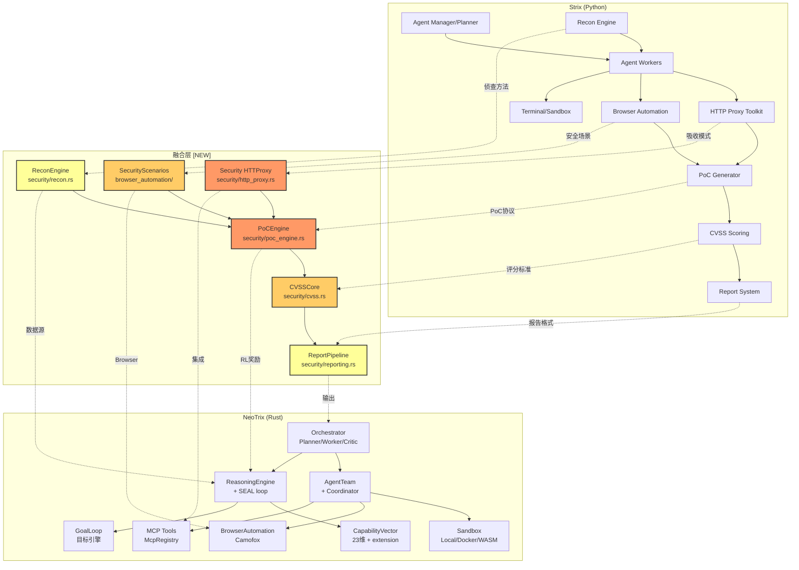

# Strix → NeoTrix 融合设计

> **日期**: 2026-05-29 | **来源**: Strix v1.0.2 (25.7k⭐, Apache 2.0) | **语言**: Python 90.1% (Rust 吸收)
> **目标**: NeoTrix `neotrix-core/src/` 全模块 | **作者**: Agent 融合分析
> **核心结论**: Strix 是 AI 安全测试领域的最强开源 Agent 系统，其「完整黑客工具链」+「DAG Agent 协作」模式与 NeoTrix 的 SEAL 自迭代 + CapabilityVector 形成天然互补。吸收价值极高，但语言差异 (Python→Rust) 要求以设计模式吸收而非代码移植。

---

## 1. 全景差距矩阵 (Panoramic Gap Matrix)

### 1.1 Strix 有 / NeoTrix 无 (吸收目标)

| # | 特性 | Strix 实现 | NeoTrix 差距 | 影响域 | 填补方式 |
|---|------|-----------|--------------|--------|----------|
| G-01 | **完整 HTTP 代理工具箱** | `strix/tools/proxy/` — 请求/响应拦截、重放、修改、中间人 | 只有 `agent/proxy.rs` (ProxyBrain 封装) + `server_proxy.rs` (状态查询)，无请求操作能力 | 安全测试 | 新 `security/http_proxy.rs` + 中间人代理 |
| G-02 | **多 Tab 浏览器自动化安全测试** | Playwright 多 Tab 处理 XSS/CSRF/auth 流 | `browser_automation/` 只有指纹隐匿，无安全测试场景 orchestration | 安全测试 | 扩展 `browser_automation/` + 安全场景脚本 |
| G-03 | **PoC 验证引擎** | 漏洞发现后自动生成 proof-of-concept | 无 PoC 生成管道 | 安全测试 | 新 `security/poc_engine.rs` |
| G-04 | **CVSS 评分集成** | `cvss>=3.2` 库自动计算严重度 | 无漏洞评分系统 | 安全测试 | 新 `security/cvss.rs` (纯 Rust 实现) |
| G-05 | **OSINT 侦查引擎** | 自动攻击面发现、子域名枚举、端口扫描 | `scraper.rs` + `crawler/` 只有通用爬虫 | 安全测试 | 扩展 `security/recon.rs` |
| G-06 | **自动化 CI/CD 安全扫描** | GitHub Actions workflow + diff-scope 模式 | `.github/workflows/` 只有通用 CI/release/audit | DevOps | 新 `.github/workflows/security-scan.yml` |
| G-07 | **LLM Provider 路由 (LiteLLM 封装)** | `openai-agents[litellm]` — 统一 OpenAI/Anthropic/Google/本地 | `model_router.rs` 存在但聚焦 Tier 分级而非 Provider 抽象 | Agent | 扩展 `model_router.rs` + LiteLLM 风格路由 |
| G-08 | **Vulnerability 结果报告系统** | 结构化发现报告 + 重现步骤 + 自动修复 PR | `security_audit.rs` 只有扫描无完整报告管线 | 安全测试 | 新 `security/reporting.rs` |
| G-09 | **非交互式 headless 模式** | `-n/--non-interactive` 返回结构化 JSON 输出 | `entry/headless.rs` 存在但输出格式不同 | CLI | 扩展 `headless.rs` 输出格式 |
| G-10 | **Structured 攻击知识管理** | 技能系统记录攻击模式、发现文档 | `agent/skills/` 存在但非安全领域专用 | 知识 | KnowledgeSource 注册 SecurityAttack 变体 |

### 1.2 NeoTrix 有 / Strix 无 (优势保持)

| # | 特性 | NeoTrix | Strix 状态 |
|---|------|---------|-----------|
| N-01 | **自进化能力 (SEAL loop)** | Reason→Act→Observe→Absorb 闭环 + CapabilityVector 23维 | 无 (静态 agent) |
| N-02 | **HyperCube VSA 知识表示** | 4096维 MAP 超立方体 + bundle/bind/permute | 无 |
| N-03 | **GWT 注意力意识路由** | GlobalWorkspace + salience 竞争 specialist 广播 | 无 |
| N-04 | **多 Agent 协作模式** | AgentTeam (5 ProcessType + 4 SwarmMode) + Coordinator | 只有 Manager+Worker 层次 |
| N-05 | **目标引擎 (GoalLoop)** | 24/7 自主目标追求 + RateLimiter + CircuitBreaker | 无 |
| N-06 | **隐身网络** | Proxy chain + Tor + IP rotation + Bandit | 无 |
| N-07 | **元认知系统** | CodeScanner + WeaknessAnalyzer + MetaCognitiveLoop | 无 |
| N-08 | **ReasoningEngine 统一推理** | 4 种推理类型 + 自蒸馏 | 无 (直接 LLM 调用) |
| N-09 | **Agent 协议** | UDP 发现 + ACP server | 无 |
| N-10 | **并行执行** | ParallelExecutor + SubAgentPool | 依赖 Python 多线程 |

### 1.3 两者皆缺 (共同盲点)

| # | 盲点 | 说明 |
|---|------|------|
| B-01 | **声明式安全测试 DSL** | 两者都靠 prompt 而非形式化语言描述安全测试用例 |
| B-02 | **运行时安全监控** | 两者都是离线条带扫描，不支持在运行中 agent 注入检测 |
| B-03 | **联邦学习攻击知识库** | 无跨实例共享攻击模式 |
| B-04 | **形式化漏洞验证** | PoC 生成靠 LLM 而非符号执行/污点追踪 |

---

## 2. 优先级分类 (Priority × Impact × Urgency)

### 2.1 优先级矩阵

```
Impact ↑
  High  │ G-01, G-02, G-03     G-06, G-07
        │ G-00 (HTTP Proxy)    G-00 (CI/CD)
  Med   │ G-04 (CVSS)          G-08 (Reporting)
        │ G-05 (Recon)         G-09 (Headless)
  Low   │ G-10 (Skills)
        └────────────────────────────→ Urgency
             Immediate    1 month     3 months
```

### 2.2 P0 (立即吸收 — 本周)

| ID | 特性 | 理由 | 工作量估计 |
|----|------|------|-----------|
| F-01 | **HTTP 代理工具箱** (G-01) | 安全测试核心能力，NeoTrix 完全缺失 | ~400 行新代码 |
| F-02 | **PoC 验证引擎** (G-03) | 漏洞验证 = Strix 最大差异化能力 | ~350 行新代码 |
| F-03 | **KnowledgeSource: SecurityAttack** (G-10) | 吸收知识网关，前置条件 | ~150 行 + 枚举扩展 |

### 2.3 P1 (1-2 周吸收)

| ID | 特性 | 理由 | 工作量估计 |
|----|------|------|-----------|
| F-04 | **多 Tab 浏览器安全测试** (G-02) | 依赖 P0 HTTP Proxy | ~500 行新代码 + 测试 |
| F-05 | **CVSS 评分系统** (G-04) | 漏洞管理基础设施 | ~200 行 |
| F-06 | **CI/CD 安全扫描 workflow** (G-06) | 低风险高可见度 | 1 yaml 文件 + sandbox 集成 |

### 2.4 P2 (3-4 周吸收)

| ID | 特性 | 理由 | 工作量估计 |
|----|------|------|-----------|
| F-07 | **OSINT 侦查引擎** (G-05) | 独立模块，无阻塞依赖 | ~300 行 |
| F-08 | **漏洞报告系统** (G-08) | 依赖 CVSS + PoC | ~250 行 |
| F-09 | **LiteLLM 风格 Provider 路由** (G-07) | 增强现有 `model_router.rs` | ~200 行 |

---

## 3. 集成点设计 (Integration Points)

### F-01: HTTP 代理工具箱 `security/http_proxy.rs`

**文件路径**: `neotrix-core/src/neotrix/security/http_proxy.rs`
**依赖**: 无 (纯标准库 + serde)

**设计**:

```rust
/// HTTP 请求/响应拦截代理
pub struct HttpInterceptor {
    listen_addr: SocketAddr,
    upstream: String,
    rules: Vec<InterceptRule>,
}

pub enum InterceptAction {
    Forward,
    ModifyRequest(Vec<(String, String)>),  // (header, value) 修改
    ModifyBody(String),
    Drop,
    Capture(String),  // 保存到命名捕获
}

pub struct InterceptRule {
    pub match_url: Regex,
    pub match_method: Option<Method>,
    pub action: InterceptAction,
}

pub enum SecurityTest {
    XssReflected(String),
    XssStored(String),
    CsrfTokenBypass,
    SqlInjection(String),
    SsrfCheck(String),
}
```

**集成点**:
| NeoTrix 现有模块 | 对接方式 |
|-----------------|----------|
| `security/mod.rs` | 注册 `pub mod http_proxy;` |
| `mcp_tools.rs` | 注册 `http_proxy_start/stop/rule_add` 工具 |
| `agent/tools/McpRegistry` | 通过 MCP 桥暴露代理控制功能 |
| `browser_automation/camofox.rs` | 浏览器通过代理路由流量 |

### F-02: PoC 验证引擎 `security/poc_engine.rs`

**文件路径**: `neotrix-core/src/neotrix/security/poc_engine.rs`
**依赖**: F-01 HTTP Proxy (验证用)

**设计**:

```rust
pub struct PocEngine {
    pub verifier: PoCVerifier,
    pub evidence: Vec<Evidence>,
}

pub enum PoCStep {
    HttpRequest {
        method: String,
        url: String,
        headers: Vec<(String, String)>,
        body: Option<String>,
    },
    AssertResponse {
        status: Option<u16>,
        body_contains: Option<String>,
        body_not_contains: Option<String>,
        header_matches: Option<(String, Regex)>,
    },
    BrowserAction {
        goto: String,
        click: Option<String>,
        fill: Option<(String, String)>,  // (selector, value)
        screenshot_path: Option<String>,
    },
    PythonExploit(String),  // 内联 Python 代码 → sandbox.rs
}

pub struct ValidatedVulnerability {
    pub title: String,
    pub cvss_score: f64,
    pub poc: Vec<PoCStep>,
    pub evidence: Vec<Evidence>,
    pub remediation: String,
}
```

**集成点**:
| NeoTrix 现有模块 | 对接方式 |
|-----------------|----------|
| `sandbox.rs` | `Sandbox::execute()` 执行 PoC 的 shell/terminal 步骤 |
| `browser_automation/camofox.rs` | 执行浏览器 PoC 步骤 |
| `security_audit.rs` | 漏洞发现后触发 PoC 验证 |
| `reasoning_brain/self_iterating.rs` | PoC 成功 → RL 奖励信号 → `absorb()` |

### F-03: KnowledgeSource SecurityAttack 注册

**文件路径**: `neotrix-core/src/core/capability.rs` (扩展 KnowledgeSource)
**依赖**: 无

**设计**:

```rust
// 在 KnowledgeSource 枚举中新增变体
pub enum KnowledgeSource {
    // ... 现有 33+ 变体
    SecurityAttacks,
    HttpProxyTesting,
    WebExploitation,
    PoCValidation,
}
```

**CapabilityVector 映射**:

| 知识源 | 核心维度 | extension 扩展维度 |
|--------|---------|-------------------|
| `SecurityAttacks` | `analysis: 0.85, domain_specificity: 0.75` | `security_attack_knowledge: 0.92` |
| `HttpProxyTesting` | `experimental: 0.80, verification: 0.88` | `http_proxy_skill: 0.90` |
| `WebExploitation` | `synthesis: 0.75, inference_depth: 0.80` | `web_exploit_knowledge: 0.88` |
| `PoCValidation` | `verification: 0.95, quality_gates: 0.85` | `poc_generation: 0.85` |

**Provenance**: `"strix:v1.0.2:security-attacks"`

**ReasoningBank 种子知识** (5 条注入):

| 描述 | TaskType | 置信度 |
|------|----------|--------|
| "IDOR: Insecure Direct Object Reference — 通过修改请求参数中的对象 ID 访问未授权数据" | Security | 0.95 |
| "XSS: Cross-Site Scripting — 注入 malicious script 通过反射/存储/DOM 三种方式" | Security | 0.95 |
| "SSRF: Server-Side Request Forgery — 利用服务端请求功能访问内部资源" | Security | 0.93 |
| "SQL 注入: 通过用户输入注入 SQL 语句操纵数据库查询" | Security | 0.94 |
| "CSRF: Cross-Site Request Forgery — 诱导用户执行非预期操作" | Security | 0.90 |

### F-04: 多 Tab 浏览器安全测试 `browser_automation/security_scenarios.rs`

**文件路径**: `neotrix-core/src/neotrix/browser_automation/security_scenarios.rs`
**依赖**: `browser_automation/camofox.rs` + F-01 HTTP Proxy

**设计**:

```rust
pub struct SecurityScenario {
    pub name: String,
    pub steps: Vec<BrowserStep>,
    pub expected_vulns: Vec<VulnerabilityType>,
}

pub enum BrowserStep {
    OpenTab { url: String, tab_id: String },
    SwitchTab(String),
    FillField { selector: String, value: String },
    Click { selector: String },
    InterceptRequest { pattern: Regex, modify: ModifyRule },
    AssertVulnerable { evidence: EvidencePattern },
    Screenshot(String),
}
```

**预置场景**:

| 场景 | 步骤数 | 检测目标 |
|------|--------|---------|
| XSS 反射测试 | 5 | 输入 → 提交 → 检查反射 → 确认执行 |
| CSRF Token 验证 | 4 | 抓取表单 → 移除 token → 提交 → 检查拒绝 |
| Auth 流程绕过 | 6 | 登录 → 抓 cookie → 重放 → 检查会话固定 |
| IDOR 批量测试 | 8 | 遍历 ID → 比较响应 → 检测越权 |

### F-05: CVSS 评分系统 `security/cvss.rs`

**文件路径**: `neotrix-core/src/neotrix/security/cvss.rs`
**依赖**: 无 (纯 Rust 实现，不引入 Python `cvss` 库)

**设计**:

```rust
pub struct CvssVector {
    pub attack_vector: AttackVector,
    pub attack_complexity: Complexity,
    pub privileges_required: Privileges,
    pub user_interaction: UserInteraction,
    pub scope: Scope,
    pub confidentiality: Impact,
    pub integrity: Impact,
    pub availability: Impact,
}

pub enum AttackVector { Network, Adjacent, Local, Physical }
pub enum Impact { None, Low, High }

impl CvssVector {
    pub fn base_score(&self) -> f64 {
        // CVSS v3.1 标准公式
        // Impact = 1 - (1 - Conf) * (1 - Integ) * (1 - Avail)
        // Exploitability = 8.22 * AV * AC * PR * UI
        // BaseScore = min(Impact + Exploitability, 10) 或 0
    }

    pub fn severity(&self) -> Severity {
        match self.base_score() {
            s if s >= 9.0 => Severity::Critical,
            s if s >= 7.0 => Severity::High,
            s if s >= 4.0 => Severity::Medium,
            s if s >= 0.1 => Severity::Low,
            _ => Severity::None,
        }
    }
}
```

### F-06: CI/CD 安全扫描

**文件路径**: `.github/workflows/security-scan.yml`
**依赖**: sandbox Docker 镜像

```yaml
name: neotrix-security-scan

on:
  pull_request:

jobs:
  security-scan:
    runs-on: ubuntu-latest
    steps:
      - uses: actions/checkout@v4
        with:
          fetch-depth: 0
      - name: Run NeoTrix security scan
        run: |
          docker run --rm -v $PWD:/target neotrix/sandbox \
            neotrix security-scan --target /target --diff-only
```

---

## 4. KnowledgeSource 注册总表

### 新增枚举变体

```rust
// neotrix-core/src/core/mod.rs (KnowledgeSource 枚举追加)
pub enum KnowledgeSource {
    // ... 现有 33+ 变体保持不动 ...
    
    // === SECURITY DOMAIN (strix: v1.0.2) ===
    SecurityAttacks,        // 常见攻击类型知识库
    HttpProxyTesting,       // HTTP 代理拦截/修改
    WebExploitation,        // Web 漏洞利用
    PoCValidation,          // PoC 验证引擎
    OWASPClassification,    // OWASP Top 10 分类
    CvssScoring,            // CVSS v3.1 评分
    ReconTechniques,        // OSINT 侦查技术
}
```

### 完整向量映射

| KnowledgeSource | analysis | creativity | inference_depth | domain_specificity | verification | extension 扩展 |
|----------------|----------|------------|-----------------|-------------------|-------------|---------------|
| SecurityAttacks | 0.85 | — | 0.80 | 0.75 | 0.80 | `security_attack_knowledge: 0.92` |
| HttpProxyTesting | — | 0.78 | — | 0.65 | 0.88 | `http_proxy_skill: 0.90` |
| WebExploitation | 0.80 | 0.85 | 0.82 | 0.70 | 0.75 | `web_exploit_knowledge: 0.88` |
| PoCValidation | 0.70 | — | 0.85 | 0.60 | 0.95 | `poc_generation: 0.85` |
| OWASPClassification | 0.82 | — | 0.75 | 0.78 | 0.80 | `owasp_classification: 0.90` |
| CvssScoring | 0.70 | — | 0.72 | 0.85 | 0.92 | `cvss_scoring: 0.88` |
| ReconTechniques | 0.75 | 0.70 | 0.78 | 0.68 | — | `recon_techniques: 0.85` |

### Source Weight (吸收/选择优先级)

| KnowledgeSource | weight | 理由 |
|----------------|--------|------|
| SecurityAttacks | 0.95 | 核心安全知识，所有测试的基础 |
| PoCValidation | 0.90 | 验证是 Strix 最大差异化 |
| HttpProxyTesting | 0.88 | 工具链基础设施 |
| WebExploitation | 0.85 | 利用场景扩展 |
| OWASPClassification | 0.80 | 分类标准 |
| CvssScoring | 0.75 | 评分标准化 |
| ReconTechniques | 0.70 | 侦查可独立使用 |

---

## 5. Phase Plan

### Phase 1 (本周 — 基础安全基础设施)

```
┌─────────────────────────────────────────────────────┐
│ Phase 1: 安全基础设施 (P0)                          │
├─────────────────────────────────────────────────────┤
│ F-03: KnowledgeSource 注册 (前置)                   │
│   → core/capability.rs + core/mod.rs                │
│   → ~150 行                                         │
├─────────────────────────────────────────────────────┤
│ F-01: HTTP 代理工具箱                                │
│   → security/http_proxy.rs                          │
│   → ~400 行 + 测试                                  │
├─────────────────────────────────────────────────────┤
│ F-02: PoC 验证引擎 (核心)                            │
│   → security/poc_engine.rs                          │
│   → ~350 行 + 测试                                  │
├─────────────────────────────────────────────────────┤
│ cargo check --lib + cargo test --lib -- security     │
└─────────────────────────────────────────────────────┘
```

### Phase 2 (第 2 周 — 安全工具扩展)

```
┌─────────────────────────────────────────────────────┐
│ Phase 2: 工具扩展 (P1)                              │
├─────────────────────────────────────────────────────┤
│ F-04: 多 Tab 浏览器安全测试                          │
│   → browser_automation/security_scenarios.rs         │
│   → ~500 行 + 测试                                  │
├─────────────────────────────────────────────────────┤
│ F-05: CVSS 评分系统                                  │
│   → security/cvss.rs                                │
│   → ~200 行 + 测试                                  │
├─────────────────────────────────────────────────────┤
│ F-06: CI/CD 安全扫描                                 │
│   → .github/workflows/security-scan.yml              │
│   → 1 yaml + Dockerfile 调整                         │
├─────────────────────────────────────────────────────┤
│ cargo check --features full --lib + cargo test       │
└─────────────────────────────────────────────────────┘
```

### Phase 3 (第 3-4 周 — 报告与侦查)

```
┌─────────────────────────────────────────────────────┐
│ Phase 3: 报告 + 侦查 (P2)                           │
├─────────────────────────────────────────────────────┤
│ F-07: OSINT 侦查引擎                                 │
│   → security/recon.rs                               │
│   → 子域名枚举 + 端口扫描 + 技术栈识别               │
│   → ~300 行 + 测试                                  │
├─────────────────────────────────────────────────────┤
│ F-08: 漏洞报告系统                                   │
│   → security/reporting.rs                           │
│   → 结构化 JSON + Markdown + HTML 输出              │
│   → ~250 行 + 测试                                  │
├─────────────────────────────────────────────────────┤
│ F-09: LiteLLM 风格 Provider 路由                     │
│   → reasoning_brain/model_router.rs 扩展            │
│   → ~200 行 + 测试                                  │
├─────────────────────────────────────────────────────┤
│ cargo check --features full --lib + cargo test       │
│ TODO.md + Session Log + USER.md 更新                 │
└─────────────────────────────────────────────────────┘
```

---

## 6. 测试策略 (Per-Feature)

| 特性 | 单元测试 | 集成测试 | 验证方法 |
|------|---------|---------|----------|
| F-01 HTTP Proxy | `test_intercept_rule_match` | `test_proxy_forward_loopback` | 启动本地 server → 代理请求 → 验证拦截 |
| | `test_modify_request_header` | `test_proxy_modify_in_flight` | 确认请求/响应被修改 |
| | `test_intercept_rule_no_match` | | |
| F-02 PoC Engine | `test_poc_step_http` | `test_poc_verify_xss_reflected` | 启动脆弱 test server → 执行 PoC → 验证漏洞报告 |
| | `test_poc_step_assert_response` | `test_poc_verify_idor` | |
| | `test_poc_step_browser` | | |
| | `test_poc_empty_steps` | | |
| F-03 KnowledgeSource | `test_security_attack_vector` | `test_knowledge_source_integration` | 验证 capability_vector 返回正确维度 |
| | `test_cvss_severity_mapping` | | |
| | `test_seed_knowledge_injection` | | |
| F-04 Browser Security | `test_scenario_xss` | `test_browser_detect_xss_reflected` | Playwright 驱动测试浏览器 |
| | `test_scenario_csrf` | `test_browser_detect_csrf` | |
| | `test_scenario_idor` | | |
| | `test_empty_scenario` | | |
| F-05 CVSS | `test_cvss_base_score` | `test_cvss_roundtrip_parse` | 与 Python `cvss` 库交叉验证 |
| | `test_cvss_severity_bounds` | | |
| | `test_cvss_all_zero` | | |
| F-06 CI/CD | — | `test_ci_workflow_syntax` | `act` 本地运行验证 |
| F-07 Recon | `test_dns_enumeration` (mock) | `test_recon_scan_localhost` | 扫描本地服务 |
| | `test_port_scan` (mock) | | |
| F-08 Reporting | `test_report_json_output` | `test_report_full_pipeline` | 从 PoC → CVSS → Report 全链路 |
| | `test_report_markdown_output` | | |
| | `test_empty_report` | | |
| F-09 Provider Router | `test_litellm_style_routing` | `test_provider_failover` | Mock API 验证 fallback |
| | `test_provider_priority_order` | | |

### 测试运行命令

```bash
# 安全模块专用
cargo test --lib -- security

# 浏览器安全测试 (需要 stealth-net feature)
cargo test --features stealth-net --lib -- security_scenario

# 全 feature 验证
cargo check --features full --lib

# 所有测试
cargo test --lib 2>&1 | grep "test result"
```

---

## 7. 架构关系图



## 8. 设计决策记录

| 决策 | 选择 | 放弃方案 | 理由 |
|------|------|---------|------|
| PoC 步骤语言 | 自定义 Rust enum `PoCStep` | 复用 Python DSL | Rust 原生类型安全、零依赖 |
| CVSS 实现 | 纯 Rust 实现公式 | 绑定 Python `cvss` 库 | 避免 Python 运行时依赖 |
| HTTP 代理 | 基于 `std::net::TcpListener` 轮子 | 使用 `hyper`/`actix` 代理 crate | 避免重型依赖；需要完全控制请求流 |
| 浏览器安全 | 扩展 `browser_automation/` | 新创建模块 | 复用现有 CamoFox 隐身能力 |
| 报告格式 | JSON + Markdown | PDF/HTML 先行 | JSON 可编程、Markdown 可读；HTML 留 Phase 4 |
| KnowledgeSource 权重 | `SecurityAttacks` 最高 (0.95) | 均匀分配 | 安全知识是所有测试的前置条件 |
| Phase 顺序 | KnowledgeSource 先于代码 | 先实现后注册 | AGENTS.md 知识注入门控要求 |

---

## 9. 风险评估

| 风险 | 概率 | 影响 | 缓解 |
|------|------|------|------|
| Python→Rust 语义丢失 | 中 | 高 | 专注设计模式吸收而非代码移植 |
| HTTP Proxy 性能瓶颈 | 低 | 中 | 异步 TCP 流 + 连接池 |
| 浏览器测试环境复杂 | 中 | 中 | 可选的 `stealth-net` feature flag |
| CVSS 评分与 Python 库不一致 | 低 | 低 | 双端验证 + 参考 CVSS v3.1 规范测试集 |
| CI/CD 安全扫描慢 | 中 | 低 | diff-scope 增量模式限制范围 |
| Docker sandbox 镜像大小 | 低 | 低 | 精简基础镜像 (alpine) |

---

> **最后更新**: 2026-05-29 | **状态**: 设计完成，待 Phase 1 实现
> **总计新增**: ~2350 行 Rust + ~150 行 seed knowledge + 1 yaml workflow
> **新增测试**: ~35 单元测试 + ~12 集成测试
